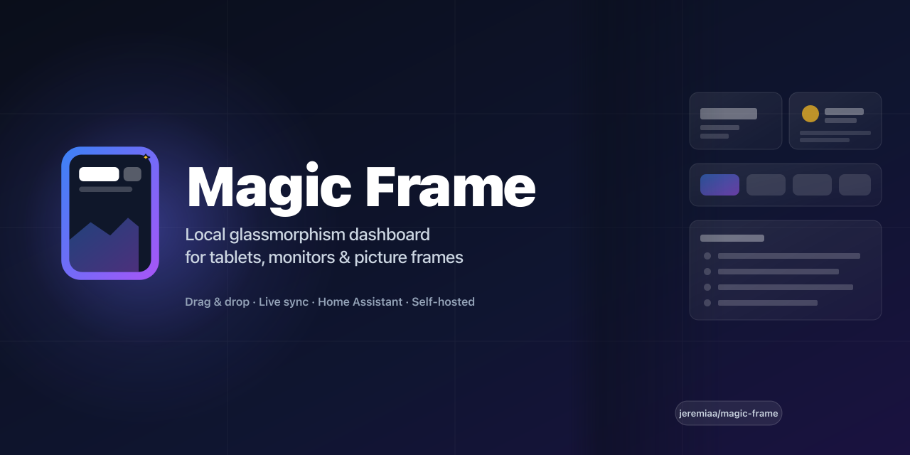
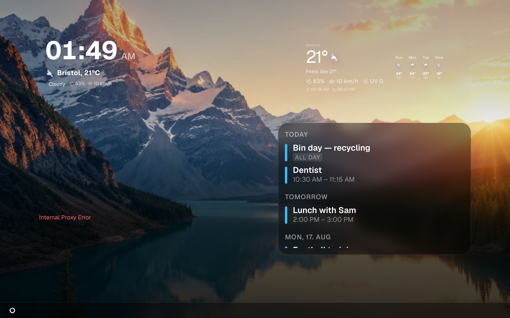
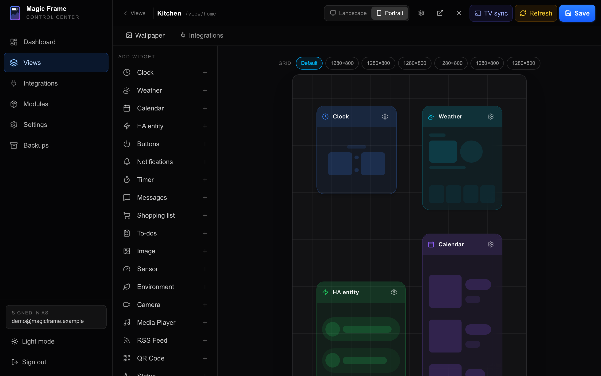
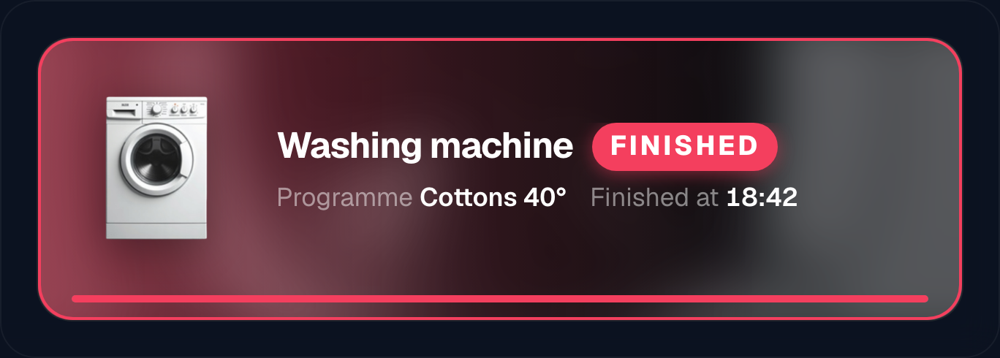
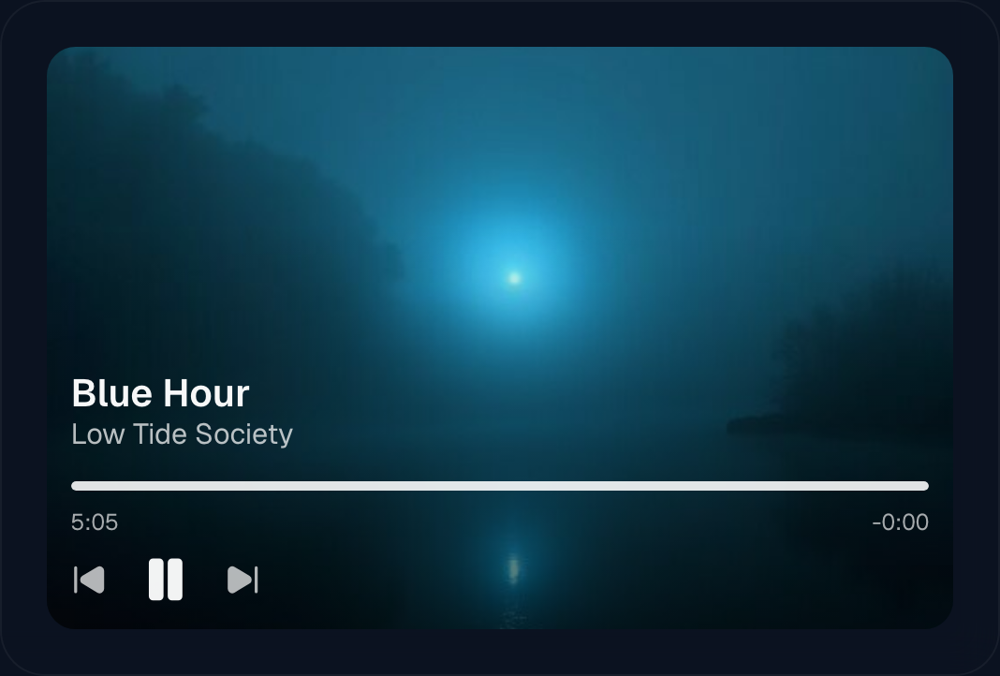

<div align="center">



**English** · [Deutsch](README.de.md) · 🌐 **[magicframe.dev](https://magicframe.dev)** · 📖 **[Documentation](https://magicframe.dev/docs/)**

Runs entirely on your home network — no cloud account, no domain needed.

Drag & drop editor · Real live updates · Smart-home · Calendar · Weather · Picture-frame mode

[](LICENSE.md)
[](https://nextjs.org/)
[](https://www.docker.com/)
[]()
[](https://github.com/sponsors/jeremiaa)

<picture>
  <source media="(prefers-color-scheme: light)" srcset="wiki/img/getting-started-result.png">
  
</picture>

</div>

<!-- s:what -->
## What it is

Magic Frame turns any browser-capable screen — tablets, kitchen monitors, old TVs, picture frames — into a self-hosted display for your home:

- **Family board** — shopping list, todos, calendar, weather
- **Smart-home hub** — live Home Assistant entities, scene buttons, camera pop-ups, notification tiles
- **Digital picture frame** — wallpaper rotation from Immich or WebDAV, subtle clock on top
- **Status display / signage** — power usage, timers, quick posts, rotating notices *(non-commercial — see [license](LICENSE.md))*

One **view** per display, each with its own URL, layout and wallpaper. Change a widget on your laptop and every display follows within a second, no refresh. It runs on a Raspberry Pi 4/5, a NAS, an old laptop, a Mac mini, a VPS, or inside Home Assistant OS as an [add-on](wiki/home-assistant-addon.md).

<!-- s:quickstart -->
## Quick start

Two commands on a fresh Linux box. Skip step 1 if you already have Docker:

```bash
# 0. Only if `curl --version` says it is missing — a minimal Debian,
#    a Proxmox template or a stripped VM image has no curl.
sudo apt update && sudo apt install -y curl git

# 1. Install Docker (with Compose plugin) — official one-liner
curl -fsSL https://get.docker.com | sh

# 2. Install Magic Frame
curl -fsSL https://raw.githubusercontent.com/jeremiaa/magic-frame/main/deploy/install.sh | bash
```

The installer pulls the pre-built multi-arch images and starts the stack, so there is no 20-minute compile on a Pi. Then open `http://<your-ip>`, create the first admin, and you are in. Every integration is added later through the UI.

> **Running Home Assistant?** Add `https://github.com/jeremiaa/magic-frame` as an add-on repository and install Magic Frame from the add-on store instead. It brings its own database and needs no access token. See [The Home Assistant add-on](wiki/home-assistant-addon.md).
>
> **macOS / Windows?** Install [Docker Desktop](https://www.docker.com/products/docker-desktop/) instead of step 1, then run step 2 in a terminal.

The same command updates an existing install, and never touches your data, login or uploaded modules. Every install path in detail: [Installation](wiki/installation.md). Updating, backups and rolling back: [Updating and backups](wiki/updating-and-backups.md).

<!-- s:looks -->
## What it looks like

Drag widgets onto a 24-column grid, configure them in the inspector, save. Every display follows within a second.

<picture>
  <source media="(prefers-color-scheme: light)" srcset="wiki/img/widgets-add-palette.png">
  
</picture>

Status cards show your devices with a picture and live details. The media card turns whatever is playing into a now-playing tile:

<table>
<tr>
<td width="50%"><picture>
  <source media="(prefers-color-scheme: light)" srcset="wiki/img/status-card-vacuum.png">
  
</picture></td>
<td width="50%"><picture>
  <source media="(prefers-color-scheme: light)" srcset="wiki/img/status-card-washer.png">
  
</picture></td>
</tr>
<tr>
<td width="50%"><picture>
  <source media="(prefers-color-scheme: light)" srcset="wiki/img/media-player-cover.png">
  
</picture></td>
<td width="50%"><picture>
  <source media="(prefers-color-scheme: light)" srcset="wiki/img/weather-background.png">
  
</picture></td>
</tr>
</table>

<!-- s:widgets -->
## Widgets

18 ship with every install: Clock, Weather, Environment, Calendar, Home Assistant entity, HA Notifications, Camera, Sensor, Image, Buttons, Timer, Messages, Shopping, Todos, Media Player, RSS, QR Code and Status — plus your own as [custom modules](wiki/custom-modules.md).

Every option of every one: [Time and weather](wiki/widgets-time-weather.md) · [Calendar](wiki/widgets-calendar.md) · [Home Assistant](wiki/widgets-home-assistant.md) · [Media and photos](wiki/widgets-media.md) · [Family](wiki/widgets-family.md)

<!-- s:docs -->
## Documentation

The full manual lives at **[magicframe.dev/docs](https://magicframe.dev/docs/)** and in this repo under [`wiki/`](wiki/README.md) — 28 pages, written from the code and checked against it in CI.

| | |
|---|---|
| **Starting** | [Getting started](wiki/getting-started.md) · [Concepts](wiki/concepts.md) · [Installation](wiki/installation.md) · [The Home Assistant add-on](wiki/home-assistant-addon.md) · [Updating and backups](wiki/updating-and-backups.md) |
| **Using it** | [The editor](wiki/the-editor.md) · [Views and displays](wiki/views-and-displays.md) · [Wallpapers](wiki/wallpapers.md) · [Widgets](wiki/widgets.md) · [Stacking and visibility](wiki/stacking-and-visibility.md) · [Themes and styling](wiki/themes-and-styling.md) |
| **Connecting things** | [Home Assistant](wiki/home-assistant.md) · [Immich](wiki/immich.md) · [Calendars](wiki/calendars.md) · [Weather providers](wiki/weather-providers.md) · [Other sources](wiki/other-sources.md) |
| **Running it** | [Settings](wiki/settings.md) · [Users and security](wiki/users-and-security.md) · [Hosting and your domain](wiki/hosting-and-domain.md) · [Troubleshooting](wiki/troubleshooting.md) |
| **Extending it** | [The companion API](wiki/companion-api.md) · [Custom modules](wiki/custom-modules.md) · [Writing a module](wiki/module-development.md) |

Reading this with an agent? [`llms.txt`](llms.txt) is the map, [`llms-full.txt`](llms-full.txt) is every page in one request. What's next: [`ROADMAP.md`](ROADMAP.md).

<!-- s:contributing -->
## Contributing

Issues with a clear reproduction are especially welcome — they directly drive releases (most of v1.1 came straight from community requests). PRs are happily reviewed; for larger changes please open an issue first so we can sort out what fits.

<!-- s:support -->
## ❤️ Support

Magic Frame is free for home use and built in my spare time. If it hangs on your wall and you want to say thanks:

[](https://github.com/sponsors/jeremiaa)
[](https://buymeacoffee.com/jeremiaa)

<!-- s:license -->
## License

**[Polyform Noncommercial 1.0.0](LICENSE.md)** — open-source-style,
allows free use, modification, distribution, and contribution.
Commercial use (selling, SaaS offering, embedding in your own products)
is not permitted without a separate license.

For commercial inquiries: **magicframeapp@gmail.com**

<sub>Vibe-coded with Claude.</sub>
