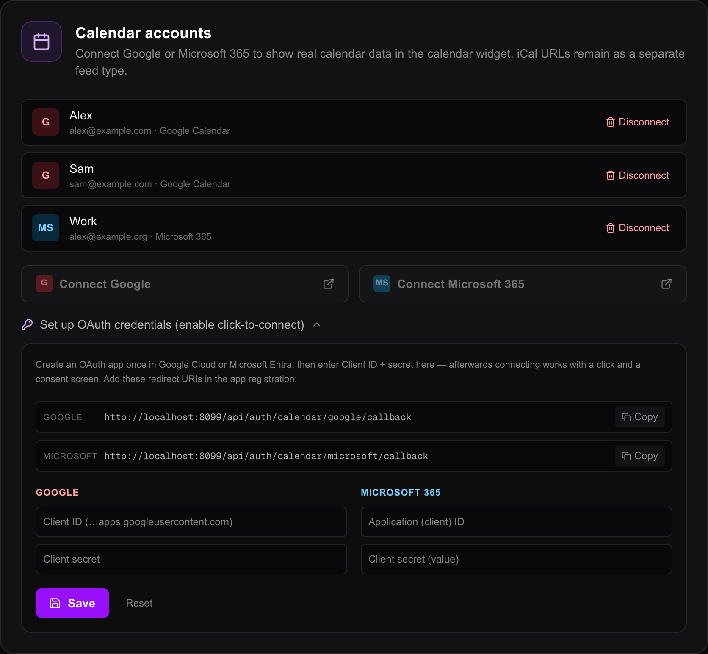
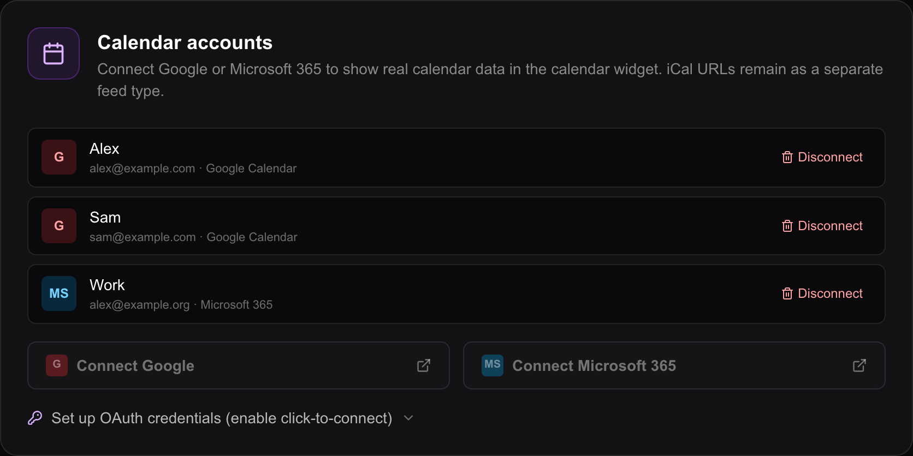

# Calendars

The calendar widget reads **feeds**. A feed is one calendar, and there are five
kinds: a plain **iCal** address, a **Google** account, a **Microsoft 365**
account, a **CalDAV** server, and a calendar your **Home Assistant** already
knows about. A widget can merge any number of them, in any mix.

This page is about **getting the accounts connected**. Building the widget — the
list, agenda and month views, colours, how many events to show — is on
[The calendar widget](widgets-calendar.md).

| Type | What it needs | Where you set it up |
| --- | --- | --- |
| iCal / Webcal | Nothing. Just the address. | In the widget itself |
| Google | An OAuth app of your own, then one click to connect | `Editor → Integrations` |
| Microsoft 365 | The same | `Editor → Integrations` |
| CalDAV | The server address, a username and an app password | `Editor → Integrations` |
| Home Assistant | A [Home Assistant connection](home-assistant.md) | Already done, if you have one |

**Start with iCal.** It needs no accounts, no developer console and no domain,
and for most family calendars it is enough. The OAuth route is worth the trouble
when you want a calendar that is not shareable as a link, or a whole account's
worth of calendars.

## An iCal address

**iCal** is the file format calendars are published in. Almost every calendar
service can hand you a subscription address for one: iCloud calls it a public
link, Google calls it the secret iCal address, an office calendar publishes one
from its sharing dialog.

1. In the editor, open the view and click the **Calendar** (`Kalender`) widget.
2. Under **Calendar sources** (`Kalender-Quellen`), click **+ iCal**. A feed card
   appears.
3. Paste the address into the field.
4. Give the feed a name and a colour on the same card.
5. Click **Speichern** (Save). Events appear within a second or two.

Both `https://` and `webcal://` addresses work — a `webcal://` address is
rewritten to `https://` before it is fetched. Nothing is connected, nothing is
stored beyond the address itself, and there is no account to expire.

Fetched iCal data is cached on the server for **10 minutes**, so five displays
showing the same calendar cause one request rather than five.

## Google and Microsoft: what has to happen first

For Google and Microsoft, Magic Frame has to identify itself as an application.
You create that application once, in Google's or Microsoft's own console, and
paste two values — a **client ID** and a **client secret** — into Magic Frame.
There is no shared Magic Frame app to borrow: it is your data, going directly
from your server to your account.

**Until those values are entered, the two connect buttons are greyed out.** That
is the expected state on a fresh install, not a fault.

### Where the fields are

**Integrations is its own entry in the editor's left-hand menu — it is not
inside Settings.**

1. Open `http://192.0.2.10/editor`, replacing `192.0.2.10` with the address of
   the machine running Magic Frame, and sign in.
2. Click **Integrations** (`Integrationen`) in the menu down the left side.
3. Scroll to the card headed **Kalender-Konten** (Calendar accounts).
4. Click the line **OAuth-Zugangsdaten einrichten (Klick-Verbinden aktivieren)**
   (Set up OAuth credentials — enable click-to-connect). It folds open.



### The redirect URI

At the top of that folded-out panel sit two grey rows, one for Google and one for
Microsoft, each with a **Kopieren** (Copy) button. They read:

```
http://192.0.2.10/api/auth/calendar/google/callback
http://192.0.2.10/api/auth/calendar/microsoft/callback
```

— with your own address in place of `192.0.2.10`. A **redirect URI** is the
address the provider sends the browser back to after you approve the access. It
has to be registered with the provider, character for character, or the sign-in
is refused.

**The rows show the address you currently have the editor open at.** They are
built from your browser's address bar. If you set `APP_BASE_URL` (see below),
the server uses *that* instead when it builds the real request, and the two can
disagree — in which case register the `APP_BASE_URL` version, not the one the
page shows.

### Google

1. Open the Google Cloud console at `https://console.cloud.google.com`.
2. Enable the **Google Calendar API** for your project.
3. Go to **Credentials** and create an **OAuth Client ID** of type *Web
   application*.
4. Under **Authorized redirect URIs**, paste the Google row you copied above.
5. Save. Google shows a **Client ID** ending in `.apps.googleusercontent.com`
   and a **Client secret**.
6. Back in Magic Frame, paste them into the two **Google** fields.
7. Click **Speichern** (Save). The message *Zugangsdaten gespeichert. Die
   Verbinden-Buttons sind jetzt aktiv.* appears and the **Google verbinden**
   button above stops being grey.

### Microsoft 365

1. Open the Azure portal at `https://portal.azure.com` and go to **App
   registrations**.
2. Register a new application.
3. Add a **Web** redirect URI and paste the Microsoft row you copied above.
4. Under **Certificates & secrets**, create a **client secret** and copy its
   **Value** — not its ID. The value is shown once.
5. The application needs the delegated permissions `Calendars.Read`,
   `offline_access` and `User.Read`.
6. Back in Magic Frame, paste the **Application (client) ID** and the secret into
   the two **Microsoft 365** fields.
7. Click **Speichern** (Save).

### Where those values are kept

The client ID and secret are stored in Magic Frame's own database. They can also
come from the environment — `GOOGLE_CLIENT_ID`, `GOOGLE_CLIENT_SECRET`,
`MS_CLIENT_ID`, `MS_CLIENT_SECRET` in `.env` — and **what you type in the
interface wins**; the environment is the fallback for a value you left empty. A
value that is currently coming from `.env` is marked with a small amber note
under the field.

Leaving a secret field empty when saving leaves the stored secret **unchanged**
— that is why the placeholder reads *Secret gesetzt — leer = unverändert*
(Secret set — empty means unchanged). To clear both providers' credentials
completely, use **Zurücksetzen** (Reset) at the bottom of the panel.

## Connecting an account

1. On `Editor → Integrations`, in the **Kalender-Konten** card, click **Google
   verbinden** or **Microsoft 365 verbinden**.
2. Your browser goes to Google or Microsoft. Sign in.
3. Approve the access. Magic Frame asks only to **read** calendars — Google
   `calendar.readonly`, Microsoft `Calendars.Read` — plus your name and email
   address so the account can be labelled, and permission to keep the connection
   alive without asking again.
4. The browser comes back to the Integrations page and a green banner says
   **Google-Konto erfolgreich verbunden.** (Google account connected
   successfully).
5. The account now appears in the list with its email address.



**Several accounts of the same provider are fine.** Connect one, then click the
same button again and sign in as somebody else — his and hers Google calendars
side by side is a normal setup. Accounts are told apart by their email address;
connecting an account that is already there refreshes it instead of adding a
duplicate.

To remove one, click **Trennen** (Disconnect) on its row and confirm. The warning
is accurate: *every feed that uses this account becomes invalid.* The widgets
pointing at it stop showing events until you point them at another account.

**Accounts belong to the Magic Frame user who connected them.** A second
Magic Frame login does not see them in this list, and will not find them in the
widget's account dropdown either.

## Using an account in a widget

1. In the editor, open the view and click the **Calendar** widget.
2. Under **Calendar sources**, click **+ Google** or **+ Microsoft**.
3. Pick the account from the dropdown on the feed card.
4. Pick which of that account's calendars to show. The list is fetched live from
   the provider through `/api/calendar/provider/calendars`. Leave it on
   **Primary** / **Default calendar** for the main one.
5. Name and colour the feed, then **Speichern** (Save).

If no account is connected, the feed card shows a link straight to the
Integrations page instead of the dropdown.

**These feeds work on a login-free display.** The access token is looked up by
the account the feed names, not by whoever happens to be looking at the screen —
which is the whole point, since a wall tablet has no session. Magic Frame
refreshes an expired token by itself, a minute before it runs out.

## A CalDAV server

**CalDAV** is what Nextcloud, Baïkal, Radicale, a Synology NAS, mailbox.org and
iCloud speak. There is no OAuth app to register and no developer console: the
server address, a username and a password are the whole setup, and Magic Frame
discovers the calendars behind them itself.

1. Open `Editor → Integrations` and find **Connect a CalDAV server**.
2. **Server address** — the same address your phone uses. The server base is
   enough; `https://cloud.example.com/remote.php/dav` for Nextcloud, or just
   `https://cloud.example.com`. Magic Frame follows `/.well-known/caldav` from
   there to the principal, and from the principal to the calendars.
3. **Username** and **App password**. Use an app password rather than your
   account password — with two-factor login enabled the account password will
   not work at all.
4. Optionally a **display name**, so a second account is distinguishable later.
5. **Connect**.

The credentials are checked against the server before anything is stored: they
are only saved once the server accepts them **and** returns at least one
calendar, so a dead account cannot end up in the list. If the login is rejected,
the message says so — that is almost always the account password where the
server wants an app password.

Then, in the widget:

1. Open the view and click the **Calendar** widget.
2. Under **Calendar sources**, click **+ CalDAV**.
3. Pick the account from the dropdown; the card shows the server's host next to
   the name.
4. Pick which of that account's calendars to show. The list comes from the
   server through `/api/calendar/provider/calendars`.
5. Name and colour the feed, then **Speichern** (Save).

Like the OAuth accounts, a CalDAV feed **works on a login-free display** — the
stored credentials belong to the account the feed names, not to whoever is
looking at the screen. Discovery is cached for 10 minutes, so a refresh does not
re-walk the whole server every time.

The server has to be reachable **from Magic Frame**, not from your phone. A
CalDAV server that only exists inside your VPN will time out here, and the error
message says so.

## Home Assistant calendars

Home Assistant has calendars of its own: a rubbish-collection schedule, a local
holiday calendar, a school timetable pulled in by an integration. They need no
account of any kind.

1. Set up the [Home Assistant connection](home-assistant.md) once.
2. In the calendar widget, click **+ Home Assistant**.
3. Pick the entity. The field offers only `calendar.*` entities from your
   instance.

The same global address and token are used for every such feed. There is nothing
per-account to expire.

## The trap: Google will not redirect to a LAN address

**This is the one that stops people, and it is worth reading before you start.**

A typical Magic Frame install is reached at something like
`http://192.0.2.10/editor` — a bare address on your home network. The redirect
URI built from it is `http://192.0.2.10/api/auth/calendar/google/callback`, and
**Google refuses to register a redirect URI on a private network address**. You
never get as far as the consent screen.

Magic Frame builds that address in this order:

1. **`APP_BASE_URL`**, if it is set. Whatever you put there is used exactly as
   written, with any trailing slash removed.
2. Otherwise the **host the request arrived with** — the `x-forwarded-host`
   header if a reverse proxy set one, otherwise the plain `Host` header.

So the fix is to give the server a name it can hand to Google:

- **Set `APP_BASE_URL` in your `.env`** to the address Google will actually send
  the browser back to — `https://frame.example.com` — and restart the app
  container. Register that same address plus
  `/api/auth/calendar/google/callback` in the Google console.
- **Or run Magic Frame behind a domain**, which it is built to do: see
  [Hosting and your domain](hosting-and-domain.md). Once the editor is reachable
  at a real name, the redirect rows on the Integrations page show that name and
  everything lines up on its own.

Two smaller details in the same area:

- **A reverse proxy must pass `x-forwarded-host`**, or the address Magic Frame
  builds is the proxy's internal one — `localhost:3000` — and the browser lands
  nowhere. This is what `APP_BASE_URL` overrides, and it is the guaranteed fix.
- **Without an `x-forwarded-proto` header, the address is built as `http://`**,
  even when you reached the page over HTTPS. If your redirect URI ends up on the
  wrong scheme, set `APP_BASE_URL` and stop guessing.

**Microsoft is more forgiving about the host** but just as strict about an exact
match: the URI you register has to be the URI that is sent, character for
character.

## When a connection fails

The Integrations page turns the provider's answer into a red banner. What the
five messages mean:

| Message | What it means |
| --- | --- |
| *Provider ist serverseitig nicht konfiguriert* | No client ID or secret stored. Fill in the OAuth credentials panel first. |
| *Autorisierung abgebrochen — kein Code vom Anbieter* | You closed the provider's window, or declined. |
| *State-Parameter ungültig* | The value Magic Frame sent out did not come back intact. Usually a stale tab; start again from the Integrations page. |
| *Token-Tausch fehlgeschlagen — Redirect-URI oder Secret falsch?* | The redirect URI registered with the provider is not the one that was used, or the client secret is wrong. This is the common one — compare both strings character for character. |
| *Unbekannter Fehler bei der Verknüpfung* | Anything else. The server log names it. |

And afterwards:

| What you see | What it usually is |
| --- | --- |
| A Google or Microsoft feed shows nothing, no warning | The account lost its authorisation. A broken feed **fails quietly** — the other feeds still draw. Reconnect the account. |
| Everything worked for about an hour, then stopped | The refresh failed. Check that the client ID and secret are still stored: this was a real defect in older versions, where credentials entered in the interface were ignored at refresh time. Fixed since v1.0.9. |
| The account list is empty although you connected one | You are signed in as a different Magic Frame user than the one that connected it. |
| A Home Assistant calendar is empty | The Home Assistant connection, not the calendar. See [Home Assistant](home-assistant.md). |

More in [Troubleshooting](troubleshooting.md).
