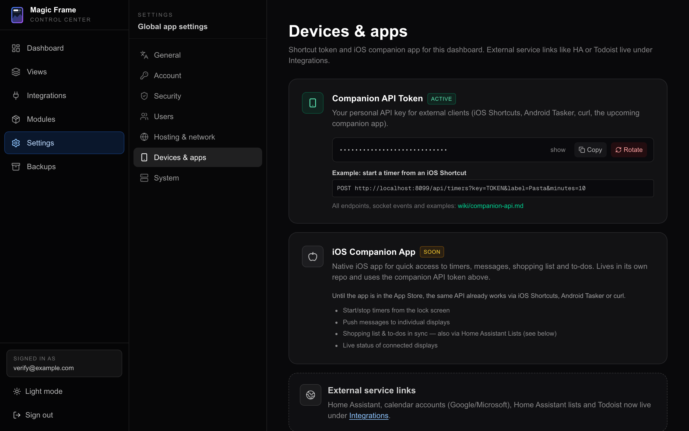
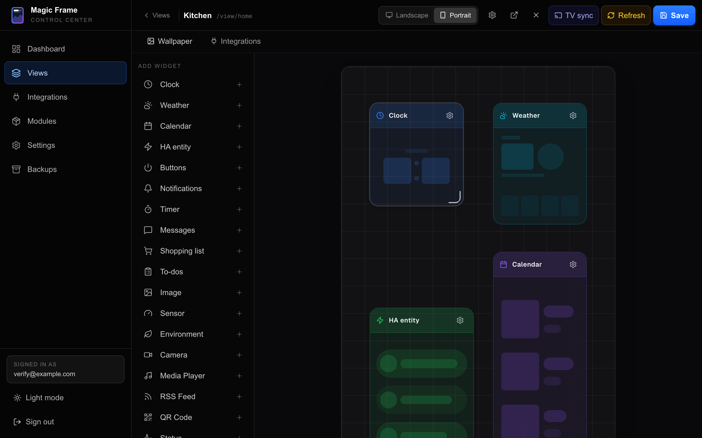

# The companion API

Magic Frame can be driven from outside the editor. A tap on your phone starts a
kitchen timer on the wall screen, Siri adds milk to the shopping list, a Home
Assistant automation makes every display jump to the doorbell view.

All of that goes through plain HTTP requests to the machine running Magic Frame.
There is no app to install and nothing to sign up for. The usual clients are
**iOS Shortcuts**, **Android Tasker**, Home Assistant's `rest_command`, and
`curl` in a script.

A **view** is one screenful shown at one address (`/view/<id>`); its id is what
the endpoints below call `dashboardId`. A **display** is any device showing a
view.

## What you can do

| I want to | Use |
| --- | --- |
| Start a kitchen timer from my phone | `POST /api/timers` |
| Put a note on the screen | `POST /api/messages` |
| Add something to the shopping list by voice | `POST /api/shopping` |
| Add or tick off a task | `POST /api/todos`, `PATCH /api/todos/[id]` |
| Make every screen show one view | `POST /api/devices/navigate` |
| Reload every screen after a change | `POST /api/devices/refresh` |
| Read the weather or the calendar my screens use | `GET /api/weather`, `GET /api/calendar` |

The four data areas — timers, messages, shopping list, to-dos — are the same
ones the [family widgets](widgets-family.md) draw. Anything you post here shows
up on every display within a second, without a reload.

## The token

Reading is open to anyone on your network. **Writing needs a token**, or a
browser already signed in to `/editor`.



### Getting it

1. Open `/editor` on your own computer and sign in.
2. Go to `Settings → Devices & apps` (`Einstellungen → Geräte & Apps`). The
   direct address is `/editor/settings#integrations`.
3. The first card is **Companion API Token**. The token is hidden behind dots.
4. Click **show** (`anzeigen`) to read it, or **Copy** (`Kopieren`) to put it on
   the clipboard.

The token is created the first time you open that card, so there is no
"generate" step. It is 32 characters of random text and belongs to **your user
account**, not to the installation — each editor user has their own.

Underneath the buttons the card prints a ready-made example, already carrying
the address you reached the editor on. It is the fastest way to see the right
shape for your own installation.

The same thing over HTTP, if you prefer:

```
GET  /api/auth/shortcut-token   → { "token": "…" }
POST /api/auth/shortcut-token   → { "token": "…a new one…" }
```

Both need a signed-in browser session; you cannot fetch a token using a token.

### Using it

Two ways, and every write endpoint accepts both.

As part of the address, which is what iOS Shortcuts needs, because its "Get
Contents of URL" action can only give you a URL:

```
http://192.0.2.10/api/timers?key=YOUR_TOKEN&label=Pasta&minutes=10
```

Or as a header, which is tidier in a script and keeps the token out of logs:

```
Authorization: Bearer YOUR_TOKEN
```

### Rotating it

The **Rotate** button on the same card issues a new token and **invalidates the
old one immediately**. Every shortcut, script and automation that used the old
one stops working until you paste the new one in. Do it if a token has leaked;
do not do it casually.

## Conventions

- **The address** is whatever you type to reach your dashboard —
  `http://192.0.2.10`, or `https://frame.example.com` if you gave it a domain.
  Every path below is relative to that.
- **Parameters work either way.** You can send JSON with
  `Content-Type: application/json`, or put everything in the query string. Mixing
  them is fine — the exceptions are noted where they exist.
- **Times** are ISO 8601 in UTC, like `2026-08-11T18:30:00.000Z`.
- **Ids** are short random strings.
- **Errors** come back as `{ "error": "…" }` with a matching status code: 400 for
  a bad request, 401 when the token or session is missing, 404 for something that
  is not there, 503 when live sync is down.
- **Error texts are German**, because German is the product's source language and
  these strings never pass through the translation layer. `text erforderlich`
  means "text required". The status code is the part to check in a script.

## Timers

Server-side countdowns, drawn by the Timer widget. See
[Family widgets](widgets-family.md) for what they look like.

| Call | Login needed | What it does |
| --- | --- | --- |
| `GET /api/timers` | no | List the running timers |
| `POST /api/timers` | yes | Start one |
| `DELETE /api/timers/[id]` | yes | End one |

`GET /api/timers` takes an optional `dashboardId`. With it you get the timers
aimed at that view **plus** the ones aimed at no view in particular; without it,
all of them. At most 20 come back, oldest first, and dismissed ones never do.

```json
{
  "timers": [
    {
      "id": "ckxy…",
      "label": "Pasta",
      "targetDashboardId": "kitchen",
      "startedAt": "2026-08-11T18:30:00.000Z",
      "durationMs": 600000,
      "completedAt": null,
      "dismissedAt": null
    }
  ]
}
```

For `POST /api/timers`:

| Field | Default | What it does |
| --- | --- | --- |
| `label` | `Timer` | The name on screen. Anything past 40 characters is cut off. |
| `minutes`, `seconds` | 0 | Added together. |
| `durationMs` | — | The length in milliseconds, instead of minutes and seconds. |
| `dashboardId` | none | Show it on one view only. Left out, it appears on every display. |

The length must come to **at least one second** — otherwise the answer is 400 —
and it is **capped at 24 hours**, so a mistyped number cannot leave a ten-year
countdown on the wall. The answer is `{ "timer": { … } }` with the object above.

`DELETE /api/timers/[id]` answers `{ "ok": true }` and the timer vanishes from
every display. It does not check who started it: anyone with a token can end
anyone's timer.

## Messages

Short notes that appear on the screen and stay until somebody clears them.

| Call | Login needed | What it does |
| --- | --- | --- |
| `GET /api/messages` | no | List the notes currently showing |
| `POST /api/messages` | yes | Post one |
| `DELETE /api/messages/[id]` | yes | Clear one |

`GET /api/messages` takes the same optional `dashboardId` and behaves the same
way: that view's notes plus the untargeted ones. Expired and cleared notes are
left out. At most 20 come back, newest first.

For `POST /api/messages`:

| Field | What it does |
| --- | --- |
| `text` | Required. Anything past 500 characters is cut off. |
| `imageUrl` | A picture beside the text. Must be an address the display can open by itself. |
| `dashboardId` | One view only. |
| `ttlSec` | Seconds until it disappears on its own. Without it the note stays until cleared. |

```
POST /api/messages?key=YOUR_TOKEN&text=Dinner+in+10+min&ttlSec=1800&dashboardId=kitchen
```

The answer is `{ "message": { … } }` with `id`, `text`, `imageUrl`,
`targetDashboardId`, `createdAt` and `expiresAt`.

**`imageUrl` only takes an address — you cannot upload a picture here.** The
image is fetched by the display's own browser, so it has to be reachable from
the tablet, not just from your phone.

## Shopping list

The household list. One list for everyone; there is no per-person scope.

| Call | Login needed | What it does |
| --- | --- | --- |
| `GET /api/shopping` | no | The whole list |
| `POST /api/shopping` | yes | Add one or several items |
| `PATCH /api/shopping/[id]` | yes | Tick or untick one |
| `DELETE /api/shopping/[id]` | yes | Delete one |
| `DELETE /api/shopping` | yes | Delete everything already ticked |

`GET /api/shopping` returns everything still open plus anything ticked in the
**last 24 hours**, up to 200 items, open ones first. It takes no parameters.

`POST /api/shopping` takes `text` or `items`. A string is split on commas,
semicolons and line breaks, so one call adds several things:

```
POST /api/shopping?key=YOUR_TOKEN&items=Milk,Bread,Cheese
```

In a JSON body, `items` may also be a real array. Either way each entry is cut
off after 120 characters and the answer is `{ "items": [ … ] }` with just the
newly added ones.

`PATCH /api/shopping/[id]` flips ticked and unticked. **It needs no body at
all** — sending the id is the whole request. An unknown id gives 404.

## To-dos

Tasks, optionally assigned to somebody in the household by name.

| Call | Login needed | What it does |
| --- | --- | --- |
| `GET /api/todos` | no | List tasks |
| `POST /api/todos` | yes | Add one |
| `PATCH /api/todos/[id]` | yes | Tick it off, or change it |
| `DELETE /api/todos/[id]` | yes | Delete it |

`GET /api/todos` returns open tasks only, up to 200. Two parameters change that:

```
GET /api/todos?assignee=Emma&includeDoneHours=12
```

`assignee` narrows it to one person — an exact match on the name, so `emma` and
`Emma` are different people. `includeDoneHours` also returns tasks completed
within that many hours.

For `POST /api/todos`:

| Field | What it does |
| --- | --- |
| `title` | Required. Anything past 200 characters is cut off. |
| `assignee` | A name. Free text; nothing has to exist first. |
| `dueDate` | An ISO 8601 date. An unreadable one gives 400. |
| `priority` | `low`, `normal` or `high`. Default `normal`. |

**An unknown `priority` is silently turned into `normal`** rather than refused,
so a typo costs you the priority without any warning.

`PATCH /api/todos/[id]` does two different things depending on the body:

- `{"toggle": true}` flips done and not-done.
- Any of `{"title", "assignee", "dueDate", "priority"}` changes those fields.

**This one is JSON-body only.** Unlike the other endpoints it does not read the
query string, so `PATCH /api/todos/abc?key=TOKEN&toggle=true` authenticates fine
and then does nothing. The token may stay in the query; the `toggle` may not.

## Controlling the displays

Three endpoints push a command to every display currently connected.

| Call | What happens on the displays |
| --- | --- |
| `POST /api/devices/refresh` | They reload the page |
| `POST /api/devices/navigate` | They all switch to one view |
| `POST /api/devices/clear-navigate` | They go back to their own view |

All three need a login and answer `{ "ok": true }`.

`refresh` takes an optional `dashboardId`, in the query or in a JSON body. With
it, only the displays showing that view reload; without it, every display does.
`navigate` **requires** `dashboardId` and answers 400 without it.

```
POST /api/devices/navigate?key=YOUR_TOKEN&dashboardId=kitchen
```

This is the same machinery as the buttons in the editor toolbar: **TV sync**
sends `navigate` for the view you are editing, the **✕** beside it sends
`clear-navigate`, and **Refresh** sends `refresh` — shift-clicking Refresh limits
it to the current view.



If live sync is not running — which on a normal install means the server is not
finished starting — these answer **503** with a German error rather than failing
silently.

To find the `dashboardId` values to use, `GET /api/dashboards` lists every view
with its id and name. It takes the same `?key=<token>` as everything else on
this page — `curl 'http://<your-server>/api/dashboards?key=TOKEN'`.

It used to need no login at all, which meant the full list of your views, their
names and the geometry of every widget on them was readable by anyone who could
reach the server. The view addresses themselves stay open; knowing one is not
the same as being handed all of them.

### Which displays are watching

`GET /api/view-clients?dashboardId=<id>` lists the displays currently showing a
view, with the pixel size and pixel ratio each one reports:

```json
{ "displays": [ { "clientId": "a1b2c3", "width": 1920, "height": 1080, "dpr": 1 } ] }
```

**This one does not accept a token.** Apart from fetching the token itself, it is
the only endpoint on this page that insists on a browser session, so it cannot be
used from a shortcut. Without one you get 401.

## Reading what the screens read

Two more routes are worth knowing because they let an outside tool see exactly
what a display sees. Both are open — a display has no login, so these could not
require one.

`GET /api/weather` takes `lat`, `lon` and `provider`, plus
`temperature_unit` (`celsius` or `fahrenheit`) and `wind_speed_unit` (`kmh`,
`mph`, `ms` or `kn`). `provider` is one of `open-meteo` (the default), `dwd`,
`openweathermap` or `home-assistant` — the last needs a `haEntity` as well.
The providers are described in [Weather providers](weather-providers.md).

```
GET /api/weather?lat=52.52&lon=13.40&provider=open-meteo
```

`GET /api/calendar` takes `feeds` — a JSON array of feed definitions, iCal,
Google, Microsoft, CalDAV or Home Assistant — plus `limit` and `days`, and
returns the merged appointments. A single iCal address can be passed as `url`
instead. See [Calendars](calendars.md).

## Live events

Every display holds one permanent connection to the server, over Socket.IO. That
is how a saved layout reaches the wall tablet in under a second, and how a timer
you start on your phone appears without a reload.

The server sends these to every connected client:

| Event | Payload | Meaning |
| --- | --- | --- |
| `LAYOUT_UPDATED` | none | The layout changed — fetch it again |
| `FORCE_NAVIGATE` | the view id | Switch to this view |
| `CLEAR_NAVIGATE` | none | Go back to your own view |
| `REFRESH_DEVICE` | a view id, or nothing | Reload — everyone, or only that view |
| `TIMER_STARTED` | the timer | A timer began |
| `TIMER_DISMISSED` | `{ "id": … }` | A timer ended |
| `MESSAGE_POSTED` | the message | A note arrived |
| `MESSAGE_DISMISSED` | `{ "id": … }` | A note was cleared |
| `SHOPPING_UPDATED` | none | Fetch the shopping list again |
| `TODOS_UPDATED` | none | Fetch the to-dos again |

**The connection only goes one way.** The server listens for no events at all;
anything a client emits is discarded. It did not always work that way: clients
used to be able to emit these events and the server passed them on, which meant
anyone who could reach the server could switch or reload every screen in the
house. That is why the three display-control endpoints above exist, and why they
check a login.

**There used to be an `HA_STATE_CHANGE` event listed here.** It has been removed
from both the code and this page. The class that would have emitted it was never
constructed, so no client ever received one — if you wrote something that waits
for it, it has been waiting for nothing. Live Home Assistant state comes from
`/api/ha/stream` over server-sent events, filtered to the entities a widget
actually shows.

## iOS Shortcuts

The whole API is designed so that a Shortcut needs nothing but a URL.

### A pasta timer

1. Open **Shortcuts**, create a new one, add the action **Get Contents of URL**.
2. Put in the address, with your own token and the id of your kitchen view:
   ```
   http://192.0.2.10/api/timers?key=YOUR_TOKEN&label=Pasta&minutes=10&dashboardId=kitchen
   ```
3. Open the arrow beside the address and set **Method** to `POST`.
4. Name it, then **Add to Home Screen**.

Tap it and the kitchen display shows a ten-minute countdown, turning orange when
it runs out. Leave `dashboardId` off and every display shows it.

### Adding to the shopping list by voice

1. New Shortcut, action **Dictate Text**.
2. Action **Get Contents of URL**, method `POST`, address built as text:
   `http://192.0.2.10/api/shopping?key=YOUR_TOKEN&text=` followed by the
   dictated-text variable.
3. Name it **Add to list**.

"Hey Siri, add to list" — say "milk" — and milk appears on the kitchen screen.

### A timer of any length

1. Action **Ask for Input**, type **Number**.
2. Action **Get Contents of URL**, method `POST`, address built as text:
   `http://192.0.2.10/api/timers?key=YOUR_TOKEN&minutes=` followed by the input
   variable.

### Reloading every screen

```
POST http://192.0.2.10/api/devices/refresh?key=YOUR_TOKEN
```

One action, no body. Handy after changing a wallpaper folder or a calendar feed
outside Magic Frame.

### A home-screen button for one chore

A task that comes back every week — bins out, dishwasher emptied — is worth its
own button. Tick it off from the phone and the kitchen screen updates.

1. Find the task's id. `GET /api/todos` lists them; each carries an `id`.
2. New Shortcut, action **Get Contents of URL**, method `PATCH`, address:
   ```
   http://192.0.2.10/api/todos/YOUR_TODO_ID?key=YOUR_TOKEN
   ```
3. Open the arrow beside the address, set **Request Body** to **JSON**, and add
   one field: `toggle`, type Boolean, value `true`.
4. **Add to Home Screen**.

Step 3 is the part people skip. `PATCH /api/todos/[id]` reads the body and
nothing else, so `&toggle=true` in the address authenticates, returns 200 and
changes nothing. The token belongs in the query; the `toggle` does not.

## What this cannot do

- **There is no versioning.** These paths are not frozen, and nothing warns a
  client that something changed. Pin nothing; expect to check after an update.
- **Nothing is pushed back to your phone.** There are no notifications; the
  screen is the output.
- **Ownership is not checked on writes.** Anyone with a valid token can end any
  timer, clear any note and delete any task, whoever created it. Tokens are
  per-user, but the data is not.
- **A public view cannot write.** The view address needs no login, so a wall
  tablet has neither session nor token, and ticking an item off there is rejected
  by the server without saying so. The full explanation and the way around it are
  in [Family widgets](widgets-family.md).
- **Reading is open to your whole network.** Anybody who can reach the server can
  read your shopping list, your to-dos and your notes without any token at all.
  That is deliberate — it is what lets a login-free display show them — but it
  makes exposing Magic Frame to the internet a decision, not a detail. See
  [Users and security](users-and-security.md) and
  [Hosting and your domain](hosting-and-domain.md).
- **Pictures cannot be uploaded through the message endpoint.** Only a link.

## Where this lives in the code

| Part | File |
| --- | --- |
| Token check, both ways | `src/lib/auth/shortcut.ts` |
| Token endpoint | `src/app/api/auth/shortcut-token/route.ts` |
| Timers | `src/app/api/timers/`, `src/lib/timers/store.ts` |
| Messages, shopping, to-dos | `src/app/api/{messages,shopping,todos}/`, `src/lib/companion/` |
| The database client they share | `src/lib/companion/prisma.ts` |
| Display commands | `src/app/api/devices/`, `src/lib/devices/control.ts` |
| The socket server | `server.js` |
| The widgets that draw this data | `src/components/widgets/{TimerWidget,MessagesWidget,ShoppingListWidget,TodosWidget}.tsx` |
| Their inspectors, all four in one file | `src/app/editor/_inspectors/CompanionInspectors.tsx` |
