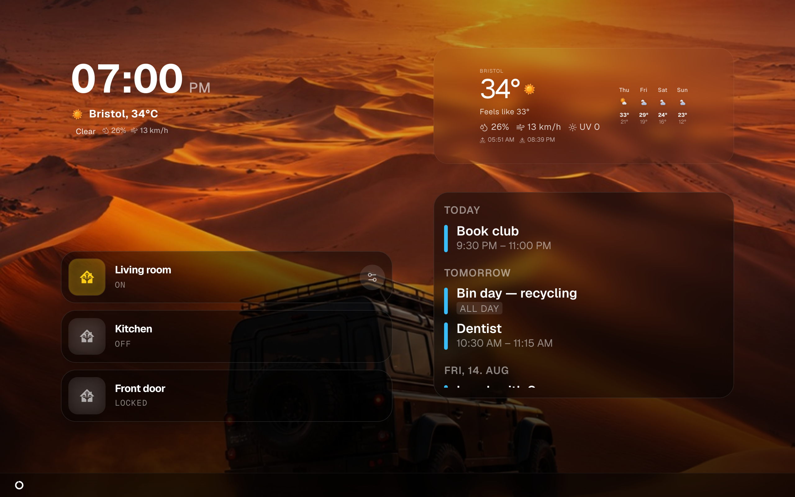

# Concepts

The five words this manual keeps using. Read this once and the rest of the wiki
stops being vague.



## The server

**Magic Frame** is one program running on one machine you own — a Raspberry Pi,
a NAS, an old laptop, a small server. It holds everything: your layouts, your
settings, your accounts. Nothing is stored anywhere else, and it does not need
the internet to work on your own network.

Everything else in this list lives inside that one program.

## A view

A **view** is one screenful — one arrangement of tiles with one background. You
build it once and it belongs to one screen.

Each view has its own address:

```
http://<the-machine-running-magic-frame>:80/view/<id>
```

That address needs **no login**. That is deliberate: a tablet screwed to the
kitchen wall cannot type a password, and it should show the family calendar the
moment it powers on. Anyone who can reach the address can see the view, so treat
it like a picture on the wall — do not put anything on it you would not show a
visitor. See [Views and displays](views-and-displays.md).

Most households end up with one view per screen: a kitchen view, a hallway view,
a children's tablet. Views do not share anything, so changing one never disturbs
another.

> In exports and in the database a view is called a **dashboard**. Same thing —
> the word changed in the interface but not underneath.

## A widget

A **widget** is one tile on a view: the clock, the weather, the calendar, a
photo, a light switch. There are 18 kinds, listed in [Widgets](widgets.md).

Two things about widgets matter everywhere else in this wiki:

1. **Every widget has a type id, and that id is a filename** — the clock is
   `ClockWidget.tsx`, the calendar is `CalendarWidget.tsx`. You see these ids if
   you export a layout as a file, and you need them if you
   [write your own widget](module-development.md).
2. **Every widget has settings of its own**, called its **config** — which city
   the weather is for, which album the photos come from. You edit a config in
   the inspector; see [The editor](the-editor.md).

Some settings exist on *every* widget, whatever kind it is: font, colour, text
shadow, alignment, nudging it a few pixels, and rules for hiding it. Those are
described once in [Widgets](widgets.md) rather than repeated on every page.

## The grid

A view is divided into **24 columns and 24 rows**, and a widget always occupies
whole cells. That is why a widget snaps as you drag it, and why a layout keeps
its proportions on a screen of a different size: the grid stretches, so a widget
that filled a quarter of a 10-inch tablet fills a quarter of a 40-inch monitor.

It also means the smallest a widget can be is one cell. If a tile looks cramped,
it needs more cells, not a smaller font.

## A display

A **display** is any device showing a view: a tablet, a TV, a monitor on a
Raspberry Pi, a phone. Magic Frame does not install anything on it. The device
opens the view's address in its normal browser and leaves it open.

Several displays can show the same view at the same time. They all stay in step,
because of the next word.

## Live sync

When you save a change in the editor, every display showing that view **updates
by itself, within a second**. Nobody walks around the house pressing reload.

This works over a permanent connection each display holds open to the server. It
is also why the whole thing runs as **one instance and cannot be scaled to two**:
that connection and the cached home state live in the memory of a single
process. Running a second copy would split the displays between them and break
the syncing. This matters only if you were planning to run it in Kubernetes; see
[Installation](installation.md).

## The wallpaper

The **wallpaper** is a view's background — a colour, one picture, or a slideshow
from your own photos. It is a property of the view, not a widget, so it always
fills the whole screen behind everything else.

This is the part that makes Magic Frame a picture frame rather than a dashboard,
and it has the most options of anything here: where the photos come from, how
they are fitted, how they change, and whether the date and place appear in a
corner. All of it is on [Wallpapers](wallpapers.md).

## How they nest

```
The server
└── a view                    one screen, one address, no login
    ├── the wallpaper         the background of that view
    └── widgets               tiles on a 24 × 24 grid
        └── a config          that tile's own settings
```

And separately, shared by all views:

```
The server
└── integrations              Home Assistant, Immich, calendars, weather
```

An **integration** is a connection to something else you run: your
[Home Assistant](home-assistant.md), your [Immich](immich.md) photo library,
your [calendars](calendars.md), a [weather service](weather-providers.md). You
set one up once, under `Editor → Integrations`, and every view can use it.

## The two halves of the interface

Magic Frame shows you two different things, and confusing them is the most
common early stumble:

| | The editor | A view |
| --- | --- | --- |
| Address | `/editor` | `/view/<id>` |
| Login | required | none |
| What it is for | building layouts | being looked at |
| Where you use it | your laptop or phone | the screen on the wall |

You never edit on the wall tablet. You edit on your own computer, press save,
and the wall tablet changes by itself.
