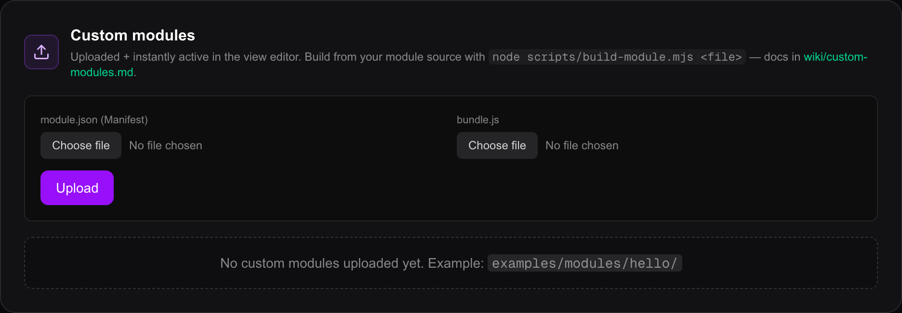

# Custom modules

Magic Frame ships with 18 kinds of widget, listed in [Widgets](widgets.md). A
**custom module** is a nineteenth kind that somebody else wrote: a small
JavaScript file you upload, which then appears in the editor alongside the
built-in widgets and draws whatever it likes on your screens.

Nothing has to be rebuilt or restarted. You upload two files and the new widget
is available a second later.

This page is about **installing** a module somebody gave you. If you want to
build one, that is [Writing a module](module-development.md).

## What a module is made of

Every module is exactly two files:

| File | What it is |
| --- | --- |
| `module.json` | The **manifest** — the module's name, its emoji, its version, and the list of settings it offers you |
| `bundle.js` | The code that draws the widget |

Whoever wrote the module produces both with one command. If you were handed a
single `.js` source file instead, it has not been built yet and cannot be
uploaded — send it back, or build it yourself as described in
[Writing a module](module-development.md).

## Installing one



1. Open `/editor` on your own computer and sign in.
2. Click **Modules** (`Module`) in the sidebar — it is its own entry, between
   **Integrations** and **Settings**. The address is `/editor/modules`.
3. Scroll past the grid of built-in widget types to the **Custom modules**
   (`Custom-Module`) card.
4. Beside **module.json (Manifest)**, click **Choose file** and pick the
   module's `module.json`. The filename appears next to the button.
5. Beside **bundle.js**, click **Choose file** and pick the module's
   `bundle.js`.
6. Click **Upload** (`Hochladen`).

A green line confirms it: *Module 'X' uploaded (N bytes). Available in the view
editor.* The module then appears as a row underneath, with its emoji, its name,
its type id and its version.

If something is wrong, the line is red and says what: a `module.json` that is
not valid JSON, a missing `type` or `label`, or a bundle that fails one of the
checks below.

### Putting it on a screen

1. Go to **Views** and open the view you want it on.
2. In the **Add widget** palette down the left, scroll to the bottom. Uploaded
   modules sit under a **Custom** heading below the 18 built-in ones, each with
   its emoji.
3. Click it. The widget lands on the grid and its inspector opens.
4. The **Content** (`Inhalt`) tab shows the settings the module's author defined
   — a text box, a switch, a colour picker, whatever the manifest lists.
5. Drag it into place, resize it, and click **Save**.

Every display showing that view fetches the module's code and starts drawing it,
within a second and without a reload.

## Managing installed modules

Each row on `/editor/modules` has three buttons on the right:

| Button | What it does |
| --- | --- |
| Eye | Turn the module off, or back on. A module that is off disappears from the palette, and any widget already using it stops drawing. |
| Document | Show the raw manifest, so you can read exactly what the module declares. |
| Bin | Delete it. It asks first, because **views using it break**. |

The row also tells you how many settings the module offers, how large its code
is in bytes, and when it was uploaded.

**Uploading a module with a type id that already exists replaces it.** That is
how you update one: build the new version, upload both files again, done. The
settings you had already filled in survive, because they are stored on the
widget, not in the module.

### Uploading without the browser

If you are rebuilding a module often, the same upload goes over HTTP. The route
takes one JSON object with the manifest and the bundle as a string:

```bash
curl -X POST https://dashboard.example.com/api/admin/modules \
  -H "Content-Type: application/json" \
  --cookie "magic_session=PASTE_YOUR_COOKIE" \
  -d @<(jq -n --argjson m "$(cat dist/module.json)" --arg js "$(cat dist/bundle.js)" \
        '{manifest:$m, bundleJs:$js}')
```

`magic_session` is the cookie a signed-in browser holds — copy its value out of
the browser's developer tools. **The companion token does not work here**, as
described above, and there is no other way to authenticate: this route wants a
session and nothing else. The cookie expires, so expect to copy it again.

## The manifest

`module.json` is what the author writes; you only need to read it to know what a
module claims to be. These are the fields it can hold:

| Field | Required | What it is |
| --- | --- | --- |
| `type` | yes | The module's id. `custom:` is put in front of it if it is not there already, so `hello` becomes `custom:hello`. Letters, digits, `_` and `-` only, up to 64 characters. |
| `label` | yes | The name shown in the palette and the module list. |
| `description` | no | One line, shown under the name. |
| `iconEmoji` | no | The emoji in the palette. Defaults to 🧩. Cut off after four characters, which is room for one emoji. |
| `version` | no | Defaults to `1.0.0`. Shown in the list; nothing checks it. |
| `fields` | no | The settings the module offers, listed below. |
| `author`, `homepage` | no | Stored, and visible when you open the raw manifest. Nothing else shows them. |

Each entry in `fields` becomes one control in the widget's inspector:

| `type` | What you get |
| --- | --- |
| `text` | A single-line box |
| `textarea` | A four-line box in a monospaced font |
| `number` | A number box |
| `boolean` | A checkbox |
| `color` | A colour picker with a `#rrggbb` box beside it, and a `×` to clear it |
| `url` | A single-line box the browser checks for a web address |

Anything else — a misspelled type, a type the author invented — falls back to a
plain text box rather than being refused.

A field can also carry `default` (filled in when you add the widget),
`placeholder`, `help` (a grey line under the control) and `required`.

**`required` is decoration.** It only decides whether the label says
"(optional)" next to it. Nothing stops you saving a widget with the field empty,
and nothing warns you. Whether the module copes is up to its author.

**Field labels are not translated.** The rest of the interface follows your
language setting; a module's labels and help text are printed exactly as its
author wrote them. A module written in German stays German on an English
installation, and the reverse.

## The type id starts with `custom:`

A built-in widget's type id is a filename — `ClockWidget.tsx`. A module's is
`custom:` followed by its name — `custom:hello`. The prefix is forced on upload,
which is what makes a collision with a built-in widget impossible, now or after
any future update.

You will see this id in the module list, in the inspector header, and in a layout
you export from the editor.

## Limits

These are checked when you upload, and the upload is refused if one fails. The
three messages come straight from the server and are **shown in German** even
with the app set to English, because they have no English translation yet.

- **The bundle may not exceed 2 MB** — *Bundle > 2 MB — bitte schlanker bauen*.
- **The bundle must be at least 20 characters** — *Bundle leer oder zu kurz*. An
  empty file is a mistake, not a module.
- **The bundle must contain the text `registerWidget`** — *Bundle ruft
  `MagicFrame.registerWidget(...)` nicht auf — falsch gebaut?* Every properly
  built module calls `window.MagicFrame.registerWidget(...)` to announce itself,
  so a file without it was built wrongly, or is not a module at all.

And these are not checked, and are worth knowing before you install anything:

- **A module is code, and it runs with everything your browser has.** It runs in
  the editor while you configure it, and on every display showing the view. It
  can read the page, and it can call any address the browser can reach —
  including Magic Frame's own routes. Nothing sandboxes it.
- **Only install modules from someone you trust**, and prefer ones whose source
  you can read. There is no signing, no review and no marketplace: what you
  upload is what runs.
- **The code is served without a login.** A display has no login, so
  `/api/modules/[type]/bundle.js` cannot require one. Anyone who can reach your
  server can download an installed module's code.
- **Only an editor user can upload.** Uploading, disabling and deleting go
  through `/api/admin/modules`, which needs a signed-in browser session. The
  companion token from [The companion API](companion-api.md) is *not* accepted
  here.

## What a module can and cannot do

A module is handed a small, fixed set of things by Magic Frame, and has no way to
reach past it.

It **can**:

- draw anything, using React's `createElement` and the hooks `useState`,
  `useEffect`, `useRef`, `useMemo` and `useCallback`;
- read its own settings, as you filled them in;
- know which view it is running on;
- fetch data from anywhere the display's browser can reach.

It **cannot**:

- run anything on the server — a module is browser code only;
- add settings beyond the six field types above, so no entity picker, no icon
  picker, no album chooser like the built-in widgets have;
- use anything other than an emoji as its icon;
- change the shared **Layout** and **Text & colour** tabs. Those work on a module
  exactly as on any other widget: font, colour, shadow, background opacity,
  nudging and hiding rules all apply, and are described in
  [Widgets](widgets.md).

It also inherits the tile: the font size, family, colour and shadow you set come
from the wrapper around it, and the dark panel behind it is the widget's
`bgOpacity`. A well-written module sizes everything relative to that inherited
font size, so it scales with the tile like the built-in widgets do.

## When something goes wrong

| What you see | What it means |
| --- | --- |
| *Module 'custom:x' not found. It may have been deleted or disabled.* in the inspector | The widget is still on the view, but the module behind it is gone or switched off. Re-upload it, or switch it back on. |
| *Lade custom:x…* for a moment, then a red ⚠ | The tile shows that while the code downloads. If nothing announces itself within five seconds it gives up with a timeout. Either the module is disabled, or it was built wrongly. |
| A red ⚠ with a message | Either the download failed, or the module's own code threw. The message is whatever was reported. |

The runtime's own messages — the loading line and the timeout — are **in
German** whatever language the app is set to. They do not pass through the
translation layer.

**A disabled or deleted module is not removed from your views.** The tile stays
where it is and shows the error instead, which is why deleting asks first. Remove
the widget from the view as well if you are done with it.

**No live preview for community modules.** The **Content** tab of a built-in
widget starts with a live preview of the real thing; for a module the inspector
says so instead. You see the result by opening the view.

## Where this lives in the code

| Part | File |
| --- | --- |
| The Modules page | `src/app/editor/(app)/modules/page.tsx` |
| Upload, enable, delete | `src/app/api/admin/modules/`, `src/lib/modules/store.ts` |
| The list the editor and displays read | `src/app/api/modules/route.ts` |
| The code a display downloads | `src/app/api/modules/[type]/bundle.js/route.ts` |
| The browser runtime that runs a module | `src/lib/modules/runtime.tsx` |
| The generated settings form | `src/app/editor/_inspectors/CustomModuleInspector.tsx` |
| A complete example module | `examples/modules/hello/` |
