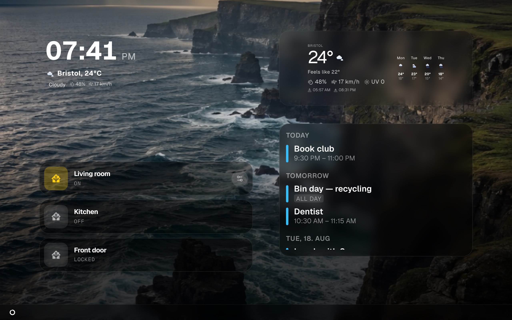

# Getting started

From nothing to a photo frame with a clock on it. One command to install, one
account to create, one view to build, one address to open on the tablet.

You do not need to know Docker, and you do not need to know Home Assistant.
Everything below is copy, paste, click.



## What you need

| | |
| --- | --- |
| A machine that stays switched on | A Raspberry Pi 4 or 5, a NAS, an old laptop, a mini-PC. This becomes **the server**. |
| Docker on that machine | The installer checks for it and stops with a clear message if it is missing. Installing it is one command, below. |
| A browser on your own computer | You build layouts here, not on the wall tablet. |
| A screen to show it on | A tablet, a TV, a monitor. It only needs a browser. Nothing is installed on it. |

Everything stays on your own network. No account, no cloud, no domain.
[Installation](installation.md) lists every other way to install it if the
one-liner below does not fit your machine.

## 1. Install Docker, if you do not have it

**Docker** is the thing that runs Magic Frame and its database as a bundle, so
you never install a database by hand.

1. Open a terminal **on the machine that will be the server** — on a Pi or a
   Linux box that means an SSH session or a keyboard attached to it.
2. Make sure `curl` is there. Every command below starts with it, and a
   minimal Debian or Proxmox install does not ship it:

   ```bash
   curl --version
   ```

   If that says *command not found*, install it — the first line for Debian,
   Ubuntu and Raspberry Pi OS, the others for the distributions that use a
   different package manager:

   ```bash
   sudo apt update && sudo apt install -y curl
   sudo dnf install -y curl          # Fedora, Rocky, AlmaLinux
   sudo pacman -S --noconfirm curl   # Arch
   sudo apk add curl                 # Alpine
   ```

3. Run this. It downloads and installs Docker:

   ```bash
   curl -fsSL https://get.docker.com | sh
   ```

4. Wait until the prompt comes back. It prints a version at the end.

On a Mac or a Windows PC, install
[Docker Desktop](https://www.docker.com/products/docker-desktop/) instead and
start it once, then carry on at step 2.

## 2. Install Magic Frame

1. In the same terminal, run:

   ```bash
   curl -fsSL https://raw.githubusercontent.com/jeremiaa/magic-frame/main/deploy/install.sh | bash
   ```

   This downloads the installer and runs it. It creates a folder called
   `magic-frame`, generates the secret that signs your login, downloads three
   ready-built containers (the app, a Postgres database and the Caddy web
   server) and starts them.

2. Wait. On a fast connection this takes a couple of minutes — the images are
   pre-built for both Intel and ARM, so nothing is compiled on your Pi.

3. When it is finished the terminal prints the Magic Frame wordmark, the line
   **Magic Frame is running!**, and an address that ends in `/editor`:

   ```
   Open in browser:  http://192.0.2.10/editor
   ```

   That address is your server. Write it down — you will use it every time you
   change something.

If instead you see `Bind for 0.0.0.0:80 failed: port is already allocated`,
something else on that machine is already using port 80. See
[Troubleshooting](troubleshooting.md), or move Magic Frame to another port as
described in [Installation](installation.md).

## 3. Create your account

1. On **your own computer**, open the address the installer printed —
   `http://192.0.2.10/editor` with your machine's own address in place of
   `192.0.2.10`.

   > If the browser refuses to connect and mentions HTTPS, it silently changed
   > your `http://` to `https://`. There is no certificate yet on a fresh local
   > install, so that fails. Type the address **including the `/editor` path**;
   > the automatic upgrade mostly only fires on bare host addresses.

2. You land on a form headed **Create the first admin** (Ersten Admin anlegen).
   This appears only once, on the very first visit — nobody else can reach it
   afterwards.
3. Type an email address. It is only your login name — no mail is ever sent —
   but it must have the shape of an address, `you@example.com`, or the form
   rejects it.
4. Type a password. It must be at least 8 characters.
5. Type it again in **Confirm password**.
6. Press **Create admin & log in**.

You land in the editor, logged in.

## 4. Look around the editor

The **editor** is the admin side of Magic Frame. Down the left is one entry per
area:

| Entry | What lives there |
| --- | --- |
| **Dashboard** | The overview you just landed on. |
| **Views** | Your screens. This is where you spend your time. |
| **Integrations** (Integrationen) | Home Assistant, Immich, calendars, Todoist. |
| **Modules** (Module) | Widgets somebody else wrote, uploaded as a file. |
| **Settings** (Einstellungen) | Account, language, security, hosting, users. |
| **Backups** | Export, import and the automatic snapshots. |

There are exactly two halves to this product, and mixing them up is the usual
early confusion: `/editor` needs a login and is where you build; `/view/<id>`
needs no login and is what the wall screen shows. See
[Concepts](concepts.md).

## 5. Create your first view

A **view** is one screenful — one arrangement of tiles with one background,
belonging to one screen.

1. Click **Views** in the left sidebar.
2. Click **New view** (Neuer View), top right.
3. In **Display name** (Anzeigename), type what you will call it — `Kitchen`,
   for example. This name is only for you.
4. Under **Orientation** (Ausrichtung), choose **Portrait** (Hochformat) or
   **Landscape** (Querformat), matching how the screen will hang. This only
   sets the shape of the canvas you draw on; you can change it later.
5. In **URL path** (URL-Pfad), type a short word — `kitchen`. The field forces
   lower case and turns anything that is not a letter, digit or hyphen into a
   hyphen, so you cannot type an address that will not work.
6. Press **Create & open** (Anlegen & öffnen).

The editor opens on your new view, and it is **not empty**. A new view is
created with three widgets already placed — a Clock, a Calendar and a Weather
widget — and a background that cycles through the 20 photos that ship with
Magic Frame, one every 45 seconds.


## 6. Arrange the tiles

The canvas is a grid of **24 columns by 24 rows**. A tile always fills whole
cells, which is why it snaps as you drag, and why the layout keeps its
proportions on a bigger screen.

- **Move a tile**: drag it anywhere on the tile. The gear icon in its corner is
  the one spot that does not start a drag.
- **Resize a tile**: drag its bottom-right corner.
- **Open a tile's settings**: click the gear icon in its title bar
  (**Widget settings** / Widget-Einstellungen). A panel opens with three tabs —
  **Layout**, **Text & colour** (Text & Farbe) and **Content** (Inhalt) — and
  **Copy** and **Delete** buttons at the bottom.
- **Add a tile**: click any entry in the **Add widget** (Widget hinzufügen)
  list on the left. There are 19 to choose from; see [Widgets](widgets.md).
- **Find a tile you cannot see**: the **Layers** (Ebenen) list under the widget
  list holds every placed widget, including ones hidden behind another. See
  [Stacking and visibility](stacking-and-visibility.md).

For a first view, try this: delete the Calendar, drag the Clock into a corner
and make it larger. Two tiles you can read from across the room beat six you
cannot. The Calendar has nothing to show yet — until you give it a feed it just
says *Please add calendar URL(s) in the editor* — so it is the obvious one to
lose. [Calendars](calendars.md) covers connecting one when you are ready.

Nothing you do here is live yet. **The change only takes effect when you save.**

## 7. Set the background

The **wallpaper** is the view's background. It is a property of the view, not a
widget, so it always fills the whole screen behind the tiles.

1. Click **Wallpaper** in the strip under the toolbar. The **Wallpaper engine**
   window opens on its **Source** (Quelle) tab.
2. Open the **Provider** dropdown. You get six choices:

   | Provider | What it does |
   | --- | --- |
   | **Bundled images (default)** | The 20 photos that ship with Magic Frame. Nothing to set up — this is what a new view already uses. |
   | **Solid colour** | One colour, no slideshow. |
   | **Unsplash (dynamic via search term)** | Photos fetched by search words. |
   | **Fixed image URL** | One picture, from an address you type. |
   | **Local NAS folder (WebDAV)** | A folder on your NAS. |
   | **Immich API (album)** | Your own [Immich](immich.md) photo library — albums, favourites, memories or people. |

3. For your first view, leave it on **Bundled images**. You already have a
   photo slideshow; swapping in your own photos is a separate job, and
   [Wallpapers](wallpapers.md) covers every source in full.
4. Set **Image change interval (seconds)** if 45 seconds is too fast or too
   slow for you.
5. Close the window with the **×** in its top right.

## 8. Save

Click **Save** (Speichern) in the top right of the editor, or press `⌘S` /
`Ctrl+S`.

The button turns green and reads **Saved** (Gespeichert) for a moment. Before
overwriting the old version it files an automatic snapshot, so a save is never
a one-way door — see [Updating and backups](updating-and-backups.md).

If a screen is already showing this view, it changes **by itself, within a
second**. Nobody walks around the house pressing reload.

## 9. Open it on the screen

Your view now has its own address:

```
http://192.0.2.10/view/kitchen
```

— your server's address, then `/view/`, then the URL path you typed in step 5.

1. On the tablet or TV, open its browser.
2. Type that address in full, including `http://` and the `/view/...` part.
   Typing it in full is what stops the browser from auto-upgrading to HTTPS and
   failing.
3. The view appears. **No login is asked for**, and that is deliberate: a
   tablet screwed to the wall cannot type a password.

Because there is no login, treat a view like a picture on the wall — anyone who
can reach the address can see it, so do not put anything on it you would not
show a visitor.

To make the tablet show it full-screen and never sleep, see
[Views and displays](views-and-displays.md).

## What to do next

| You want | Read |
| --- | --- |
| Your own photos on it | [Wallpapers](wallpapers.md), then [Immich](immich.md) |
| The family calendar | [Calendars](calendars.md) and [the calendar widget](widgets-calendar.md) |
| Lights and switches on the screen | [Home Assistant](home-assistant.md) |
| A tablet that never sleeps or shows browser chrome | [Views and displays](views-and-displays.md) |
| To understand the words this manual uses | [Concepts](concepts.md) |
| A different way to install | [Installation](installation.md) |
| It to be a Home Assistant add-on instead | [The Home Assistant add-on](home-assistant-addon.md) |
| Something is broken | [Troubleshooting](troubleshooting.md) |
