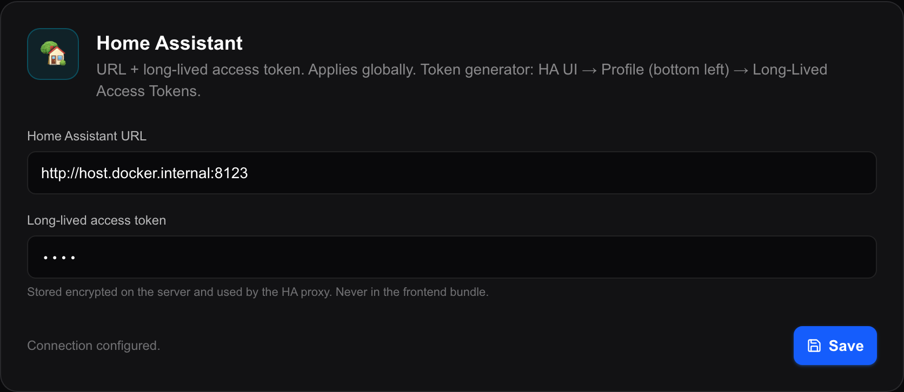
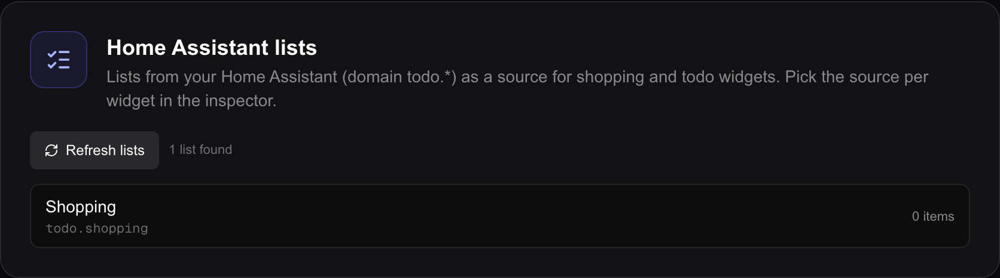

# Home Assistant

**Home Assistant** is the open-source home-control software many people run on a
machine at home. In it, every light, sensor, switch, camera and shopping list is
an **entity** with an id like `light.kitchen` or `sensor.hallway_temperature`.

Connecting Magic Frame to it is one address and one token, entered once. After
that every view can show and switch anything Home Assistant knows about. If you
do not run Home Assistant, nothing on this page applies and everything else in
Magic Frame still works.

This page is about **making the connection**. What you can then build with it is
on [Home Assistant widgets](widgets-home-assistant.md) (entities, notifications,
cameras, sensors, buttons), [The calendar widget](widgets-calendar.md) (Home
Assistant calendars), [Family widgets](widgets-family.md) (shopping lists and
to-dos) and [Time and weather widgets](widgets-time-weather.md) (a `weather.*`
entity as the forecast source).

## Where the connection lives

**Integrations is its own entry in the editor's left-hand menu — it is not
inside Settings.**

1. Open `http://192.0.2.10/editor` in a browser, replacing `192.0.2.10` with the
   address of the machine running Magic Frame.
2. Sign in.
3. Click **Integrations** (`Integrationen`) in the menu down the left side. The
   page is titled **Daten- & Medienquellen** (Data and media sources) and its
   address is `/editor/integrations`.
4. The first card on that page is **Home Assistant**.

## Making a token and pasting it in

A **long-lived access token** is a long string of characters that lets one
program talk to your Home Assistant without a password. You create it inside
Home Assistant and paste it into Magic Frame once.

1. Open your Home Assistant in a second browser tab.
2. Click your own user name at the very **bottom of the left sidebar**. Your
   profile page opens.
3. Find the **Long-lived access tokens** section on that page and click **Create
   token**.
4. Type a name for it — `Magic Frame` — and confirm.
5. Home Assistant shows the token **once**. Copy it now. If you lose it you
   cannot look it up again; you delete it there and make a new one.
6. Switch back to the Magic Frame tab, on `Editor → Integrations`.
7. In the **Home Assistant** card, type your Home Assistant's address into
   **Home-Assistant-URL** — for example `http://192.0.2.10:8123`. Include the
   `http://` and the port. A trailing slash does no harm; it is stripped before
   use.
8. Paste the token into **Long-Lived Access Token**. The field masks it, like a
   password.
9. Click **Speichern** (Save). The button turns green and reads **Gespeichert**
   (Saved) for about two seconds.
10. Look at the small line to the left of that button. It should now read
    **Verbindung konfiguriert.** (Connection configured). If it still says
    **Nicht konfiguriert — HA-Widgets bleiben leer** (Not configured — HA widgets
    stay empty), one of the two fields is empty.
11. Scroll down the same page to **Home Assistant Listen** and click **Listen
    aktualisieren** (Refresh lists). If your Home Assistant to-do lists appear
    there, the connection genuinely works — that button is the quickest proof.

The token is stored in Magic Frame's own database on your server and is used
only by the server. It is never sent to a display and never appears in a page a
browser downloads.

### Which address to type

- **Use the IP address, not a `.local` name.** Magic Frame runs inside a
  container, and a container does not resolve mDNS names such as
  `homeassistant.local` or names that only your router knows. The error you get
  otherwise says exactly this.
- **Include the port.** Home Assistant's own is `8123` unless you changed it.
- **`http://` is right for a normal home setup.** Use `https://` only if your
  Home Assistant really has a certificate. A self-signed certificate is refused
  by the server even though your browser accepts it.

## As a Home Assistant add-on, there is no token

If you installed Magic Frame as a **Home Assistant add-on**, skip everything
above. The add-on is handed a token by the Home Assistant **Supervisor** — the
part of Home Assistant that manages add-ons — and reaches Home Assistant at the
internal address `http://supervisor/core`. Nothing to create, nothing to paste.

Magic Frame notices it is running as an add-on by the presence of
`/data/options.json` (the file the Supervisor writes), or by the
`SUPERVISOR_TOKEN` variable. The environment variable `MAGIC_FRAME_ADDON` forces
the answer either way if the automatic detection is ever wrong.

**Anything you type into the card wins over the Supervisor connection.** That is
the only reason to touch the fields in add-on mode: pointing the frame at a
*different* Home Assistant than the one it is running inside. See
[The Home Assistant add-on](home-assistant-addon.md).

## Which connection wins

Magic Frame decides once per request, in this order:

1. **What you typed** on the Integrations page — used as soon as *either* the
   URL or the token field has something in it.
2. **The Supervisor connection**, in add-on mode only.
3. **A connection left over from a very old version**, which stored the address
   and token on the view with the id `1`. This exists so installations from
   before the Integrations page kept working; you never set it deliberately.

If none of the three produces both an address and a token, every Home Assistant
feature is simply off: widgets stay empty and the server answers those requests
with *Home Assistant not configured*.

## How live state reaches a display

This is worth understanding, because it explains both why the frame is fast and
why Magic Frame cannot be run as two copies.

- **The server holds one single WebSocket connection to Home Assistant.** Not
  one per display, not one per widget. It opens on the first display that asks
  for live state, authenticates with your token, pulls a snapshot of *every*
  entity, and then subscribes to Home Assistant's `state_changed` events.
- **Every state that arrives is cached in the server's memory.** A display that
  connects later gets the cached snapshot immediately rather than waiting for
  the next time your kitchen light happens to change.
- **From there it is fanned out to the displays over SSE** — a one-way
  connection each display holds open, at `/api/ha/stream?ids=light.kitchen,…`.
  The first message is the snapshot for the ids that display asked for; after
  that only changes are sent, filtered to those ids. A blank comment is sent
  every 25 seconds so that proxies do not close the idle connection.
- **All widgets on one display share a single SSE connection**, not one each.
  The page collects the entity ids every widget wants, and opens one stream for
  the union of them. That is not tidiness: a browser allows only six
  simultaneous connections per address, and with a stream per widget the seventh
  widget froze the whole page.
- **`/api/ha/state?ids=…` is the fallback**, a plain question-and-answer request
  that reads the entities once. Widgets use it when live sync is switched off,
  and it is what polls a media player for the wallpaper's album artwork.

If the connection to Home Assistant drops, the server tries again after two
seconds, then four, then eight, up to a minute between attempts, for as long as
at least one display is listening. It re-reads the address and token on every
attempt, so correcting a wrong token on the Integrations page is picked up by
the next retry — you do not have to restart anything.

**This is why Magic Frame runs as one instance and cannot be scaled to two.**
The entity cache and the WebSocket live in the memory of a single process. A
second copy would hold a second connection and a second cache, and displays
would be split between them. See [Concepts](concepts.md).

## Home Assistant lists

Home Assistant has its own to-do lists — the built-in shopping list, plus
anything an integration adds. Each one is an entity in the `todo.` domain.

1. On `Editor → Integrations`, scroll to **Home Assistant Listen** (Home
   Assistant lists).
2. Click **Listen aktualisieren** (Refresh lists).
3. Every `todo.*` entity appears with its name, its entity id underneath, and
   how many entries it currently holds. A counter beside the button says how
   many were found.

This card is a **read-only check** — there is nothing to tick here. You pick
which list a widget shows in that widget's own inspector; see
[Family widgets](widgets-family.md).

Two details worth knowing:

- **The item count is best effort.** Modern Home Assistant does not keep list
  items in the entity's state, so Magic Frame asks the `todo.get_items` service
  for them in one bundled call. If that call fails, the lists are still listed
  and still usable — they just all show `0`.
- **An empty result usually means the connection, not the lists.** The card says
  so: *no `todo.*` entities found — check whether the Home Assistant connection
  above is active and whether at least one list exists in Home Assistant.*

The list itself is served by `/api/ha-lists`;
`/api/ha-lists/[entity]/items` reads and writes the entries of one list for the
widgets.

## Switching things: how a service call works

Everything a view does *to* your house — tapping an entity pill, pressing a
button, running a script — goes through one route, `/api/ha/action`. Magic Frame
sends the call to Home Assistant; the display never talks to Home Assistant
itself and never sees your token.

The call carries an entity, a **domain** and a **service**. Left unset, the
domain is `homeassistant` and the service is `toggle`, which is what a plain tap
on a pill does. Three special cases exist because the generic toggle does not
cover them:

| Entity | What actually happens |
| --- | --- |
| `lock.*` | Home Assistant has no `lock.toggle`, and the generic toggle skips locks silently. The server reads the lock's current state and then calls `lock.lock` or `lock.unlock`. If the state cannot be read, it falls back to the generic toggle. |
| `button.*` | A button cannot be toggled, so it is pressed: `button.press`. |
| `input_button.*` | The same: `input_button.press`. |

A call that Home Assistant has not answered within five seconds is given up on,
so a slow or missing Home Assistant cannot make the whole display hang.

The Buttons widget's `ha_service` action is the general form: you name the
domain and service yourself — `script.good_night`, `scene.movie_time`,
`light.turn_on` — and can attach a JSON object of parameters. See
[Home Assistant widgets](widgets-home-assistant.md).

## What putting this on a wall really means

Be honest with yourself about this before you screw a tablet to the wall.

A view's address needs **no login**. That is deliberate, and it is the whole
reason a wall panel works: a tablet cannot type a password. The buttons on it
must work without a session, so the routes behind them do not ask for one.

**`/api/ha/action` has no login check** — it cannot have one, or the buttons on
a wall panel would not work. What it does have is a limit on *what* a caller
without a session may ask for:

- the entity has to be on one of your saved views, including any entity id
  hidden in the service payload;
- the service has to be one the widgets actually use (`toggle`,
  `turn_on`/`turn_off`, the cover controls, `lock`/`unlock`, `press`, the media
  transport) or a `domain.service` you put on a Button widget.

So somebody on your network can switch the lamp that is on your kitchen screen.
They cannot unlock a door that is on no screen, and they cannot reach
`hassio.host_reboot` by naming that lamp.

A signed-in editor session skips the limit — the entity picker has to be able to
try things that are not placed anywhere yet.

If you need to reach something that is genuinely on no view — a custom module
with a hard-coded entity, or a script of your own — turn the limit off with
`MAGIC_FRAME_HA_ACTION_UNRESTRICTED=1` in your `.env`. On the add-on it is the
`ha_action_unrestricted` option; on Kubernetes it is the same key in the
ConfigMap. The refusal message names the variable, so you do not have to
remember it.

The same is true of the reading side. These all answer without a login:

| Route | What it hands out |
| --- | --- |
| `/api/ha/entities` | **Every** entity in your Home Assistant, with its friendly name and current state. |
| `/api/ha/state` | The full state of any entities asked for. |
| `/api/ha/stream` | The same, live. |
| `/api/ha-lists` | Your to-do and shopping lists. |
| `/api/ha/history` | Up to a week of recorded history for an entity. |
| `/api/ha/camera/[entity]/snapshot`, `/stream`, `/webrtc` | A picture or a live stream from any camera. |
| `/api/ha/media/[entity]/artwork` | The album cover of a media player. |
| `/api/ha/local/[...path]` | Files from Home Assistant's `www` folder. |
| `/api/ha/notifications` | Your Home Assistant notifications. |

The editor and everything under `/editor` **is** behind the login. It is the
view-facing routes that are open, on purpose.

What follows from that:

- **Keep the machine on your own network.** On a home LAN this is the same
  exposure as a light switch in the hallway: whoever is in the house can use it.
- **Do not port-forward Magic Frame to the internet.** Publishing it publishes
  the list above, and with it your house. If you need access from outside, use a
  VPN into your own network, or Home Assistant's own remote access with the
  frame left where it is. See [Hosting and your domain](hosting-and-domain.md).
- **Think about which entities the token can reach.** The token is yours, so it
  can do everything you can. There is no read-only mode.

None of this is a reason not to use it — it is a reason to keep it indoors. See
also [Users and security](users-and-security.md) and
[Views and displays](views-and-displays.md).

## When it does not work

| What you see | What it usually is |
| --- | --- |
| Widgets stay empty, no error | No connection saved. The card's status line says `Nicht konfiguriert`. |
| *Hostname not resolvable* / `ENOTFOUND` | A `.local` or router-only name. Use the IP address. It can also be a DNS server that answers the IPv6 lookup with NXDOMAIN instead of NODATA, which throws the whole lookup away even though the IPv4 record is fine. |
| *Connection refused* / `ECONNREFUSED` | Wrong port, or something in between blocking it. |
| *Host unreachable* | From inside the container there is no route to that address at all. |
| *Connection reset* | Usually `https` pointed at an `http` port, or the other way round. |
| *TLS certificate not accepted* | A self-signed certificate. Your browser knows the exception, the server does not. Use `http` on the local network. |
| Timeout | Home Assistant did not answer within the time allowed. |
| `Home Assistant returned 401` | The token is wrong, or it was deleted in Home Assistant. Make a new one. |
| Live values freeze but the page is fine | The WebSocket dropped. It reconnects by itself at a slowing interval; the server log names the reason. |

**Several of these messages are shown in German even when the app is in
English** — they are produced by the server and have no English translation yet.

More in [Troubleshooting](troubleshooting.md).
