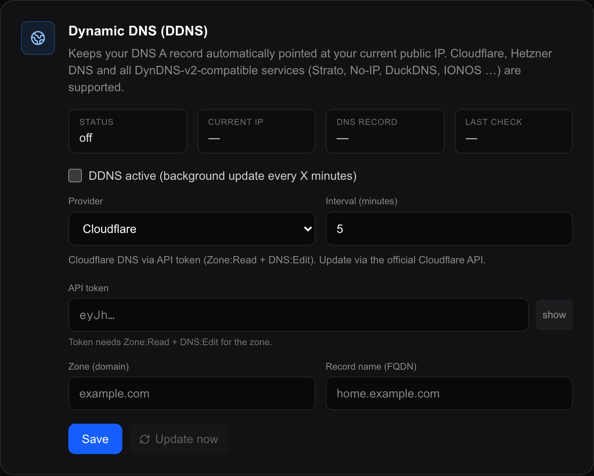

# Hosting and your domain

How Magic Frame is reached: on your own network with a plain address, or from
anywhere with a real domain and a real certificate. Also what to do when the
machine already runs a web server, and what to do when you would rather keep
your own reverse proxy in charge.

A **reverse proxy** is a program that sits in front of an application, takes the
requests from the outside and passes them on. Magic Frame ships with one —
[Caddy](https://caddyserver.com) — because a proxy is also the thing that
fetches and renews certificates, and doing that by hand is miserable.

---

## What listens where

The Docker stack publishes three things on the machine:

| Address on the machine | Container | What it is |
| --- | --- | --- |
| `${HTTP_PORT}` → 80 | `caddy` | Plain HTTP. **This is the address people open.** |
| `${HTTPS_PORT}` → 443, TCP and UDP | `caddy` | HTTPS, once you configure a domain. UDP is for HTTP/3. |
| `127.0.0.1:2019` | `caddy` | Caddy's own control interface. Bound to the machine itself, so nothing on your network can reach it. |
| — | `db` | Postgres. **Not published**, reachable only from inside the stack. See [Installation](installation.md) if you need it from a database tool. |

The `app` container publishes **no** port at all. It listens on 3000 inside the
stack, and only Caddy talks to it. That is why there is no way to bypass the
proxy, and why changing ports is a matter of changing what Caddy binds.

### Changing the ports

Only needed when 80 or 443 are already taken on that machine — because it
already runs another web server, for instance.

1. Open `.env` in the folder holding `docker-compose.yml`.
2. Set both values, for example:

   ```
   HTTP_PORT="8080"
   HTTPS_PORT="8443"
   ```

3. Apply it, from that same folder:

   ```bash
   docker compose up -d
   ```

4. Every address now carries the port: `http://192.0.2.10:8080/editor`,
   `http://192.0.2.10:8080/view/kitchen`.

Leaving them unset keeps 80 and 443, so an existing installation is unaffected.
The full table of ports and volumes is in [Installation](installation.md).

**Automatic certificates need 80 and 443 reachable from the public internet.**
If you move HTTPS off 443 you are almost certainly terminating TLS somewhere
else — jump to [Behind your own reverse proxy](#behind-your-own-reverse-proxy).

---

## On your own network

This is the default and it needs no configuration at all. Find the address of
the machine running Magic Frame and open it:

| Who | Address |
| --- | --- |
| You, to build layouts | `http://192.0.2.10/editor` |
| A wall tablet, to show a screen | `http://192.0.2.10/view/kitchen` |

Give that machine a **fixed address** — either a static address in its own
network settings, or a permanent lease in your router keyed to its MAC address.
Otherwise every tablet in the house points at the wrong place the next time the
machine reboots.

A hostname works too if your network resolves one, but a plain address is one
fewer thing to break.

### The browser will try to make that HTTPS, and fail

**This is the single most common "it doesn't work" on a fresh installation.**

Chrome, Edge and Brave silently upgrade `http://` to `https://` for addresses
you type. On a new installation there is no certificate yet, so the upgrade
fails and the browser shows a connection error — before the request ever reaches
Magic Frame. The application is running fine; you simply never got to it.

Three ways out, in order of effort:

1. **Type the full path.** `http://192.0.2.10/login` instead of
   `http://192.0.2.10`. The automatic upgrade usually only fires on a bare
   address.
2. **Turn the setting off for good.** In Brave, `brave://settings/security` →
   *Always use secure connections* → off. Chrome and Edge have the same setting
   at `chrome://settings/security`. A per-site exception works too.
3. **Give it a domain**, below. Then the upgrade succeeds, because there is a
   real certificate to upgrade to.

---

## Automatic HTTPS with a domain

Magic Frame can fetch and renew a free Let's Encrypt certificate by itself. You
need a domain name you control, pointed at your home address.

1. Go to `Settings → Hosting & network` in the editor sidebar. The second card
   is **HTTPS (Caddy reverse proxy)**.
2. Leave the mode toggle on **Configured** (*Konfiguriert*).
3. Tick **Enable HTTPS**.
4. Type your domain in **Domain (FQDN)** — for example
   `dashboard.example.com`. It must already point at this machine.
5. Type an email address in **ACME email**. Let's Encrypt uses it for expiry
   warnings and refuses to issue without one.
6. Choose a **challenge mode** — this is how Let's Encrypt proves you own the
   name:

   | Mode | Choose it when |
   | --- | --- |
   | **HTTP-01** | Port 80 is open from the internet to this machine. Simplest. Nothing else to fill in. |
   | **DNS-01** | Port 80 is closed, or your provider blocks it, or you want a wildcard. Needs an API token for your DNS provider. |

7. For DNS-01, pick your **DNS provider** and fill in the fields it asks for.
   Ten are built in: Cloudflare, Hetzner DNS, AWS Route 53, DigitalOcean,
   DuckDNS, Porkbun, Namecheap, IONOS, Netcup and Linode.
8. Click **Save + reload**.
9. A green bar appears. Within a few seconds the **Status** tile at the top of
   the card changes to *TLS active* and the badge next to the card title turns
   into a green **TLS**. Your domain now works over HTTPS.

### The other controls on that card

| Control | What it does |
| --- | --- |
| **Additional domains** | More names on the same certificate. Type one, press Enter or **Add**; it appears as a removable chip. |
| **HTTP → HTTPS redirect** | On by default, and recommended. Switch it off and Caddy keeps serving plain HTTP on port 80 alongside HTTPS. |
| **Reload only** | Pushes the current configuration to Caddy again without saving changes. Useful when a certificate attempt failed and you want to retry. |
| **Show Caddyfile** | Prints the configuration file Magic Frame generated. Read-only, and the fastest way to see what actually got applied. |

The four tiles across the top are the status: **Status** (*TLS active* /
*HTTP proxy* / *not reachable*), **Domain**, **Mode** (which challenge and which
provider) and **Last reload**. They refresh by themselves every 30 seconds. When
something goes wrong, the error from the last attempt appears as a red bar under
them.

### After HTTPS works, set COOKIE_SECURE

The login cookie has a flag that says "only ever send me over HTTPS". It is off
by default, because switching it on before HTTPS works would stop you signing in
at all.

1. Open `.env` on the machine.
2. Set:

   ```
   COOKIE_SECURE="true"
   ```

3. Apply it, from the folder holding `docker-compose.yml`:

   ```bash
   docker compose up -d
   ```

4. In the editor, `Settings → Security` → *Session & cookies* now shows
   **Cookie Secure: on (HTTPS)**.

Everybody is signed out by this restart and signs in again — that is normal.
Do **not** set it while you still reach the dashboard over plain HTTP on the
network: the browser will refuse to keep the cookie and the login page will
simply reload forever.

### Custom Caddyfile mode

If your DNS provider is not in the list of ten, or you need something the form
cannot express, switch the mode toggle to **Custom Caddyfile**. The card turns
into a text box and whatever you write there is handed to Caddy verbatim.

The placeholder shows the shape:

```
mydomain.example.com {
    tls {
        dns gandi {env.GANDI_TOKEN}
    }
    reverse_proxy app:3000
}
```

Two things to know:

- **A syntax error cannot take the site down.** Magic Frame writes the file and
  then asks Caddy to load it; Caddy parses and validates it first and swaps
  atomically. If it does not parse, the previous configuration keeps running and
  you get the error back as a red bar.
- `app:3000` is where the application lives inside the stack. Keep that, unless
  you also set `APP_UPSTREAM` — see below.

### How this works underneath

Worth a paragraph, because it explains what to look at when something is stuck.
The `app` container writes the Caddyfile into a volume that both containers
share, then calls Caddy's control interface at `http://caddy:2019` and asks it
to load the new configuration. Magic Frame never restarts Caddy; a reload keeps
every open connection alive.

So a failure is one of two kinds, and the red bar tells you which: *writing the
Caddyfile failed* (the volume is not mounted or is full) or *Caddy admin not
reachable* (the `caddy` container is not running). Both are visible with
`docker compose ps` in the folder holding `docker-compose.yml`.

---

## Dynamic DNS

Most home connections get a new public address every so often. Dynamic DNS keeps
a DNS record pointed at the current one, so your domain does not go stale
overnight — and so the certificate above can keep renewing.



1. Go to `Settings → Hosting & network`. The first card is **Dynamic DNS
   (DDNS)**.
2. Tick **DDNS active**.
3. Pick a **provider**:

   | Provider | Fields it asks for |
   | --- | --- |
   | **Cloudflare** | API token (needs Zone:Read and DNS:Edit for the zone), zone, and the record name as a full name such as `home.example.com`. |
   | **Hetzner DNS** | Auth API token from the DNS console, zone, and the record name — full name, or just the sub-name, or `@` for the domain itself. |
   | **Generic (URL / DynDNS v2)** | One update address, for anything that speaks the classic DynDNS protocol: Strato, No-IP, DuckDNS, IONOS and most routers' own services. Optionally, the words in the reply that mean "changed" and "already correct" — the defaults are `good` and `nochg`. |

4. Fill in the fields. Each provider keeps its own set, so switching provider to
   look at another one does not lose what you already typed.
5. Set the **interval in minutes**. Five is the default and is plenty.
6. Click **Save**.
7. Click **Update now**. The **Current IP** and **DNS record** tiles fill in and
   should show the same value.

After that it runs by itself: the server checks every minute whether the
interval has elapsed, and only then looks up the public address and updates the
record if it changed. The four tiles — Status, Current IP, DNS record, Last
check — refresh in the browser every 30 seconds, and the last error, if any,
appears as a red bar. This is `/api/admin/ddns`, with the manual button on
`/api/admin/ddns/update`.

Two details:

- **IPv4 only.** The public address is looked up from `api.ipify.org` and is
  rejected unless it is a four-part IPv4 address. There is no AAAA record
  handling.
- **The token is shared with the certificate card.** If you set up Cloudflare or
  Hetzner here and then choose the same provider for a DNS-01 certificate, the
  HTTPS card fills the token in for you rather than asking again. The card says
  so with a green line under the provider dropdown.

---

## Behind your own reverse proxy

If you already run nginx, Traefik, nginx Proxy Manager, a Cloudflare Tunnel or
anything else that terminates TLS, let it keep doing that and leave Magic
Frame's own certificate handling switched off.

1. **Do not enable HTTPS** in the Caddy card. Left off, Caddy is a plain proxy
   on port 80 and nothing else.
2. **Move the ports** so your own proxy can have 80 and 443. In `.env`:

   ```
   HTTP_PORT="8080"
   HTTPS_PORT="8443"
   ```

3. **Point your proxy at `http://192.0.2.10:8080`** — the machine running Magic
   Frame, on the HTTP port you just chose.
4. **Tell Magic Frame its real address**, so links it generates — above all the
   OAuth return addresses for Google and Microsoft calendars — do not come out
   pointing at an internal name:

   ```
   APP_BASE_URL="https://dashboard.example.com"
   ```

   No trailing slash. Left empty, Magic Frame rebuilds the address from the
   `Host` header of each request, which is right for most setups and wrong for
   some.
5. **Set `COOKIE_SECURE="true"`**, since your proxy is serving HTTPS.
6. **Set `TRUSTED_PROXY_HOPS`** to how many proxies sit between the internet
   and Magic Frame — `2` when your own proxy forwards to the built-in Caddy.
   Magic Frame then takes the client address from that position in
   `X-Forwarded-For`, which your proxy has to be passing on. Left at the
   default, everyone behind your proxy counts as one address for the
   brute-force lock. Getting it wrong is safe: the address is treated as
   unknown and the per-account lock carries on. See
   [Users and security](users-and-security.md).
7. Apply everything, from the folder holding `docker-compose.yml`:

   ```bash
   docker compose up -d
   ```

### `APP_UPSTREAM`

Only relevant if you keep Magic Frame's Caddy but the application container is
not called `app`. That happens on Kubernetes, where the service may be named
something like `magic-frame-app`. Set:

```
APP_UPSTREAM="magic-frame-app:3000"
```

and every `reverse_proxy` line in the generated Caddyfile points there instead
of `app:3000`. Only a host name with an optional port is accepted; anything else
is ignored and the default is used, so nothing extra can be smuggled into the
configuration file. See [Installation](installation.md) for the Kubernetes side.

---

## When Magic Frame is a Home Assistant add-on

The HTTPS card **hides itself**. Instead of the domain and provider fields you
get a short paragraph, with an **Add-on** badge, saying that Home Assistant
handles the proxy and the certificate.

That is not a limitation being papered over — the add-on genuinely ships without
its own Caddy, because there would be two proxies fighting over the same job.
For access from outside, use Home Assistant's own remote access settings. The
dynamic DNS card is still there and still works.

Magic Frame detects the add-on by the presence of `/data/options.json`, which
the Supervisor creates for every add-on. Attempts to save a certificate
configuration are refused by the server as well, not just hidden in the
interface. See [The Home Assistant add-on](home-assistant-addon.md).

---

## When it does not work

| What you see | Usually |
| --- | --- |
| Browser error before the page loads, on a fresh install | The HTTPS auto-upgrade described [above](#the-browser-will-try-to-make-that-https-and-fail). Type `http://192.0.2.10/login` in full. |
| `Bind for 0.0.0.0:80 failed: port is already allocated` | Something else on the machine has port 80. Stop it, or set `HTTP_PORT`. |
| Status stays *HTTP proxy* after saving a domain | The certificate was not issued. Read the red bar; with HTTP-01 it is nearly always port 80 not being reachable from the internet. |
| Status says *not reachable* | The `caddy` container is not running. |
| Logged out again immediately after every sign-in | `COOKIE_SECURE="true"` while you are still on plain HTTP. |
| Google or Microsoft calendar drops its connection behind a proxy | `APP_BASE_URL` is not set. |

More of these, in more detail, on [Troubleshooting](troubleshooting.md).

## Where to go next

- [Installation](installation.md) — ports, volumes, and everything in `.env`
- [Users and security](users-and-security.md) — what is behind a login and what
  is not, before you open anything to the internet
- [Settings](settings.md) — the rest of the settings page
- [The Home Assistant add-on](home-assistant-addon.md) — running it inside Home
  Assistant instead
