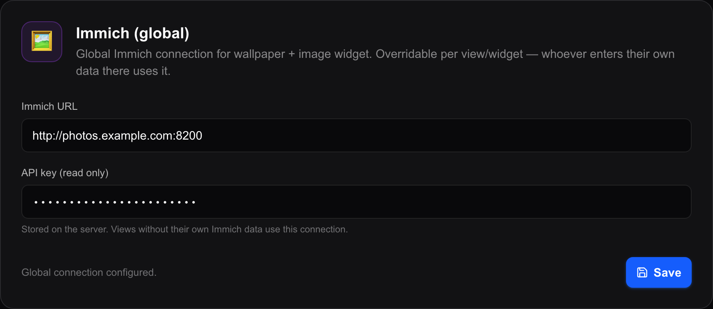

# Immich

**Immich** is self-hosted photo-library software — your own pictures, on your own
machine, with albums, faces and "on this day" memories. It is the source that
turns Magic Frame into a picture frame showing your family instead of stock
photography.

This page is about **connecting** to it. What the pictures then do on screen —
fit modes, split view, transitions, the photo info bar — is on
[Wallpapers](wallpapers.md), and the Image widget that shows an album inside a
tile is on [Media and photo widgets](widgets-media.md).

Two things are true of every Immich source here:

- **The display never talks to Immich.** Magic Frame fetches each picture on the
  server and passes it on, so your API key never leaves the machine and a wall
  tablet does not need to reach Immich at all.
- **Pictures are served as Immich's own *preview* rendition**, not the original
  file. That is what keeps a 4K television loading photographs quickly.

## Making a read-only API key in Immich

An **API key** is a long string that lets one program read your library without
your password.

1. Open Immich in a browser and sign in.
2. Click your account picture in the top right corner, then **Account
   Settings**.
3. Open the **API Keys** section and create a new key.
4. Give it a name — `Magic Frame` — and grant it **read** permissions only.
   Magic Frame never writes to Immich: it lists albums, lists named people,
   searches for assets, reads memories and downloads picture previews. Nothing
   else.
5. Immich shows the key once. **Copy it now**, because you cannot look it up
   again.

## The global connection

Enter the key once and every view can use it.

**Integrations is its own entry in the editor's left-hand menu — it is not
inside Settings.**

1. Open `http://192.0.2.10/editor` in a browser, replacing `192.0.2.10` with the
   address of the machine running Magic Frame, and sign in.
2. Click **Integrations** (`Integrationen`) in the menu down the left side.
3. Find the card headed **Immich (global)**.
4. Type your Immich address into **Immich-URL** — for example
   `http://192.0.2.10:2283`. Include the `http://` and the port; Immich's own is
   `2283` unless you changed it.
5. Paste the key into **API-Key (Read Only)**. The field masks it.
6. Click **Speichern** (Save). The button turns green and reads **Gespeichert**
   (Saved) for about two seconds.
7. The line beside the button now reads **Globale Verbindung konfiguriert.**
   (Global connection configured). Until both fields are filled it reads
   **Optional — nur nötig, wenn Views keine eigenen Daten haben** (Optional —
   only needed if views have no data of their own).

There is no *Test connection* button on this card. The honest test is to open a
view's wallpaper dialog and press **Mit Immich verbinden / Alben laden**
(Connect to Immich / load albums): if your albums appear, the connection works.

## The global connection and a per-view one

A view's wallpaper dialog has its own **Immich Instanz URL (Domain)** and
**API-Key** fields, and this is the rule:

> **Leave both empty and the view uses the global connection. Fill them in and
> this one view uses those instead.**

For the wallpaper, the two fields fall back **independently**: a view that has an
address but no key uses its own address with the global key. That is almost never
what anyone wants, so fill in both or neither.

The Image widget has the same override and adds a choice of *which* connection to
follow — and there it is all or nothing: with **Vom View (Wallpaper)** selected,
a wallpaper that does not have both fields filled is ignored and the global
connection is used.

| Where | The choice |
| --- | --- |
| `Editor → Integrations → Immich (global)` | The connection every view falls back to. |
| A view's **Wallpaper → Quelle** tab | Empty fields = the global one. Filled = this view's own server and key. |
| The Image widget's **Immich-Quelle** | `Global (Einstellungen)` uses the global connection; `Vom View (Wallpaper)` uses the one from this view's wallpaper — and falls back to the global one if the wallpaper has none. |

Why bother with per-view credentials at all: two Immich servers, or two accounts
on one server. A children's tablet showing a different person's library from the
kitchen screen is the case this exists for.

**Installations from before the global connection existed keep working.** Their
Immich details sit on each view and count as an override, so nothing changes
until you clear them.

## The four sources

Choose one under **Immich-Quelle** (Immich source) in the wallpaper dialog. All
four are described here; the click-by-click setup is in
[Wallpapers](wallpapers.md).

| Source | Dropdown entry | What you get |
| --- | --- | --- |
| `album` | Album | Every photo in the albums you tick. **Several albums at once.** |
| `favorites` | Favoriten | Every photo you starred in Immich. No album needed. |
| `memories` | Rückblicke (Memories) | Immich's "on this day, X years ago" pictures, for today. |
| `people` | Personen | Every photo showing **at least one** of the people you tick. |

### Album

Press **Mit Immich verbinden / Alben laden** and the list fills with your albums
and their photo counts, sorted by name. Tick as many as you like.

- Several ticked albums are **merged into one shuffled slideshow**.
- A photo that sits in two ticked albums appears **once**, not twice.
- One album that has been deleted or is unreadable does not take the others down
  — it contributes nothing and the rest still play.
- Both old and new Immich versions work. Immich 3.0 stopped returning an album's
  photos with the album itself, so Magic Frame falls back to searching for the
  album's contents when it sees only a count.

### Favourites

Everything with a star in Immich. Nothing to pick, and the slideshow follows the
library: star a picture and it is in the rotation the next time a display
reloads.

### Memories

Immich's own "on this day" collections **for today**. Magic Frame asks Immich to
filter them to the current date, and filters by day and month itself as well in
case an older Immich version ignores the request. The set changes by itself as
the date moves.

One wrinkle, handled for you: Immich's memories are returned without the extra
photo details that every other source carries. Without them there would be no
place name in the info bar, and every memory would count as landscape in split
view. Magic Frame therefore fetches those details afterwards, for up to 120
photos, a few at a time.

### People

The one people ask for. Press **Mit Immich verbinden / Personen laden** and a
grid of faces appears; tick the ones this frame should show.

- **Only people you have given a name to in Immich appear here.** Immich creates
  an entry for every face it detects, and a list of several hundred unnamed
  faces would be unusable. Name them in Immich first and press the button again.
- People you hid in Immich stay hidden here too.
- **Ticking several people shows a photo containing *any* of them**, not only
  photos containing all of them. Immich's own search does the opposite, so Magic
  Frame asks per person and merges the results. A picture with two ticked people
  on it still appears once.
- One person deleted in Immich does not break the others; that person simply
  contributes nothing.
- The faces in the grid come through Magic Frame as well
  (`/api/wallpaper/immich/people/thumbnail`), so the key stays on the server even
  in the editor.

## How many pictures, and how they are chosen

- Up to **1500 photos** go into one wallpaper slideshow, shuffled properly.
- A larger album still works: Magic Frame reads far more than that from Immich —
  up to 20 pages of 1000 — shuffles the lot, and takes 1500. Photo number 4999
  has the same chance of being shown as photo number 3.
- The **Image widget** is smaller: up to **200** photos from one album.
- **The playlist is built when the page loads.** A photo added to an album
  afterwards appears on the display after its next reload; see the per-view
  auto-refresh in [Views and displays](views-and-displays.md).
- **Every display shuffles for itself.** Two screens showing the same album are
  not on the same picture.

## The routes involved

You never call these yourself; they are here so you know what talks to what.

| Route | What it does |
| --- | --- |
| `/api/wallpaper/immich/albums` | Lists your albums for the wallpaper dialog. |
| `/api/wallpaper/immich/people` | Lists your **named** people. |
| `/api/wallpaper/immich/people/thumbnail` | One face picture for that grid. |
| `/api/wallpaper/immich/playlist` | Builds the slideshow for a view — the chosen source, shuffled, with photo details and portrait/landscape worked out. |
| `/api/wallpaper/immich` | Serves one photo to a display. |
| `/api/immich-widget` | The Image widget's album list and its playlist. |
| `/api/immich-widget/image` | Serves one photo to the Image widget. |

The two list routes accept an address and key **in the request** so the editor
can show your albums before you have saved anything. Nothing entered there is
stored; leave them empty and the global connection is used instead.

## When it does not work

| What you see | What it usually is |
| --- | --- |
| *API key invalid, or has no permission to read albums* | The key was typed short, or it was made without read permission. Make a new one. |
| *Timeout — is the Immich URL correct and reachable on the same network?* | A `.local` name, or the wrong port. Magic Frame runs in a container and does not resolve names your router invents; use the IP address. |
| *Could not reach Immich. URL correct?* | Same family of problem, without the wait — usually the port. |
| Album list stays empty, no error | The connection works but the account genuinely has no albums. |
| People grid stays empty | No **named** people in Immich yet. The card says so. |
| The screen is **black** | The source could not be reached when the display loaded, or the album is empty. Magic Frame does **not** fall back to the bundled pictures. See [Wallpapers](wallpapers.md), which explains this at length. |
| A view ignores the global connection | That view has its own Immich fields filled in. Clear both and it falls back. |

More in [Troubleshooting](troubleshooting.md).
