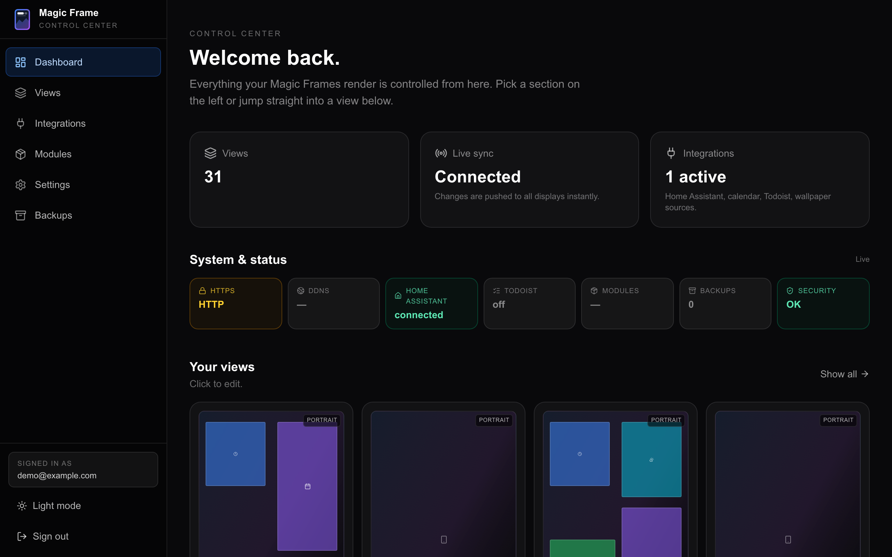
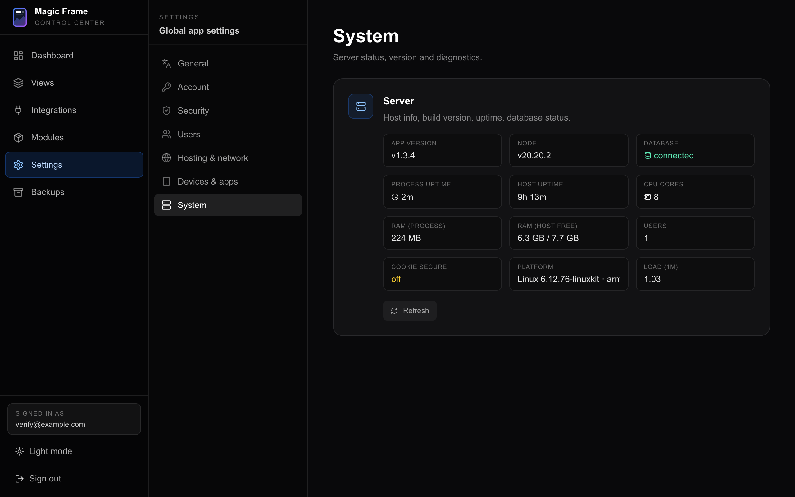

# Installation

Every way to install Magic Frame, and which one to pick.

Magic Frame is **one program on one machine you own**. That machine holds your
layouts, your settings and your accounts, and every screen in the house opens an
address on it. It ships as a **Docker stack** — a bundle of three containers
that start together, so you never install a database by hand:

| Container | What it does |
| --- | --- |
| `app` | The Next.js application. The editor, the views, the API. Listens on port 3000 **inside** the stack only. |
| `db` | Postgres 16. Holds layouts, users, snapshots, calendar tokens, uploaded modules. |
| `caddy` | A web server in front of the app. Plain HTTP by default; it fetches a real certificate by itself once you configure a domain. |

## Which one should you pick

| Situation | Use |
| --- | --- |
| A Linux box, a Pi, a NAS, a laptop — anything with Docker | **[The one-line installer](#the-one-line-installer)**. This is the normal path. |
| You want the code checked out first and to read the script before running it | **[Clone, then run the script](#clone-then-run-the-script)** |
| You changed the source, or you run a fork | **[Build from source](#build-from-source)** |
| You already manage your own `docker compose` stacks and want no script | **[Docker Compose by hand](#docker-compose-by-hand)** |
| You run a Kubernetes or k3s cluster | **[Kubernetes](#kubernetes)** |
| Home Assistant is the box that is always on | **[The Home Assistant add-on](home-assistant-addon.md)** — no separate machine, no Docker knowledge, no access token |

## Where it runs

| Hardware | |
| --- | --- |
| Raspberry Pi 4 / 5, mini-PC (NUC, Beelink, …) | Yes |
| Synology / QNAP NAS | Yes — through the Docker package in the NAS operating system |
| Old laptop / desktop / Mac mini | Yes |
| VPS / cloud server | Optional — only if you want access from outside your home |

As long as you do not deliberately set up a domain, everything stays on your own
network. Nothing is sent anywhere.

Free disk space matters more than anything else: the installer warns below
roughly 5 GB free. Pulling the ready-built images needs about 2–3 GB; building
from source needs about 5 GB.

---

## The one-line installer

`deploy/install.sh` is the default path. It downloads ready-built images for
`amd64` and `arm64`, so a Raspberry Pi does not spend twenty minutes compiling.

1. Open a terminal **on the machine that will run Magic Frame**.
2. Install `curl` if `curl --version` says it is missing. A minimal Debian, a
   Proxmox container template or a stripped-down VM image usually has no curl,
   and both commands below need it:

   ```bash
   sudo apt update && sudo apt install -y curl   # Debian, Ubuntu, Raspberry Pi OS
   sudo dnf install -y curl                      # Fedora, Rocky, AlmaLinux
   sudo pacman -S --noconfirm curl               # Arch
   sudo apk add curl                             # Alpine
   ```

3. Install Docker if it is not there yet:

   ```bash
   curl -fsSL https://get.docker.com | sh
   ```

4. Run the installer:

   ```bash
   curl -fsSL https://raw.githubusercontent.com/jeremiaa/magic-frame/main/deploy/install.sh | bash
   ```

4. Wait. When it finishes, the terminal prints **Magic Frame is running!** and an
   address ending in `/editor`.
5. Open that address in a browser and create your admin account. See
   [Getting started](getting-started.md).



### What the script actually does

In order:

1. **Checks the prerequisites.** `docker` must be installed, the `docker
   compose` plugin must exist (not the old separate `docker-compose` binary),
   and the Docker daemon must be running and reachable by your user. It stops
   with a plain-English message if any of that is missing.
2. **Warns about disk space** if the current volume has less than 5 GB free.
3. **Clones the repository** into a folder named `magic-frame`, or updates it if
   it is already there. If you run the script from inside an existing checkout,
   it updates that one in place.
4. **Writes `.env`** by copying `.env.example`, and generates `SESSION_SECRET` —
   64 characters of hex, using `openssl` if present and `/dev/urandom` otherwise.
   An existing `SESSION_SECRET` is never overwritten, because replacing it would
   log everyone out. The file is then set to `chmod 600`.
5. **Detects your time zone** and writes it into `TZ` in `.env`. Without this the
   containers run on UTC, which shifts every calendar time. It looks at
   `timedatectl`, then `/etc/timezone`, then where `/etc/localtime` points. An
   existing `TZ` value is kept.
6. **Pulls the images and starts the stack.** If the pull fails — a fork with no
   published images, or no internet — it falls back to building from source so
   the install still finishes.
7. **Waits for the app**, polling `/login` up to 60 times, two seconds apart.
8. **Prints the summary**: the address to open, how to see the logs, how to stop,
   how to update, and a database backup command.

The script is safe to run again. Re-running it is also how you update — see
[Updating and backups](updating-and-backups.md).

### Options

| Passed as | Effect |
| --- | --- |
| `--build` | Build the images from source instead of pulling them. |
| `MAGIC_FRAME_BUILD=1` | The same thing as an environment variable. |
| `MAGIC_FRAME_DIR=<folder>` | Clone into a different folder name. Default `magic-frame`. |
| `MAGIC_FRAME_HOST=<address>` | Which address the summary prints. Default `0.0.0.0`, which makes it print `localhost` plus the detected LAN address. |

### If something in the repository was rewritten

The published history was rewritten a few times during launch week. If you
cloned in that window, a plain `git pull` fails with *divergent branches* or
*would clobber existing tag*. The installer handles both: it fetches tags with
`--force`, and if your copy has genuinely diverged it resets it to the published
version. Your `.env`, your database and your uploaded modules are untouched by
that — none of them live in the repository folder.

---

## Clone, then run the script

Identical result, but you get the code first and can read the script before you
run it. Useful if `curl | bash` makes you uncomfortable, or if `curl` is not
installed.

```bash
git clone https://github.com/jeremiaa/magic-frame.git
cd magic-frame
./deploy/install.sh
```

The script notices it is already inside the repository, updates it, and carries
on from step 4 above.

---

## Build from source

Use this if you changed the code, or you run a fork with no published images.

```bash
cd magic-frame
./deploy/install.sh --build
```

Everything else is the same. The build is slow — expect 15 to 25 minutes on a
Raspberry Pi — and it needs about 5 GB of free disk. `docker-compose.yml` keeps
both a `image:` line and a `build:` line, so both paths stay available in the
same file forever.

---

## Docker Compose by hand

If you would rather not run a script, the compose file is a normal one.

1. Get the repository:

   ```bash
   git clone https://github.com/jeremiaa/magic-frame.git
   cd magic-frame
   ```

2. Copy the example environment file:

   ```bash
   cp .env.example .env
   ```

3. **Put a real value in `SESSION_SECRET`.** This is the one field you must not
   skip. It signs the login cookie, and it has to be at least 32 characters.
   Generate one with `openssl rand -hex 32` and paste it in.

   > **If `SESSION_SECRET` is empty or shorter than 32 characters, `/login` and
   > `/editor` answer a plain-text 503 and explain what to do.** That is
   > deliberate: it used to let the request through instead, which meant a
   > missing secret quietly left the editor open to anyone. Displays keep
   > working either way — `/view/…` never needed a session.

4. Set `TZ` to your own time zone, for example `TZ="Europe/Berlin"`. Left empty,
   every container runs on UTC and calendar entries appear at the wrong time.
5. Start it:

   ```bash
   docker compose up -d
   ```

6. Open `http://<the-machine>/editor` and create your admin account.

### What is in `.env`

Everything except `SESSION_SECRET` is optional and can be added later, followed
by `docker compose up -d`.

| Variable | What it is for |
| --- | --- |
| `DATABASE_URL` | Where Postgres is. The default points at the `db` container. Change it only if you run your own database elsewhere. |
| `SESSION_SECRET` | Signs the login cookie. At least 32 characters. Required. |
| `COOKIE_SECURE` | Set to `true` once the site is served over HTTPS. If it disagrees with reality the browser refuses to store your login. |
| `APP_BASE_URL` | The full address the dashboard is reachable at, no trailing slash. Used for calendar OAuth callbacks. Left empty, the app rebuilds it from each request's `Host` header, which is right for most setups. |
| `APP_UPSTREAM` | The host and port Caddy uses to reach the app. Only needed when the app container is called something else — on Kubernetes, for example. |
| `HTTP_PORT`, `HTTPS_PORT` | Which ports on the host the stack occupies. Default `80` and `443`. |
| `TZ` | An IANA time zone such as `Europe/Berlin`, handed to all three containers. Empty means UTC. |
| `GOOGLE_CLIENT_ID`, `GOOGLE_CLIENT_SECRET` | Google Calendar. See [Calendars](calendars.md). |
| `MS_CLIENT_ID`, `MS_CLIENT_SECRET` | Microsoft 365 Calendar. See [Calendars](calendars.md). |
| `OPENWEATHERMAP_API_KEY` | Only if a weather widget uses the OpenWeatherMap provider. See [Weather providers](weather-providers.md). |
| `MAGIC_FRAME_UPDATE_REPO` | Which GitHub repository the update banner watches. Default `jeremiaa/magic-frame`; change it if you maintain a fork. |
| `CADDY_ADMIN_URL` | How the app reaches Caddy to reload it. Only change it if Caddy runs outside the stack. |

There is deliberately **no `ADMIN_EMAIL` / `ADMIN_PASSWORD` in `.env.example`**.
The first account is created in the browser on first visit, so your password
never sits in a plain-text file. The container still honours those two variables
if you set them yourself, but only while the user table is still empty.

The three integrations with their own credential fields — Google, Microsoft,
OpenWeatherMap — can also be entered in the interface under
`Editor → Integrations`, and what you enter there wins over the environment
variable.

### Ports the stack takes on the host

| Port | Container | Note |
| --- | --- | --- |
| `${HTTP_PORT}` → 80 | `caddy` | Default 80. This is the address people open. |
| `${HTTPS_PORT}` → 443 | `caddy` | Default 443, TCP and UDP. |
| `127.0.0.1:2019` | `caddy` | Caddy's admin interface, bound to the machine itself so nothing on the network can reach it. |
| — | `db` | Postgres. **Not published.** The database is reachable as `db:5432` from inside the stack and from nowhere else. |

Until recently the database port *was* published, with the default user and
password. Anything on your network that could reach the machine could read the
password hashes, the two-factor secrets, the companion tokens and the Home
Assistant token — and because a published Docker port is attached in front of
the host firewall, `ufw` blocking 5432 made no difference. If you connect with
pgAdmin or DBeaver and want it back, put it in a `docker-compose.override.yml`
next to the compose file, bound to the machine itself:

```yaml
services:
  db:
    ports:
      - "127.0.0.1:5432:5432"
```

Compose merges that file automatically, and an update never touches it.

The `app` container publishes **no** host port at all. Everything goes through
Caddy.

### Changing the ports

Only do this if 80 or 443 are already taken on that machine — because you
already run another web server there, for instance.

1. Open `.env` in an editor.
2. Set the two values, for example:

   ```
   HTTP_PORT="8080"
   HTTPS_PORT="8443"
   ```

3. Apply it:

   ```bash
   docker compose up -d
   ```

4. Your addresses now carry the port: `http://192.0.2.10:8080/editor` and
   `http://192.0.2.10:8080/view/kitchen`.

Automatic HTTPS from Let's Encrypt needs ports 80 and 443 reachable from the
public internet. If you move HTTPS off 443 you are almost certainly behind your
own reverse proxy doing the TLS — set `COOKIE_SECURE` and `APP_BASE_URL` to
match. See [Hosting and your domain](hosting-and-domain.md).

### Where the data lives

Six named Docker volumes, all of which survive an update:

| Volume | Contents |
| --- | --- |
| `magic_pgdata` | The whole database: layouts, users, snapshots, calendar tokens, uploaded modules. |
| `magic_wallpapers` | Uploaded images, including the ones you upload for Status cards. |
| `magic_configs` | Generated configuration written by the app. |
| `magic_caddy_config` | The Caddyfile the app writes and Caddy reads. |
| `magic_caddy_data` | Certificates and the ACME account key. |
| `magic_caddy_conf` | Caddy's own state. |

The database is named `magicdashboard`, from before the product was renamed.
**Do not rename it** — every existing installation would lose its data on the
next update, and nothing in the application refers to the name except the
connection string.

---

## Kubernetes

Two independent sets of Kubernetes material ship with the project.

> **The app must run at `replicas: 1`. This is not a recommendation.**
>
> The application keeps things in the memory of a single process that have no
> shared backing store: the live-sync connections that push layout changes to
> every display, and the Home Assistant bridge, which holds **one** WebSocket to
> Home Assistant and caches every entity state in memory. There is no Redis
> adapter. A second replica would split the displays between two processes that
> cannot see each other, and live updates would silently stop working for some
> of them. On top of that the app runs `prisma db push` at startup, so two pods
> starting together would race on the schema.
>
> A wall dashboard scales vertically, not out. Every manifest and template in
> the repository is already set to `replicas: 1`; leave it there.

### The Helm chart

`kubernetes/` holds a community Helm chart contributed by @RudiKlein, with a
full deployment guide at
`kubernetes/docs/magic-frame-kubernetes-deployment-guide.md`. It offers three
routes to the same set of resources:

| Route | For |
| --- | --- |
| `helm install magic-frame . -f values.yaml` | The fastest path; Helm manages the release. |
| `helm template … \| kubectl apply -f -` | You want Helm's templating but apply the manifests yourself. |
| `kubectl apply -f authoring/with-caddy/` or `authoring/without-caddy/` | No Helm at all. These files are the committed output of `helm template`. |

Before the first deploy, three values in `values.yaml` must be changed — they
ship as obvious placeholders:

| Key | Set it to |
| --- | --- |
| `appConfig.sessionSecret` | A unique random value, at least 32 characters. |
| `appConfig.dbPassword` | Your own database password. |
| `caddy.enabled` | `true` if you want the bundled Caddy as the entry point, `false` if you already run your own ingress controller. |

With Caddy disabled, the app is exposed through a NodePort service on
`nodePorts.httpPort` (default `30080`) and you point your own proxy at it. Note
that storage is provisioned statically with `hostPath` volumes by default, which
only works reliably on a single-node cluster; the guide explains how to switch
to a dynamic StorageClass such as k3s's `local-path` instead.

### The hand-written manifests

`deploy/k8s/README.md` is a second, smaller set: copy-paste YAML blocks for a
namespace, secrets, Postgres, the app and an Ingress. It makes one deliberate
change from the Compose stack — **Caddy is dropped**, and TLS is left to your
ingress controller and cert-manager, which is the normal way to do it on
Kubernetes. The in-app domain and TLS settings do nothing in that arrangement.

Two things that catch people out there:

- **Live updates need a WebSocket upgrade through your ingress.** nginx-ingress
  and Traefik (the k3s default) both do this out of the box. If live updates
  stop arriving after a while, the ingress is closing the idle connection —
  raise the read and send timeouts.
- **Pin the image.** `ghcr.io/jeremiaa/magic-frame-app:latest` is fine to try
  with, but use a version tag in production so that a pod restart does not
  silently move you to a new release.

---

## Home Assistant

If Home Assistant is already the machine that never turns off, you do not need
any of the above. Magic Frame installs as an add-on, brings its own database,
and talks to Home Assistant through the Supervisor — so there is no access token
to create. See [The Home Assistant add-on](home-assistant-addon.md).

---

## Checking what you actually installed

`Settings → System` (Einstellungen → System) reports the running version, the
platform, uptime, memory, whether the database is reachable and how many
accounts exist. It is the quickest way to confirm an install or an update did
what you think it did.



## After installing

| Next | Page |
| --- | --- |
| Create your account and build the first screen | [Getting started](getting-started.md) |
| Understand views, widgets, wallpapers | [Concepts](concepts.md) |
| A domain and real HTTPS | [Hosting and your domain](hosting-and-domain.md) |
| Keeping it up to date, and backups | [Updating and backups](updating-and-backups.md) |
| It did not come up | [Troubleshooting](troubleshooting.md) |
