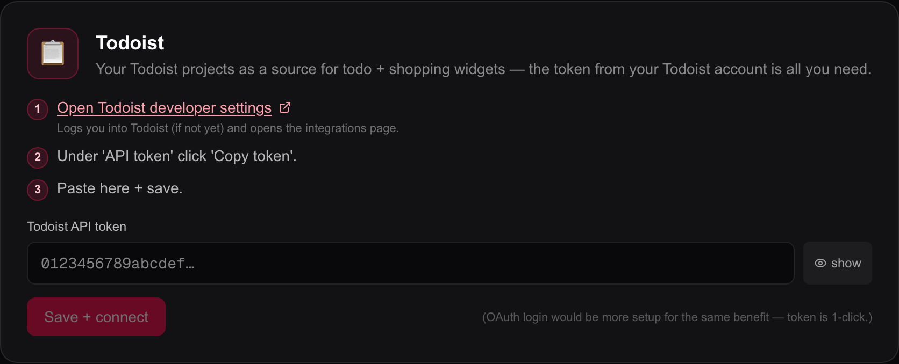

# Other sources

Three smaller connections: a **WebDAV folder** on your NAS for photographs,
**Todoist** for lists, and **RSS** feeds for headlines. None of them needs the
others, and none is required.

| Source | What it feeds | Where you set it up |
| --- | --- | --- |
| WebDAV | The wallpaper of one view | The view's own **Wallpaper** dialog |
| Todoist | The Shopping list and Todos widgets | `Editor → Integrations` |
| RSS | The RSS widget, and the RSS card in the Notifications widget | In the widget itself |

**Integrations is its own entry in the editor's left-hand menu — it is not inside
Settings.** Open `http://192.0.2.10/editor` (replacing `192.0.2.10` with the
address of the machine running Magic Frame), sign in, and click **Integrations**
(`Integrationen`) in the menu down the left side.

## A WebDAV folder

**WebDAV** is a way of reaching a folder on another machine over the network,
and nearly every NAS speaks it — Synology, QNAP, OpenMediaVault, a Nextcloud, a
Raspberry Pi with a shared drive. Turn it on in your NAS's own settings first; on
most it is a service you switch on and which then listens on a port of its own.

WebDAV is used for **wallpapers only**. No widget reads from it.

### Connecting one

1. In the editor, open the view and click **Wallpaper** in the toolbar above the
   canvas.
2. On the **Quelle** (Source) tab, choose **Lokaler NAS Ordner (WebDAV)**.
3. Type the server address into **WebDAV Server-URL (z.B. NAS)** — for example
   `http://192.0.2.20:5005`. If you leave the `http://` off, Magic Frame adds it
   rather than failing.
4. Type the user name and the password for the NAS.
5. Click **NAS Verbinden / Ordner wählen** (Connect NAS / choose folder). The
   folder list fills.
6. Click through the folders until you reach the one you want. Above the list, a
   line tells you **how many usable pictures are in the folder you are standing
   in**.
7. Close the dialog and press **Speichern** (Save) in the header.

The picture count in step 6 is the fastest way to be sure before a screen shows
you nothing. Two Synology-specific folders — `@eaDir` and `#recycle` — are hidden
from the list, because they are thumbnails and deleted files rather than
anything you want on a wall.

### Which files are used

| Kind | Extensions | What happens |
| --- | --- | --- |
| Shown | `.jpg`, `.jpeg`, `.png`, `.webp`, `.gif`, `.avif`, `.bmp` | Used as wallpaper. |
| Deliberately skipped | `.heic`, `.heif`, `.tif`, `.tiff`, `.cr2`, `.cr3`, `.nef`, `.arw`, `.dng`, `.raf`, `.orf` | Counted, then skipped. |

**HEIC and camera RAW files are excluded on purpose, because no browser can draw
them.** A folder copied straight off an iPhone is usually all HEIC, and a folder
straight off a camera is all RAW. Rather than reporting an empty folder — which
sends people hunting for a connection fault that does not exist — Magic Frame
counts those files separately and says what it found: *this folder holds N
pictures in a format browsers cannot show (for example HEIC or RAW). Please use
JPG, PNG or WebP.*

Converting them to JPG on the NAS is the fix. There is no conversion inside Magic
Frame, and adding one would mean a resizing pipeline the project deliberately does
not have.

### The rest of the honest list

- **Only the folder you chose is read.** Sub-folders are not searched. Point the
  view at the folder that actually holds the pictures.
- **Up to 100 pictures** are taken per load, at random, from that folder. A
  folder of 4000 photographs works; you see a different hundred each time a
  display reloads.
- **The NAS password stays on the server.** Every picture is fetched by Magic
  Frame and passed on through `/api/wallpaper/webdav`, so a display never needs
  to reach the NAS and never sees the credentials.
- **These credentials are per view.** There is no global WebDAV connection on the
  Integrations page; each view that uses a NAS folder carries its own.
- **The photo info bar shows raw coordinates, not place names.** Magic Frame
  reads the first 128 KB of each file to get its EXIF block, which gives the date
  and the camera model; there is no lookup of the town name for NAS photos. A
  file with no EXIF falls back to its modification date, which is when it landed
  on the NAS rather than when it was taken. See [Wallpapers](wallpapers.md).
- **If the NAS is asleep when a display reloads, the screen goes black.** There
  is no fallback to the bundled pictures. [Wallpapers](wallpapers.md) explains
  this at length; it is the single most common cause of a dark frame.

The folder browser is `/api/webdav/browse`, the slideshow is built by
`/api/wallpaper/webdav/playlist`, and single pictures are served by
`/api/wallpaper/webdav`.

### When it does not work

| What you see | What it usually is |
| --- | --- |
| *Falscher Benutzername oder Passwort* (Wrong user name or password) | Exactly that. Some NAS systems want the full user name including a domain. |
| *Der eingestellte Ordner existiert auf dem Server nicht* (The chosen folder does not exist) | The folder was renamed or removed on the NAS. Browse to it again. |
| *NAS nicht erreichbar* (NAS unreachable) | Wrong address or port, the NAS asleep, or WebDAV not switched on. |
| The folder list loads but shows no pictures | The count line tells you whether the folder is empty or full of HEIC and RAW. |

## Todoist

Todoist is a to-do service. Connecting it lets the Shopping list and Todos
widgets show — and tick off — a Todoist project, so the wall panel and everyone's
phone hold the same list.

### Connecting it

1. Go to `Editor → Integrations` and find the card headed **Todoist**.
2. Click **Todoist Developer-Settings öffnen** (Open Todoist developer settings).
   It opens `https://app.todoist.com/app/settings/integrations/developer` in a
   new tab, signing you in on the way if needed.
3. Under **API token**, click **Copy token**.
4. Back in Magic Frame, paste it into **Todoist API-Token**. The **anzeigen**
   (show) button beside the field reveals what you pasted.
5. Click **Speichern + Verbinden** (Save and connect).
6. The token is tested immediately. On success the message *Token gespeichert +
   verifiziert* appears, a green **verbunden** badge appears beside the card's
   title, and your projects are listed underneath with their ids.

If the token is refused, Magic Frame shows **what Todoist actually said**,
including the HTTP status, rather than assuming the token is wrong. An amber
**Fehler** (Error) badge with *Token gespeichert, aber Verbindung
fehlgeschlagen* means the token is stored but Todoist would not accept it.

**Token ändern** (Change token) replaces it; **Entfernen** (Remove) deletes it
after a confirmation.

Magic Frame does not offer a Todoist sign-in with a consent screen — the card
says why, at the bottom: an OAuth flow would be considerably more setup for the
same result, where the token is one click.

### What it can do

Magic Frame talks to Todoist's **unified API v1**. The older REST v2 was
switched off by Todoist and now answers every request with *410 Gone*; if you
are running a version from before that change, this is why lists stopped
loading.

Through it, a view can list your projects, list the tasks in one, add a task,
rename it, set a due date and priority, tick it off, un-tick it, and delete it.
Which of those a widget actually offers is on
[Family widgets](widgets-family.md).

**Todoist only returns open tasks.** A Todoist-backed list therefore shows
nothing under "done" and cannot un-tick something you just ticked, because
Todoist has no call for "give me everything completed here".

### What a display can reach

Be aware of this before putting a Todoist list on a wall.

The two routes the widgets use — `/api/todoist/projects` and
`/api/todoist/tasks/[projectId]` — **have no login check**, deliberately, because
a view has no session and the widgets have to work on it. The consequence is that
anyone who can reach the Magic Frame server over the network can list your
Todoist projects and read, add, complete and delete tasks in them.

Your token itself never leaves the server, and the project list that goes out
carries only names and ids. But keep the machine on your own network and do not
publish it to the internet. The same reasoning, at greater length, is under
["What putting this on a wall really means"](home-assistant.md) and in
[Users and security](users-and-security.md).

The token is entered and changed through `/api/admin/todoist`, which **is**
behind the login like everything else under `/editor`.

## RSS feeds

An **RSS feed** is a machine-readable list of a site's latest articles. Most news
sites, blogs and many local authorities publish one; the address usually ends in
`/rss`, `/feed` or `.xml`.

There is nothing to set up centrally. You paste feed addresses into the RSS
widget, or into the RSS card of the Notifications widget — see
[Media and photo widgets](widgets-media.md) and
[Home Assistant widgets](widgets-home-assistant.md).

### What the server does with them

Feeds are fetched and parsed **on your server**, through `/api/rss`, and never by
the display. That is not a preference: a browser cannot load a feed from another
site directly, because the site does not permit it.

- **RSS 2.0 and Atom both work.** The parser is deliberately small and looks for
  the title, the link, the date, a picture and a teaser — enough for headlines,
  not a full reader.
- **Up to 8 feeds** are merged into one list. Paste more and the extra ones are
  ignored.
- **Each feed is cached for 10 minutes**, keyed on its address, so several
  displays showing the same feed cause one request.
- **A feed has 10 seconds to answer.** One that is slow or broken is simply left
  out and the others still draw. Only when *every* feed fails does the widget
  show an error.
- **Articles are sorted newest first.** Anything without a date goes to the end,
  in the order the feed listed it.
- **Duplicates are removed** by their link, falling back to the title. Some feeds
  list the same article twice, and merging several feeds from one publisher
  overlaps; the newest copy is kept.
- **The source label is the feed's host name**, with `www.` removed.

### Pictures and teasers

If a feed provides a picture, Magic Frame finds it — an `enclosure`, a
`media:thumbnail`, a `media:content`, or failing those the first real image
inside the article's own HTML. Tracking pixels, spacers, Feedburner graphics,
advertising images and Gravatar avatars are skipped, which is why a feed that
looks image-heavy in a reader sometimes shows no picture here: everything it
carried was one of those.

The teaser is the article's description with the HTML stripped out and the
whitespace collapsed, cut at 300 characters. A description identical to the
title is dropped rather than printed twice.

### What does not work

- **Feeds behind a login or an API key.** Requests carry no credentials, so a
  feed that needs them answers with an error and is skipped.
- **Podcast audio, full article text, comments.** Only what the list above names
  is read.
- **More than 50 articles** from one request. The widget's own limit is lower
  again — see [Media and photo widgets](widgets-media.md).
