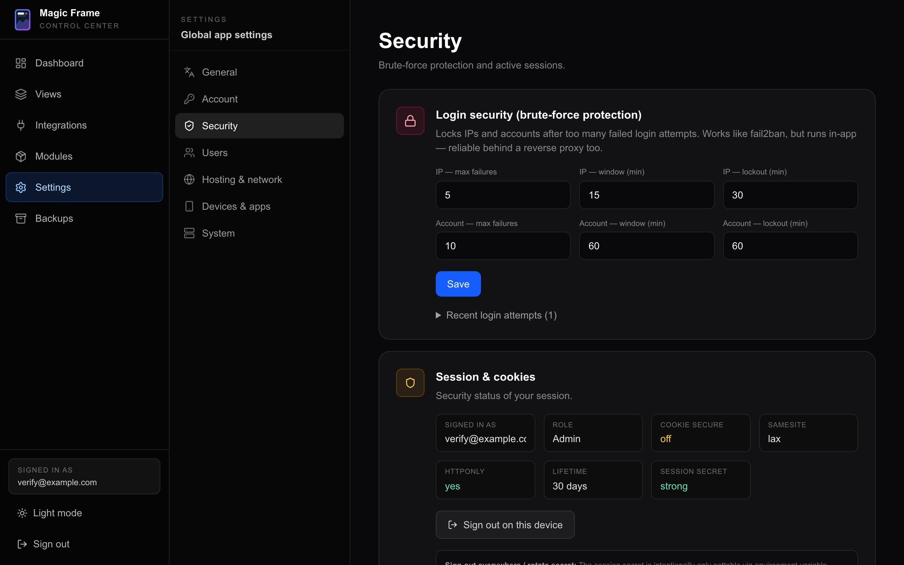
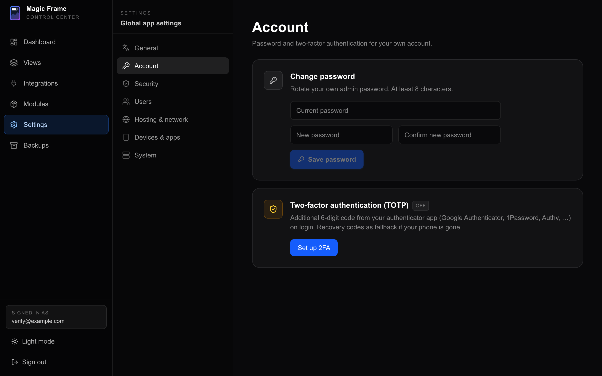
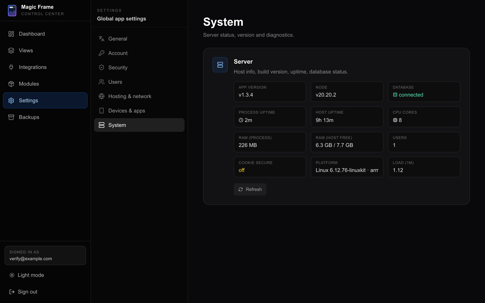

# Settings

Everything that applies to the **whole installation** rather than to one screen:
your language, your password, who else may log in, how the machine is reached
from outside, and what the server is doing right now.

Settings that belong to *one screen* — its background, its tiles, its refresh
interval — are not here. Those live in the view itself; see
[The editor](the-editor.md).

## Finding it

1. Open the editor at `http://192.0.2.10/editor` and sign in.
2. In the dark sidebar on the left, click **Settings** (German: *Einstellungen*).
3. A second, narrower sidebar appears with seven entries. The first one,
   **General**, is already selected.

On a phone the second sidebar becomes a row of pills that scrolls sideways
across the top of the page.

### Integrations is *not* inside Settings

This trips people up, and other pages sometimes write it the wrong way round.
**Integrations is its own entry in the main sidebar**, at the same level as
Settings — `/editor/integrations`, labelled *Integrationen* in German. That is
where Home Assistant, Immich, your Google and Microsoft calendar accounts, Home
Assistant lists, Todoist and the OpenWeatherMap key are configured. The page is
titled **Data & media sources** (*Daten- & Medienquellen*).

Inside Settings there *is* a section called **Devices & apps** whose web address
ends in `#integrations`, which is where the confusion comes from. That section
holds only the companion token and a signpost card pointing at the real
Integrations page. So:

| You want to set up | Go to |
| --- | --- |
| Home Assistant, Immich, calendars, Todoist, OpenWeatherMap | Sidebar → **Integrations** |
| The token for iOS Shortcuts and scripts | Sidebar → **Settings** → **Devices & apps** |

The other main-sidebar entries are **Dashboard**, **Views**
([Views and displays](views-and-displays.md)), **Modules**
([Custom modules](custom-modules.md)) and **Backups**
([Updating and backups](updating-and-backups.md)).

### Linking straight to a section

The selected section is written into the address, so you can bookmark one or
paste it to somebody:

| Section | Address |
| --- | --- |
| General | `/editor/settings#general` |
| Account | `/editor/settings#account` |
| Security | `/editor/settings#security` |
| Users | `/editor/settings#users` |
| Hosting & network | `/editor/settings#hosting` |
| Devices & apps | `/editor/settings#integrations` |
| System | `/editor/settings#system` |

### Who may change what

The settings that change how the installation runs need an **Admin** account:
the domain and certificate, dynamic DNS, the brute-force limits, the default
language, custom modules, restoring a backup, connecting Todoist, and creating
or deleting users. A **View only** account sees those cards but cannot change
them, and the ones it may not even read say so rather than showing zeros.

Everything about the views themselves — layouts, wallpapers, adding and deleting
views — is open to any account that can sign in, and so is minting a companion
token. [Users and security](users-and-security.md) lists both sides in full.

---

## 1. General

*Allgemein.* One card: **Language** (*Sprache*).

Two buttons, **German** and **English**. Clicking one does two separate things:

1. It switches the language in **this browser** immediately, and remembers it
   there.
2. It saves that language as the **default for the whole installation**, through
   `/api/admin/locale-default`.

The second part is the useful one. A wall tablet that has never had a language
picked on it asks the server on every load and takes whatever you chose here. So
you set the language once on your laptop and the kitchen screen follows on its
next reload.

A browser that *has* had a language picked keeps its own choice for good. If one
screen is stubbornly showing the wrong language, that is why — open the view on
that device, and set the language from that device.

**When you would touch this:** once, just after installing. English is what a
fresh installation falls back to if the server cannot be asked.

---

## 2. Account

*Konto.* Two cards, both about **your own** login. Nothing here affects anybody
else.

### Change password

1. Type your current password in the first box.
2. Type the new one in the second box, and again in the third.
3. Click **Save password**.
4. A green bar says the password was changed. You stay logged in.

The new password must be at least **8 characters** and must differ from the
current one. If the current password is wrong you get a red bar and nothing
changes. This goes through `/api/auth/password`.

There is no "forgot password" mail. If you lock yourself out, another admin can
delete the account and make a new one; if you are the only admin, see
[Users and security](users-and-security.md).

### Two-factor authentication (TOTP)

Adds a six-digit code from an authenticator app to your login, plus ten
one-time recovery codes for when the phone is gone.

The full walk-through, including what to do when you lose both the phone and the
codes, is on [Users and security](users-and-security.md). In short: **Set up
2FA** → scan → type one code → **Confirm + activate** → save the ten recovery
codes that appear once and never again.

**When you would touch this:** before you let the dashboard be reachable from
outside your home. On a network-only installation it is optional.

---

## 3. Security

*Sicherheit.* Two cards. These are about the login **as a whole**, not about
your own account.

### Login security (brute-force protection)

Locks out an address, or an account, after too many failed logins. It does the
job `fail2ban` would do on the machine, but inside the application, so it still
works when a reverse proxy sits in front.

Six numbers, three for the address and three for the account:

| Field | Default | Meaning |
| --- | --- | --- |
| IP — max. failures | 5 | Failures allowed from one address before it is locked. |
| IP — window (min) | 15 | The period those failures are counted over. |
| IP — lockout (min) | 30 | How long the address stays locked. |
| Account — max. failures | 10 | Failures allowed against one email address. |
| Account — window (min) | 60 | The period those are counted over. |
| Account — lockout (min) | 60 | How long that account stays locked. |

Under the numbers, **Active locks** appears whenever something is locked, with a
**Release** button per entry, and a fold-out list of the **last 50 login
attempts** — time, address, email, and whether it worked. Everything on this
card is served by `/api/admin/security`.

A successful login clears the locks for that address and that account. Sitting
out the timer works too.

**When you would touch this:** after you locked yourself out (press **Release**),
or when the attempts list starts filling with addresses you do not recognise.

### Session & cookies

A read-only status panel for **the session you are using right now**:

| Field | What a healthy installation shows |
| --- | --- |
| Signed in as | your email |
| Role | Admin or View only |
| Cookie Secure | *on (HTTPS)* once you run HTTPS, *off* on a plain network install |
| SameSite | `lax` |
| HttpOnly | yes |
| Lifetime | 30 days |
| Session secret | *strong* — anything else is a problem, see below |

**Session secret: weak** means `SESSION_SECRET` is shorter than 32 characters or
missing, and that has a consequence far bigger than this panel suggests. Read
the warning on [Users and security](users-and-security.md) before you leave it
like that.

The button underneath signs you out **on this device only**. There is no list of
other logged-in devices and no "sign out everywhere" button — the design decision
is spelled out in the grey note on the card: signing every device out means
changing `SESSION_SECRET` in `.env` and restarting, which makes every existing
cookie undecryptable at once. Data comes from `/api/admin/session-info`.

---

## 4. Users

*Nutzer.* One card, **Additional users** (*Weitere Nutzer*).

The list shows every account with a square badge — `ADM` for admin, `VIE` for
View only — the email, the role, and whether that account has a companion token.
Your own row is marked *(you)*.

To add one:

1. Type an email address in the first box.
2. Type a password of at least 8 characters in the second box. You are typing it
   *for* them; there is no invitation mail.
3. Pick **Admin** or **View only** in the dropdown.
4. Click **Create**.
5. The person appears in the list straight away and can sign in.

To remove one, click **Delete** on their row and confirm. Two deletions are
refused: your own account, and the last remaining admin.

Both are handled by `/api/admin/users` and `/api/admin/users/[id]`, and both
require an admin. A View-only account sees the list but gets a line of text
instead of the form.

**When you would touch this:** when a second person in the house wants to
rearrange the screens.

---

## 5. Hosting & network

*Hosting & Netzwerk.* Two cards, **Dynamic DNS (DDNS)** and **HTTPS (Caddy
reverse proxy)**. Both are only interesting if you want the dashboard reachable
from outside your home network, or want a real certificate instead of a browser
warning.

- Dynamic DNS keeps a DNS record pointed at your changing home address.
  Cloudflare, Hetzner DNS and any DynDNS-v2 service are supported.
- The HTTPS card configures the Caddy web server that ships with Magic Frame:
  domain, Let's Encrypt address, challenge type, and ten built-in DNS providers.

Both are covered step by step on
[Hosting and your domain](hosting-and-domain.md), including what to do instead
when you already run your own reverse proxy.

**One thing to know here:** when Magic Frame runs as a **Home Assistant add-on**,
the HTTPS card replaces itself with a short explanation instead of showing any
fields. Home Assistant does the proxying and the certificate there, so there is
nothing for this card to configure. See
[The Home Assistant add-on](home-assistant-addon.md).

---

## 6. Devices & apps

*Geräte & Apps.* Three cards. Despite the `#integrations` in its address, this
section is **not** where Home Assistant or Immich are connected.

### Companion API Token

A personal key that lets a script, an iOS Shortcut or an Android automation talk
to Magic Frame without a browser login.

The token is hidden behind dots. **Show** reveals it, **Copy** puts it on the
clipboard, and **Rotate** — the red button — replaces it with a new one after a
confirmation dialog. Rotating breaks every shortcut you already built, so only
do it when you think the old token leaked.

The card prints one worked example underneath: a `POST` to `/api/timers` that
starts a ten-minute timer with a label. The token is fetched and rotated
through `/api/auth/shortcut-token`, and
it is accepted by `/api/timers`, `/api/messages`, `/api/shopping` and
`/api/todos` — either as `?key=…` in the address or as an
`Authorization: Bearer …` header. The full list of what you can do with it is on
[The companion API](companion-api.md).

**Each account has its own token**, and the token acts as that account.

### iOS Companion App

Marked **Soon**. There is nothing to configure — the card exists to say the app
is being built in a separate project and will use the token above. Until it
ships, the same things are doable from iOS Shortcuts, Android Tasker or `curl`.

### External service links

A dashed card that is purely a signpost: Home Assistant, calendar accounts,
Home Assistant lists and Todoist moved to the **Integrations** page, and the
card links straight there.

---

## 7. System

One card, **Server**. Twelve read-only tiles plus a **Refresh** button, all from
`/api/admin/server-info`:

| Tile | What it tells you |
| --- | --- |
| App version | The version you are actually running. Compare it against the newest release before reporting a bug. |
| Node | The Node.js version inside the container. |
| Database | *connected* or *error*. An error here means nothing will save. |
| Process uptime | How long the app container has been running. A number close to zero means it restarted. |
| Host uptime | How long the machine has been up. |
| CPU cores | Cores the container can see. |
| RAM (process) | What the app itself is using. |
| RAM (host free) | Free and total memory on the machine. |
| Users | How many accounts exist. |
| Cookie Secure | Whether `COOKIE_SECURE=true` is set. |
| Platform | Operating system, kernel and processor architecture. |
| Load (1m) | The machine's one-minute load average. |

**When you would touch this:** when something is misbehaving, or before opening
a bug report — the version, the platform and the database state are the first
three things anybody will ask for.

---

## What is deliberately not here

| Looking for | It is on |
| --- | --- |
| Home Assistant, Immich, calendars, weather keys, Todoist | Sidebar → **Integrations** — see [Home Assistant](home-assistant.md), [Immich](immich.md), [Calendars](calendars.md), [Weather providers](weather-providers.md), [Other sources](other-sources.md) |
| Uploading a widget somebody else wrote | Sidebar → **Modules** — [Custom modules](custom-modules.md) |
| Exports, snapshots, restoring | Sidebar → **Backups** — [Updating and backups](updating-and-backups.md) |
| Wallpaper, tiles, refresh interval of one screen | The view itself — [The editor](the-editor.md) |
| Light or dark **editor** theme | The sun/moon button at the bottom of the main sidebar, remembered per browser — [Themes and styling](themes-and-styling.md) |
| Ports, volumes, `.env` | The machine, not the interface — [Installation](installation.md) |

## Where to go next

- [Users and security](users-and-security.md) — accounts, two-factor, and an
  honest list of what is and is not protected
- [Hosting and your domain](hosting-and-domain.md) — ports, HTTPS, your own
  reverse proxy
- [Troubleshooting](troubleshooting.md) — when a setting appears not to have
  taken effect
