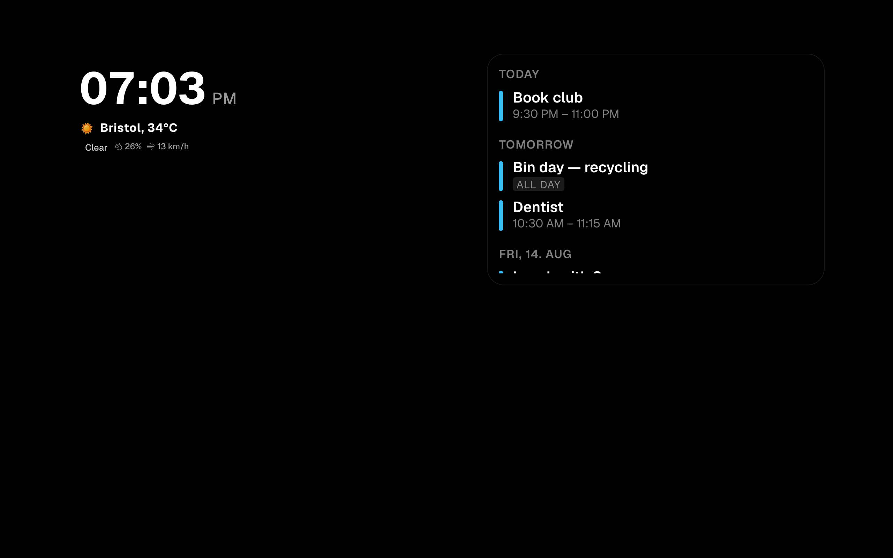

# Troubleshooting

The failures people actually hit, what causes each one, and what to do. Each
entry is written the same way: **symptom**, then **cause**, then **what to do**.

If you are not sure which entry you are in, start with the first one. More than
half of "it didn't work" turns out to be something that is cached.

---

## The change I made did not happen

**Symptom.** You changed a setting, saved a layout, or deployed an update, and
the screen still shows the old thing. Sometimes it is right in one browser and
wrong in another, or right in the editor and wrong on the tablet.

**Cause.** Several layers hold on to a copy of something, each for a different
length of time, and they do not all clear at once.

| Layer | Holds | For how long |
| --- | --- | --- |
| The browser | Pages, scripts, images | Until you force a reload |
| The display's own storage | The wallpaper settings of that view, the language, the editor's light/dark choice | Until overwritten by a successful fetch, or forever for the language |
| Photo addresses | Immich images, WebDAV images | A week and ten days respectively, marked unchanging |
| Uploaded files, module code | `/api/uploads/[name]`, `/api/modules/[type]/bundle.js` | 5 minutes, 60 seconds |
| The server, in memory | The Home Assistant entity list | 60 seconds |
| The server, in memory | Each iCal calendar feed | 10 minutes |
| The server, in memory | Home Assistant notifications | 4 seconds |
| The server, in memory | The update check against GitHub | 6 hours |
| The calendar widget itself | Its events | Refetched every 15 minutes |

**What to do**, in this order — stop as soon as it works:

1. **Force a reload** on the device that is wrong: `Cmd+Shift+R` on a Mac,
   `Ctrl+Shift+R` on Windows and Linux. On a tablet, close the browser tab and
   open the address again.
2. **Wait a minute** if the thing you changed was a Home Assistant entity or a
   notification. Those two clear themselves within a minute.
3. **Wait ten minutes** if it was a calendar address. The server keeps each
   iCal feed for that long, and the widget only asks again every fifteen.
4. **Restart the application**, from the folder holding `docker-compose.yml`:

   ```bash
   docker compose restart app
   ```

   Everything in the "in memory" rows above is gone the moment the container
   restarts. Layouts, accounts and settings are in the database and are not
   affected.
5. **Try a private window.** If it is right there and wrong in your normal
   window, it was the browser, and the force-reload did not reach far enough.

**A note on the language:** a browser that has ever had a language picked in it
keeps that choice forever, and ignores the installation-wide default. If one
screen is stubbornly in the wrong language, open that screen's own browser and
change it there. See [Settings](settings.md).

---

## The browser will not open `http://<address>` at all

**Symptom.** You type the address of the machine and the browser shows a
connection error, or complains that a secure connection failed — sometimes
before Magic Frame has even finished installing.

**Cause.** Chrome, Edge and Brave silently upgrade addresses you type from
`http://` to `https://`. A fresh installation has no certificate, so the upgrade
fails and the request never arrives. Nothing is wrong with Magic Frame; you
never reached it.

**What to do:**

1. **Type the full path** instead of the bare address:
   `http://192.0.2.10/login`. The upgrade usually only fires on a bare host.
2. If that does not help, **turn the setting off**. In Brave, open
   `brave://settings/security` and switch off *Always use secure connections*.
   In Chrome and Edge the same setting is at `chrome://settings/security`. A
   per-site exception works too.
3. **Fix it permanently by giving it a domain.** Then the upgrade succeeds
   because there really is a certificate. See
   [Hosting and your domain](hosting-and-domain.md).

---

## `Bind for 0.0.0.0:80 failed: port is already allocated`

**Symptom.** The install or an update stops with that message, or with
`port is already allocated` naming 80 or 443.

**Cause.** Something else on that machine already has the port — usually a
distribution's `nginx` or `apache2`, or another container.

**What to do:**

1. Find out what has it, on the machine itself:

   ```bash
   ss -tlnp | grep :80
   docker ps --filter "publish=80"
   ```

   The first command lists programs listening on port 80; the second lists
   containers publishing it.
2. Either stop the other program — for a system nginx that is
   `systemctl stop nginx && systemctl disable nginx` — or move Magic Frame by
   setting `HTTP_PORT` and `HTTPS_PORT` in `.env`. See
   [Hosting and your domain](hosting-and-domain.md).
3. Bring the stack up again properly, from the folder holding
   `docker-compose.yml`:

   ```bash
   docker compose down && docker compose up -d
   ```

   **`down` then `up` matters here, and `restart` is not enough.** When Caddy
   could not bind the port, the container was created without its port mappings
   at all. Only recreating it gives them back.

---

## The whole screen is black, but the clock still works

**Symptom.** A view that used to show photos shows a black background. The
tiles — clock, calendar, controls — are all still there and still updating. It
often appears after a while rather than immediately, or after the screen
reloads itself overnight.

**Cause.** The photo source could not be reached, and the wallpaper falls back
to **black**. It does not fall back to the pictures that ship with Magic Frame.
When the list of photos comes back empty — because Immich is down, an album was
deleted, the WebDAV folder is unreachable, or a credential expired — there is
nothing to draw and the background stays black.



Two things make this show up later rather than at once:

- The list of photos is fetched when the view loads. A source that dies at
  midday does not blank the screen until the next load.
- A view can be set to reload itself every few hours. That reload is what turns
  a working screen into a black one.

**What to do:**

1. **Check the source is up**, from the machine running Magic Frame:

   ```bash
   curl -I http://192.0.2.10:2283
   ```

   Substitute your own Immich address. Anything other than a response here means
   the problem is between the two machines, not in Magic Frame.
2. **Read the reason on the display itself.** Open the same `/view/<id>` address
   on your computer, press `F12`, and look at the Console tab. A WebDAV failure
   prints the actual reason there — wrong folder, wrong password, no images in
   that folder.
3. **Check the connection in the editor**: sidebar → **Integrations** →
   *Immich (global)*, or the per-view Immich fields in the wallpaper settings.
   Re-enter the API key if it was rotated. See [Immich](immich.md) and
   [Wallpapers](wallpapers.md).
4. **Give the screen something to show in the meantime.** In the view's
   wallpaper settings, switch the source to **Bundled** or to a solid colour.
   Those need no network at all and cannot go black.

**This is known and deliberate, not a bug you can configure away.** The photo
source is passed straight through with no copy kept on the Magic Frame machine,
which is why nothing survives the source going away. If a screen must never be
blank, use the bundled pictures for it.

---

## Home Assistant will not connect

**Symptom.** Entity dropdowns stay empty, Home Assistant tiles show an error,
or saving the connection reports a failure.

**Cause and what to do** depend on the message. Magic Frame turns the underlying
network error into a sentence rather than the useless "fetch failed", so read
the message carefully:

| Message says | Cause | What to do |
| --- | --- | --- |
| **Host name could not be resolved** | The container cannot look the name up. A Docker container knows neither `.local` names nor entries from your computer's hosts file. | Enter Home Assistant by **IP address** instead of by name. If the name resolves inside the container and this still happens, read the next section. |
| **Connection refused** | Something answered and said no. Wrong port, or Home Assistant is not listening there. | Check the port. `8123` is the usual one. |
| **Host not reachable** | No route from the container to that address. | Different network segment, or a firewall. Check from the machine itself with `curl`. |
| **Connection reset** | Almost always `https` pointed at an `http` port, or the other way round. | Swap the scheme in the address. |
| **TLS certificate not accepted** | Home Assistant has a self-signed certificate. Your browser has an exception for it; the server does not. | Use `http://` on your own network, or give Home Assistant a certificate that validates. |
| **Timed out** | Nothing answered within 8 seconds. | Check the address is reachable at all. With a `.local` name, use the IP. |

Set the address at sidebar → **Integrations** → *Home Assistant*. See
[Home Assistant](home-assistant.md) for what goes in each field.

### The confusing one: it resolves with `dig`, but Magic Frame says it cannot

**Symptom.** You go into the container, `dig` and `curl` resolve the Home
Assistant name perfectly — and Magic Frame still reports that the host name
cannot be resolved.

**Cause.** Your own DNS server. Magic Frame's image is Alpine-based, which uses
musl for name lookups. musl asks for the IPv4 and the IPv6 record together. If
your resolver answers the IPv6 question with `NXDOMAIN` — "no such name" —
instead of a `NOERROR` with an empty answer, musl throws the **whole** lookup
away, even though the IPv4 record came back fine. `dig` and `curl` do not go
through that code path, which is why they keep working and make it look like a
Magic Frame problem. Split-horizon and self-hosted resolvers — Technitium,
Pi-hole, Unbound — are where this turns up.

**What to do:**

1. Confirm it, from anywhere that can query your resolver:

   ```bash
   dig @192.0.2.53 ha.example.com AAAA
   dig @192.0.2.53 ha.example.com A
   ```

   `NXDOMAIN` on the first line and a working answer on the second is the
   fingerprint.
2. **Quick fix:** enter Home Assistant by IP address.
3. **Proper fix:** make the resolver answer `NOERROR` with no data for names
   that only have an IPv4 record. Every DNS server has a setting for this.

*(Found and tracked down by @proffalken.)*

---

## The calendar is empty on the wall screen

**Symptom.** A calendar tile shows nothing, or shows a heading and no entries,
while the same calendar looks fine everywhere else.

**Cause.** A calendar tile can hold several feeds, and **a feed that fails is
silent**. The server answers with a normal, successful response containing an
empty list of events plus a note about which feed failed — and the widget only
reads the events. So a wrong address, a deleted account or a renamed Home
Assistant entity looks exactly like "there is nothing on that day".

**What to do:**

1. **Ask the server directly and read the note.** On your own computer, open:

   ```
   http://192.0.2.10/api/calendar?url=https://example.com/family.ics
   ```

   with your own address and your own iCal address. In the answer, look at the
   `feeds` section. `error` on a feed says exactly what went wrong.

   2. **Check the obvious causes**, in this order:

   | `error` says | Meaning |
   | --- | --- |
   | `Downstream calendar status 404` / `401` | The iCal address is wrong or no longer valid. Regenerate it in the source calendar. |
   | `missing_accountId` | A Google or Microsoft feed lost its account link — usually because the account was removed and added again under Integrations. Open the widget and pick the account again. |
   | `missing_entityId` | A Home Assistant calendar feed has no entity. The entity was probably renamed in Home Assistant. |
   | `missing_url` | An iCal feed with an empty address field. |

3. **If there is no error, the feed is fine and the window is the problem.** A
   list-style calendar only shows events that have not finished yet, within the
   number of days it is set to look ahead. A calendar with nothing in the next
   30 days genuinely shows nothing. Raise the number of days in the widget, or
   switch it to the month view, which shows the grid regardless. See
   [The calendar widget](widgets-calendar.md).
4. **If you just fixed the address and it is still empty,** wait. The server
   holds each iCal feed for 10 minutes and the widget asks again every 15.

---

## I am locked out of the login page

**Symptom.** The login page says the address or the account is locked and gives
a number of minutes.

**Cause.** The brute-force protection. Five failed attempts from one address
within 15 minutes locks it for 30; ten against one account within an hour locks
that account for an hour.

**What to do:**

- **Wait it out.** The number of minutes on screen is real.
- **Or sign in as someone else and release it.** A correct login clears both
  locks anyway; if you are already in on another device, go to
  `Settings → Security`, find the entry under **Active locks** and press
  **Release**.
- **If the list shows `unknown` instead of addresses**, the proxy in front is
  not passing one on. Only the per-account lock is working, and the per-address
  one is skipped on purpose rather than filing everyone under one entry. Open
  `Settings → Hosting & network` and press save once — that rewrites the
  Caddyfile with the header. [Users and security](users-and-security.md)
  explains the rest, including setups with your own proxy in front.

---

## Signing in works, and then I am signed out again immediately

**Symptom.** The login form accepts the password, the editor flashes up, and you
are back at the login page.

**Cause.** `COOKIE_SECURE="true"` while you are reaching the dashboard over
plain HTTP. The browser is told to keep the cookie only over HTTPS, sees plain
HTTP, and throws it away — so the next request has no session.

**What to do:**

1. Open `.env` on the machine running Magic Frame.
2. Either set `COOKIE_SECURE=""` (if you use plain HTTP on your network) or
   finish setting up HTTPS so the setting is true of the connection as well. See
   [Hosting and your domain](hosting-and-domain.md).
3. Apply it, from the folder holding `docker-compose.yml`:

   ```bash
   docker compose up -d
   ```

---

## `/login` and `/editor` answer 503 and talk about a session secret

**Symptom.** A plain page of text instead of the login form. The displays at
`/view/…` keep working normally. `docker compose ps` shows the app healthy and
the logs show nothing wrong.

**Cause.** `SESSION_SECRET` is missing or shorter than 32 characters, so the
sign-in gate cannot verify anything. It refuses rather than letting the request
through — the container is not broken, it is declining on purpose. Older
versions did let it through, which quietly left the editor open to anybody.

**What to do:** set a long random secret and restart. Where it lives depends on
how you installed:

- **Docker Compose:** `SESSION_SECRET` in `.env`, then `docker compose up -d`.
  Re-running `deploy/install.sh` also replaces a too-short one for you.
- **Kubernetes:** the `SESSION_SECRET` key in the **Secret** (Helm:
  `appConfig.sessionSecret`), then restart the app pod.
- **Home Assistant add-on:** it generates and keeps one — you should never see
  this.

`openssl rand -hex 32` prints a suitable value. Everyone signed in has to sign
in again afterwards. Full background on
[Users and security](users-and-security.md).

---

## A button on a display does nothing, and nothing appears anywhere

**Symptom.** Tapping a tile on a wall panel has no effect. In a signed-in
browser the same tile works.

**Cause.** A display without a login may only act on entities that are on one of
your saved views, and only with the services the widgets use. Something else —
a custom module with a hard-coded entity, a script of your own, a service the
widgets never call — gets refused.

**What to do:** the display shows the reason briefly at the bottom of the
screen, and `docker compose logs app` records every refusal with the entity and
the service. If the entity really should be reachable, either place it on a view
or turn the limit off with `MAGIC_FRAME_HA_ACTION_UNRESTRICTED=1` in `.env`
(add-on: the `ha_action_unrestricted` option). See
[Home Assistant](home-assistant.md).

---

## The photos and the layout are fine, but a display drifted out of step

**Symptom.** One tablet shows an older version of the layout than the others.

**Cause.** The permanent connection that keeps displays in step dropped, and
that display never noticed.

**What to do:**

1. Reload that display's browser once. It reconnects and catches up.
2. If it keeps happening, look at what is between them — sleeping Wi-Fi on a
   cheap tablet is the usual culprit.
3. Set an **auto-refresh** interval on the view so it reloads itself every few
   hours. See [Views and displays](views-and-displays.md).

Note that a second copy of Magic Frame cannot run alongside the first: the live
connection and the cached home state live in one process's memory. Two copies
split the displays between them and the syncing breaks. See
[Concepts](concepts.md).

---

## Nothing saves, and the System page says the database has an error

**Symptom.** Saving a layout fails. `Settings → System` shows **Database:
error**.

**Cause.** The `db` container is not running, or ran out of disk.

**What to do:**

1. On the machine, from the folder holding `docker-compose.yml`:

   ```bash
   docker compose ps
   ```

   This lists the three containers and their state. `db` should be *running* and
   healthy.
2. Check free space with `df -h`. A full disk stops Postgres and also makes the
   next update fail with `no space left on device`.
3. Reclaim space taken by old Docker builds:

   ```bash
   docker builder prune -af && docker image prune -af
   ```

   This deletes build caches and unused images. It does **not** touch your data,
   which lives in named volumes — see [Installation](installation.md).

---

## Before you report a bug

Have these three ready, all from `Settings → System`:

- the **App version**,
- the **Platform** line,
- whether **Database** says connected.

Plus, if a screen is involved, what the browser console says on the device
showing it — `F12`, then the Console tab.

## Where to go next

- [Updating and backups](updating-and-backups.md) — updating, and going back to
  an older version when an update made things worse
- [Users and security](users-and-security.md) — lockouts, sessions, and what is
  not behind a login
- [Hosting and your domain](hosting-and-domain.md) — ports, certificates,
  reverse proxies
- [Settings](settings.md) — where each of the settings named above lives
