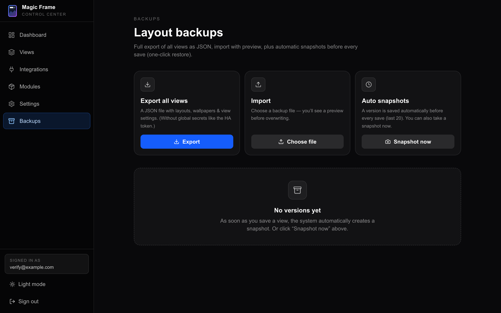

# Updating and backups

How to move to a new version, what a backup actually contains, how to put one
back, and how to go backwards when a release does not suit you.

Two sentences up front, because they answer most of the worry:

- **An update never touches your data.** Your layouts, accounts, settings,
  uploaded images and uploaded modules all live outside the program files, in
  the database and in Docker volumes. Nothing in an update goes near them.
- **Every save already makes a backup of the view you saved.** Magic Frame files
  an automatic snapshot before it overwrites a layout, and keeps the last 20.

## Updating

### If you installed with the installer

This is the normal case — you ran the one-line command, or cloned the repository
and ran `./deploy/install.sh`.

1. Open a terminal on the machine running Magic Frame.
2. Go into the folder:

   ```bash
   cd magic-frame
   ```

3. Run the same script you installed with:

   ```bash
   ./deploy/install.sh
   ```

4. Wait. It prints **Magic Frame is running!** again when it is done.
5. In your browser, hard-refresh the editor — `Cmd+Shift+R` on a Mac,
   `Ctrl+Shift+R` elsewhere.

There is no separate `git pull` to remember; the script does it. What it does,
in order: fetches the latest code, keeps your existing `SESSION_SECRET` and `TZ`
untouched, pulls the new images and restarts the stack.

Two behaviours worth knowing:

- **The script updates itself.** The code it just fetched may include a new
  version of `install.sh`, and the shell would otherwise keep running the old
  one from memory. It notices the file changed and restarts once with the new
  version. You will see *Installer updated itself — restarting with the new
  version*. This is normal and happens at most once per run.
- **A rewritten history is handled.** If your copy of the repository has
  diverged from the published one — which happened to anyone who cloned during
  launch week — the script resets the working copy to the published version
  instead of failing. Your `.env`, your database and your uploaded modules are
  not in the repository, so they are unaffected. Anything you hand-edited inside
  the repository folder **is** replaced.

If you originally installed with `--build`, keep using it:

```bash
./deploy/install.sh --build
```

### If you run Docker Compose by hand

```bash
cd magic-frame
git pull
docker compose pull
docker compose up -d
```

Building from source instead of pulling:

```bash
docker compose up -d --build
```

### If you run the Home Assistant add-on

Home Assistant offers the new version on the add-on's own page — press
**Update** there. The container is replaced and `/data` is kept, so views,
accounts and settings come across. See
[The Home Assistant add-on](home-assistant-addon.md).

### If you run Kubernetes

Change the image tag and re-apply: `helm upgrade magic-frame . -f values.yaml`
for the Helm chart, or edit the manifest and `kubectl apply -f` again for the
raw ones. Pin a version tag rather than `latest`, so that a pod restart does not
move you to a new release on its own. See [Installation](installation.md).

### How you find out there is a new version

The editor checks GitHub for the newest published release and compares it with
the version you are running. When yours is older, an amber banner appears at the
top of the editor reading **New version available** with the new version number
and your current one, plus a **View release** link to the release notes.

| | |
| --- | --- |
| How often it checks | At most every 6 hours; the answer is cached in between. |
| Dismissing it | Per version, per browser. It comes back when a newer version than the one you dismissed appears. |
| Which repository it watches | `jeremiaa/magic-frame`. Change `MAGIC_FRAME_UPDATE_REPO` in `.env` if you maintain a fork. |

You can always read the running version yourself under
`Settings → System` (Einstellungen → System).

### Your displays reload themselves

You do not have to walk around the house after an update. When the server comes
back, each display reconnects, asks the server which version it is now running,
and reloads itself once if the answer changed. The reload is spread over a few
random seconds so that a dozen tablets do not all fetch at the same instant, and
a display will not do it twice within a minute.

The editor in **your** browser is the one that needs the hard refresh — Next.js,
Caddy and your browser each keep their own cache, and "I do not see the change"
is almost always one of those three rather than a failed update.

## What survives an update, exactly

| Thing | Where it actually lives | Survives |
| --- | --- | --- |
| Views, widgets, wallpapers per view | Postgres, in the `magic_pgdata` volume | Yes |
| Accounts, passwords, 2FA secrets, sessions | Postgres | Yes |
| Snapshots | Postgres | Yes |
| Calendar OAuth tokens | Postgres | Yes |
| Home Assistant, Immich, Todoist, OpenWeatherMap credentials entered in the interface | Postgres | Yes |
| Uploaded custom modules | Postgres — the manifest and the JavaScript bundle are database rows, not files | Yes |
| Images you uploaded in the interface | The `magic_wallpapers` volume | Yes |
| Certificates Caddy fetched | The `magic_caddy_data` volume | Yes |
| `.env`, including `SESSION_SECRET` | The repository folder, but never overwritten by the installer | Yes |
| Files you edited inside the repository folder | The repository folder | **No** — replaced by the published version |

The last row is the only one to watch. The repository folder is program code; do
not keep anything of your own in it.

## The three kinds of backup

They are different things and they protect against different accidents. Know
which is which.

| | What it covers | Where |
| --- | --- | --- |
| **Layout export** | All your views: layout, widgets, wallpaper settings. One JSON file you download. | `Backups → Export all views` |
| **Snapshots** | One view at a point in time. Made automatically before every save. | `Backups`, the **Versions** list |
| **A database dump** | Everything, including accounts and credentials. | A command in the terminal |



## Layout export

1. In the editor, click **Backups** in the left sidebar.
2. Click **Export** (Exportieren) on the **Export all views** card.
3. Your browser downloads a file named `magicframe-backup-<date>.json`.

### What is in it

Per view: the id, the display name, the wallpaper configuration, the view
settings, and every widget with its type, label, config, background opacity and
its position and size on the grid.

### What is **not** in it

This is the important half, and it is deliberate — the file is meant to be safe
to hand to somebody or paste into an issue.

- Accounts, passwords, two-factor secrets
- Your Home Assistant address and access token
- Immich address and API key
- Google and Microsoft calendar tokens
- Your OpenWeatherMap key
- Uploaded images
- Uploaded custom modules
- Snapshots
- Anything else under `Settings`

So a layout export is **not** a full backup of your installation. It restores
what your screens look like, not what they are connected to. Restoring one onto
a fresh install gives you your layouts back with every integration disconnected,
and you reconnect them by hand.

Two more consequences worth planning around:

- A widget that points at a Home Assistant entity keeps the entity name in its
  config, so it lines up again once you reconnect Home Assistant.
- A view whose wallpaper comes from Immich keeps the album selection, but the
  connection it used is not in the file.

## Importing a layout export

1. Click **Backups** in the left sidebar.
2. On the **Import** card, click **Choose file** (Datei wählen) and pick the
   JSON file.
3. A preview appears: every view in the file, with the number of widgets in
   each. Nothing has changed yet.
4. Read it, then click **Overwrite** (Überschreiben).
5. Confirm the question that appears. It tells you how many views will be
   overwritten and that the current state is snapshotted first.
6. The page reports how many views were imported, and every connected display
   reloads its layout.

Three things that follow from how the import works:

- **Views that are not in the file are left completely alone.** An import is not
  a wipe-and-replace of your installation, only of the views the file names.
- **A view that is in the file is replaced whole.** Its widgets are deleted and
  recreated from the file; anything you added since the export is gone.
- **The current state of every affected view is snapshotted first**, with the
  reason *before import*. If the import was a mistake, the way back is in the
  Versions list below.

If the file is not a Magic Frame export, the page says **Not a valid Magic Frame
backup file** and nothing happens.

## Snapshots — the everyday undo

A **snapshot** is one view, frozen at one moment. You do not have to ask for
them: Magic Frame files one automatically before it overwrites a layout.

| Reason shown | When it was made |
| --- | --- |
| **before save** | Automatically, every time you press Save in the editor. |
| **manual** | You pressed **Snapshot now**. |
| **before import** | Just before a layout import overwrote that view. |
| **before restore** | Just before you restored an older snapshot of that view. |

Limits, which matter more than the feature:

- **The last 20 are kept, across all views together** — not 20 per view. On a
  busy editing session with three views open, twenty fills up quickly, so a
  snapshot is an undo for today, not an archive for next month. For anything you
  want to keep, export the layout.
- **A view with no widgets is never snapshotted.** An empty layout would restore
  as an empty screen, which is not a version worth keeping.

### Taking one on purpose

1. Click **Backups**.
2. Click **Snapshot now** (Snapshot jetzt) on the **Auto snapshots** card.
3. A snapshot is taken of every view that has widgets, and the page tells you
   how many.

Do this before a big rearrangement.

### Going back to one

1. Click **Backups**. The **Versions** list shows the most recent snapshots,
   newest first, each with the view's name, why it was taken, how many widgets
   it holds and how long ago.
2. Find the line you want and click **Restore** (Wiederherstellen).
3. Confirm. The message names the view and tells you the current state is being
   saved first.
4. The view is replaced with the snapshot, and every display showing it reloads.

**A restore is itself undoable.** Before it writes, it takes a *before restore*
snapshot of what was there — so restoring the wrong version is one more click to
fix, not a disaster.

The bin icon next to **Restore** deletes that snapshot from the list. It does
nothing to the view.

## A full database dump

The two features above cover layouts. Accounts, integration credentials and
calendar tokens live in Postgres, and copying the whole database is the only
thing that captures them.

The installer prints this command when it finishes, and it is in the project's
own maintenance notes:

```bash
docker compose exec db pg_dump -U postgres magicdashboard | gzip > backup-$(date +%F).sql.gz
```

Run it from the `magic-frame` folder. It writes a compressed dump of the whole
database into that folder, named with today's date. Copy it somewhere that is
not that machine — a backup on the same disk is not a backup.

That is one of the two halves. The other is the `magic_wallpapers` volume, which
holds the images you uploaded through the interface. Copy that too if you have
uploaded any.

The add-on install does not need this: the Home Assistant Supervisor stops the
add-on and backs up its whole `/data` folder for you. See
[The Home Assistant add-on](home-assistant-addon.md).

> **Magic Frame ships no restore command for a dump.** Putting one back is a
> plain Postgres job — the database is called `magicdashboard`, the user is
> `postgres`, and it runs in the `db` container. Do it with the stack's own
> Postgres tooling, and read the output rather than trusting it silently.

## Going back to an older version

Sometimes a release does not suit you. The compose file reads a variable for the
image tag, so pinning is a one-line change.

1. Open `.env` in the `magic-frame` folder.
2. Add a line naming the version you want, without the leading `v`:

   ```
   MAGIC_FRAME_VERSION="1.3.3"
   ```

3. Apply it:

   ```bash
   docker compose up -d
   ```

4. Check `Settings → System` — it reports the version now running.

Remove the line again (or set it back to `latest`) when you want to follow
releases again.

> **Going backwards is caught for you now.** The application brings the
> database schema in line with its own expectations every time the container
> starts, and it is allowed to drop things to do so. Moving *forward* is what
> that is designed for; moving *back* across a release that changed the schema
> would lose whatever was added in between.
>
> Since 1.6.0 that no longer happens silently. Each successful start records
> the version that ran, and a start of an older version stops with a message
> naming both versions and leaving the database untouched. Restore a backup
> from that older version's time and it starts cleanly. If you genuinely want
> the loss, `MAGIC_FRAME_ALLOW_SCHEMA_DOWNGRADE=1` says so out loud.
>
> Take a database dump before rolling back anyway, and prefer reporting the
> problem to living on an old version.

Rolling back an *add-on* install works the same way in Home Assistant's own
add-on page, with the same warning.

## Which routes do what

Everything on the Backups page is an HTTP call you can make yourself, and all of
them require a signed-in session.

| Route | What it does |
| --- | --- |
| `/api/admin/backups/export` | `GET` — returns the layout export as JSON, with a download filename attached. |
| `/api/admin/backups/import` | `POST` — takes an export file as the body, snapshots each affected view, then overwrites them. |
| `/api/admin/backups/snapshots` | `GET` lists the stored versions; `POST` takes a snapshot of every view that has widgets. |
| `/api/admin/backups/snapshots/[id]/restore` | `POST` — puts one snapshot back, after snapshotting the current state. |
| `/api/admin/backups/snapshots/[id]` | `DELETE` — removes one snapshot from the list. |
| `/api/admin/update-check` | `GET` — the version comparison behind the update banner. |

One route in this area needs **no** session: `/api/version` returns nothing but
the running version number. That is deliberate — the displays have no login, and
this is what they use to notice a restart and reload themselves.

## Where to go next

| | |
| --- | --- |
| Install paths and what each one does | [Installation](installation.md) |
| The editor, saving, the Versions list in context | [The editor](the-editor.md) |
| Accounts, two-factor, sessions | [Users and security](users-and-security.md) |
| Something broke after an update | [Troubleshooting](troubleshooting.md) |
