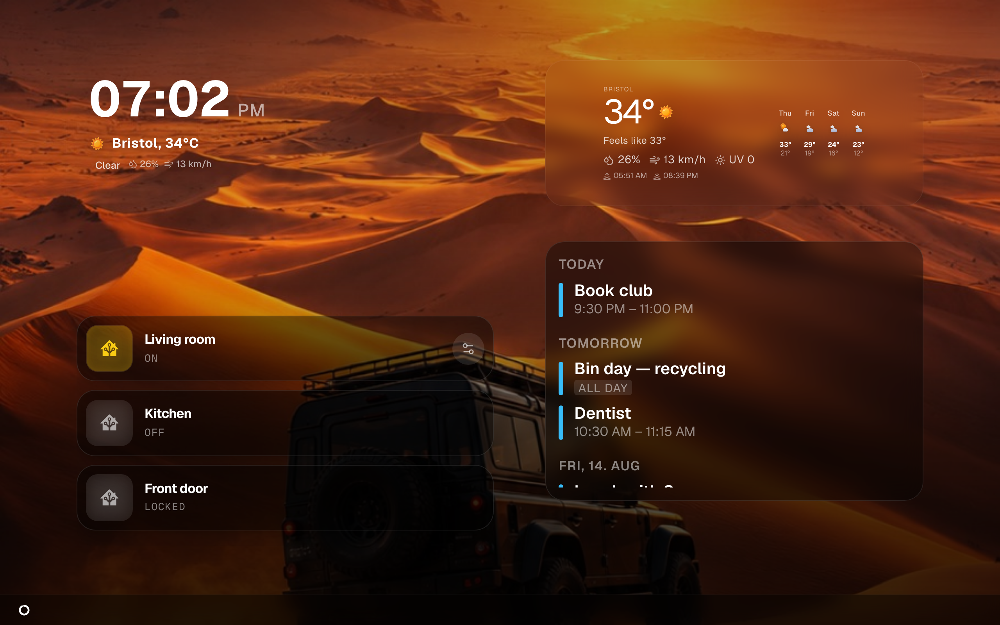

# Views and displays

A **view** is one screenful — one arrangement of tiles with one background. A
**display** is any device showing one: a tablet screwed to the kitchen wall, a
TV, a monitor on a Raspberry Pi, a phone you pick up.

Magic Frame installs nothing on the display. The device opens one web address in
its normal browser and leaves it open. That is the whole integration.



## One view per display

Each view has its own address:

```
http://192.0.2.10/view/<id>
```

`192.0.2.10` stands for the machine running Magic Frame; `<id>` is the URL path
you gave the view when you created it — `kueche`, `flur`, `kinder`. The address
is shown under every card in the editor's view list, and next to the view name
in the editor's header.

Most households end up with one view per screen. Views share nothing, so
changing the kitchen view never disturbs the hallway one. Several displays
*can* show the same view at the same time, and then they stay in step with each
other automatically.

## The address needs no login

**`/view/<id>` is public.** Anyone who can reach the machine over the network
gets the view, with no password, no cookie and no setup.

This is deliberate. A tablet on a wall cannot type a password, and it should
show the family calendar the second it powers on. The login only guards
`/editor` and everything under it — the view addresses are outside it entirely.

### What that means for you

- **Treat a view like a picture hanging on the wall.** Anybody on your network —
  a guest on the wifi, a smart TV, a child's console — can open it if they know
  or guess the address. Do not put on it anything you would not show a visitor.
- **The view is read-only in one direction only.** It shows what you configured,
  but the buttons on it work for whoever taps them, including tapping a light
  or running a Home Assistant script.
- **Do not expose the machine to the open internet without thinking hard about
  this.** Port-forwarding your Magic Frame publishes every view to everyone. See
  [Hosting and your domain](hosting-and-domain.md) and
  [Users and security](users-and-security.md).
- **A hard-to-guess path is not security, but it is not nothing.** `kueche` is
  guessable; a longer path is at least not the first thing anyone tries.

## Setting up a tablet as a kiosk

"Kiosk" just means: one page, full screen, always on. Magic Frame's side of it
is one address; the rest is the device's own settings.

1. Put the tablet on the same network as the machine running Magic Frame.
2. Open its browser and type the full address, for example
   `http://192.0.2.10/view/kueche`. Type `http://` yourself — Chrome, Edge and
   Brave silently upgrade a bare address to `https://`, and a fresh local
   install has no certificate, so the page fails before it is ever reached.
3. The view appears. Give it a few seconds on the first load: the layout, the
   photos and the home state each arrive on their own.
4. Put the browser into full screen so the address bar disappears. On Android
   this is usually the browser's own "Add to Home screen", which opens the page
   without browser chrome; on iPad it is *Share → Add to Home Screen*.
5. In the tablet's own settings, stop the screen from sleeping and stop it from
   locking. Magic Frame cannot do this for you — it is a web page.
6. Leave it. The page updates itself; it does not need to be reopened.

The view sizes itself to whatever window it gets: the 24 × 24 grid stretches to
fill the screen, and it re-measures when the window changes. A layout built on a
10-inch tablet keeps its proportions on a 40-inch monitor.

The display also reports its own pixel size back to the server, which is what
fills the display chips in the editor (below).

## Staying in step

A display does three things to keep itself current, without you touching it:

| | What happens |
| --- | --- |
| **Live push** | The display holds an open connection to the server. When you press save in the editor, the server tells every display at once and each one re-reads its layout — normally within a second. |
| **Polling** | Every five seconds the display re-fetches its layout anyway. So even if the live connection has dropped, a change arrives within a few seconds. |
| **Version check** | If the connection drops and comes back because the server was restarted for an update, the display notices the version changed and reloads itself once, with a random delay of up to three seconds so a house full of screens does not all reload at the same instant. |

## Auto-refresh

A browser left open for weeks accumulates: image data, page memory, the odd
stuck request. Cheap tablets and TV browsers feel it first.

**Auto-Aktualisierung** (Auto refresh) reloads the whole page on a timer, which
clears all of that.

1. In the editor, open the view.
2. Click the gear icon in the header to open **View-Einstellungen** (View
   settings).
3. Set **Auto-Aktualisierung** to 1, 2, 3, 4, 6, 8, 12 or 24 hours. `Aus` (Off)
   is the default and means no reload.
4. Press **Speichern** (Save). The displays pick the setting up and start their
   timer.

It is per view, so the always-on kitchen monitor can refresh every few hours
while a rarely used view never does.

**The reload is a real page reload**, so the display is briefly blank and then
rebuilds. Everything is re-fetched — including the photos. If the photo source
happens to be unreachable at that exact moment, the screen goes black rather
than keeping the pictures it had; see [Wallpapers](wallpapers.md).

## Driving a display from the editor

Four controls in the editor's header act on the screens rather than on the
layout. They all take effect immediately — there is nothing to save.

| Control | Route | What it does |
| --- | --- | --- |
| **TV Sync** | `/api/devices/navigate` | Every connected display switches to the view you have open. A confirmation box tells you it was sent. |
| **✕** | `/api/devices/clear-navigate` | Cancels that. Every display goes back to the view whose address it was opened with. |
| **Refresh** | `/api/devices/refresh` | Reloads every connected display. Hold `Shift` while clicking to reload only the displays showing the view you have open. |

Two honest limits:

- **TV Sync goes to every display, not to one.** There is no picker. If you have
  five screens, all five switch, and the ✕ button is how you get them back.
- **Nothing is stored.** A display that was switched with TV Sync and then
  reloads (or auto-refreshes) is back on its own view. The forced view lives
  only in the open page.

These are ordinary HTTP routes and they require a login **or** a shortcut token,
so a Home Assistant automation can call them too — for instance to put the
hallway screen on the doorbell view when someone rings. See
[The companion API](companion-api.md).

## The list of connected displays

When at least one display is showing the view you are editing, a row of chips
appears above the canvas: **Standard** first, then one chip per display labelled
with its pixel size, for example `1280×800`.

Clicking a chip makes the editing canvas take on that display's exact
proportions, so the tiles are laid out against the real shape of the screen
instead of an idealised one. It changes nothing that gets saved.

How the list is built: every open view posts its viewport size to
`/api/view-clients` when it loads, again whenever the window is resized, and
then once a minute. The editor re-reads the list once a minute.

What that means in practice:

- **A display disappears from the list three minutes after it stops reporting.**
  A screen you just switched off can linger for a couple of minutes.
- **A newly opened display can take up to a minute to appear**, because the
  editor only re-reads the list on its own timer. Reload the editor page to see
  it at once.
- **The list is kept in memory only.** Restarting Magic Frame empties it, and it
  fills up again as the displays send their next heartbeat.
- **It shows sizes, not names.** There is no way to label a screen "kitchen"; two
  identical tablets show two identical chips.

## When a display shows nothing

| What you see | Usual cause |
| --- | --- |
| The browser cannot connect at all | The address was upgraded to `https://`. Type `http://` in full. |
| A blank white page | Wrong path. Check the id under the card in `/editor/views`. |
| A black screen with the tiles on it | The wallpaper source is unreachable. See [Wallpapers](wallpapers.md). |
| Tiles are there but stale | The live connection dropped. The five-second poll should catch up; if not, reload. |
| The layout is right but nothing updates on save | Check the **Live-Sync** counter on the editor's control centre. `Offline` means saves are not being pushed. |

More in [Troubleshooting](troubleshooting.md).
