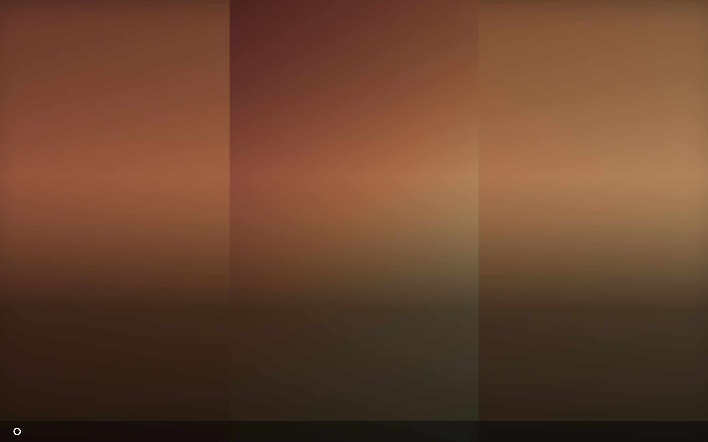
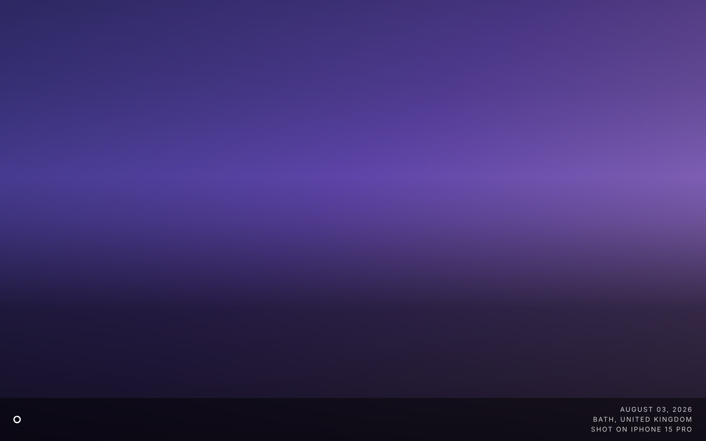

# Wallpapers

The **wallpaper** is a view's background: a colour, one picture, or a slideshow
of your own photos. It belongs to the view, not to a widget, so it always fills
the whole screen behind everything else.

This is the part that makes Magic Frame a picture frame rather than a dashboard.
A view with a photo source, a fit mode and nothing else on it is a digital
picture frame; add a clock and a calendar and it is still a picture frame, with
a clock on it.

## Where the settings are

1. In the editor, open the view.
2. Click **Wallpaper** in the toolbar above the canvas.
3. A dialog opens with three tabs: **Quelle** (Source), **Anzeige** (Display)
   and **Overlays & Text**.
4. Change what you need, close the dialog, then press **Speichern** (Save) in
   the header.

Nothing reaches the screens until you save. The dialog says so at the bottom,
because it is the most common way to lose ten minutes of fiddling.

## Where the pictures come from

Pick the source at the top of the **Quelle** tab.

| Source | Dropdown entry | What it is |
| --- | --- | --- |
| `bundled` | Mitgelieferte Bilder (Standard) | 20 photographs that ship with Magic Frame, in `public/wallpapers/`. Nothing to set up, no network needed. Shuffled on every load, so a screen does not always start on the same picture. This is what a new view gets. |
| `color` | Vollfarbe (einfarbiger Hintergrund) | One flat colour, no slideshow. Pick it with the colour swatch or type a hex value. Unset means `#0f172a`, a very dark blue. |
| `url` | Feste Bild-URL | One fixed picture from a web address. It never changes. |
| `webdav` | Lokaler NAS Ordner (WebDAV) | A folder on your own NAS, over WebDAV. |
| `immich` | Immich API (Album) | Your own [Immich](immich.md) photo library — an album, your favourites, your memories, or everyone tagged as a particular person. |
| `unsplash` | Unsplash (Dynamisch via Suchbegriff) | Despite the name, this does not use Unsplash. It asks an image-generation service on the internet (`image.pollinations.ai`) for 20 pictures built from your search words. It is the one source that needs the internet and sends your search words off the machine. |

### Immich

1. Choose **Immich API (Album)** as the source.
2. Leave **Immich Instanz URL** and **API-Key** empty to use the connection you
   set up once under `Editor → Integrations` — that is the normal case. Fill
   them in only if this one view should use a different Immich server or key.
3. Choose the **Immich-Quelle**: `Album`, `Favoriten` (Favourites), `Rückblicke`
   (Memories) or `Personen` (People).
4. For albums, press **Mit Immich verbinden / Alben laden** (Connect to Immich /
   load albums). The list fills with your albums, each with its photo count.
   Tick as many as you like.
5. For people, press **Mit Immich verbinden / Personen laden**. A grid of faces
   appears. Only people you have given a name to in Immich show up here.

What the four Immich sources do:

| Setting | What you get |
| --- | --- |
| `Album` | Every photo in the ticked albums. Several albums are merged into one slideshow, and a photo that is in two of them still appears only once. |
| `Favoriten` | Every photo you starred in Immich. No album needed. |
| `Rückblicke` | Immich's "on this day, X years ago" memories, for today. It changes by itself as the date moves. |
| `Personen` | Every photo showing at least one of the people you ticked. |

Up to **1500 photos** are pulled into one slideshow, shuffled. A larger album
still works — you get 1500 of it, drawn from the whole album rather than the
first 1500.

The display never talks to Immich. Every picture is fetched by Magic Frame and
passed on through `/api/wallpaper/immich`, so the API key never leaves the
server and a tablet does not need to reach Immich at all. The image served is
Immich's own **preview** rendition, not the original file — that is what keeps a
4K TV loading pictures quickly.

### A WebDAV folder

1. Choose **Lokaler NAS Ordner (WebDAV)** as the source.
2. Type the server address, for example `http://192.0.2.20:5005`. If you leave
   the `http://` off, Magic Frame adds it.
3. Type the user name and password for the NAS.
4. Press **NAS Verbinden / Ordner wählen** (Connect NAS / choose folder). The
   folder list fills.
5. Click through the folders to the one you want. A line above the list tells
   you how many usable pictures are in the folder you are standing in — that is
   the fastest way to be sure you picked the right one before the screen shows
   you nothing.

Formats that work: `.jpg`, `.jpeg`, `.png`, `.webp`, `.gif`, `.avif`, `.bmp`.

**HEIC and camera RAW files do not work** — no browser can draw them. A folder
straight off an iPhone is usually all HEIC, and Magic Frame says so instead of
pretending the folder is empty: *"…images in a format that browsers cannot show
(for example HEIC or RAW). Please use JPG, PNG or WebP."*

Up to **100 pictures** are picked from the folder per load, at random. Only the
chosen folder is read; sub-folders are not searched.

As with Immich, the pictures are passed through Magic Frame
(`/api/wallpaper/webdav`), so the NAS password stays on the server.

### How often the picture changes

**Bildwechsel Intervall** (Change interval) sets the seconds each picture stays
up: 10 to 3600 (one hour), in steps of ten. It appears for the bundled, WebDAV,
Immich and generated sources, and not for a solid colour or a fixed URL, where
there is nothing to change to.

A new view is created at 45 seconds. A view where the value was never stored
runs at 60.

## How a picture is fitted to the screen

Your photos are not the shape of your screen. **Bildanzeige** (Image display) on
the **Anzeige** tab decides what happens about that.

| Mode | Dropdown entry | What it does |
| --- | --- | --- |
| `cover` | Füllen (Ausschnitt, Standard) | Fills the screen completely and crops whatever does not fit. The default. |
| `contain` | Einpassen (ganzes Bild) | Shows the whole picture, with empty bars where the shapes disagree. Nothing is cropped, nothing is distorted. |
| `blur` | Einpassen + Blur-Rand | Fits the whole picture like `contain`, then fills the bars with a heavily blurred, slightly enlarged copy of the same picture. The screen is full, nothing is cropped, and the edges take the colour of the photo. This is the one to use for a frame that shows portrait photos on a landscape screen. |
| `fill` | Strecken (verzerrt) | Stretches the picture to the screen. Faces get wider or taller. Included for completeness. |
| `none` | Zentriert (Originalgröße) | Draws the picture at its own pixel size in the middle. A big photo is cropped, a small one sits in a sea of black. |

**Bild-Position** (Image position) — `Oben` (Top), `Mitte` (Centre, the default)
or `Unten` (Bottom) — decides which part survives when a picture is cropped. Set
it to `Oben` if `Füllen` keeps cutting heads off.

## Two and four pictures at once

**Aufteilung (Split-View)** on the **Anzeige** tab puts more than one photo on
the screen at a time.

| Setting | Dropdown entry | What it does |
| --- | --- | --- |
| `off` | Aus (ein Bild) | One picture at a time. The default. |
| `auto` | Auto (Hochformat paaren) | Landscape photos are shown one at a time; portrait photos are paired up and shown side by side. |
| `grid2` | 2 nebeneinander | Always two side by side, in playlist order. |
| `grid4` | 2×2 (vier Bilder) | Always four in a square, in playlist order. |

`auto` is the interesting one, and it is what a mixed family album wants. A
portrait photo on a landscape screen either gets cropped to a strip of somebody's
chin or floats between two black bars. Paired with another portrait photo it
fills the screen properly.

The pairing is not limited to neighbours: **every** portrait picture in the
playlist is paired with another one, wherever it sits in the list, so you do not
end up with lonely portraits just because they were not next to each other. If
there is an odd number, the last one is shown on its own. Pairs and single
landscape shots are then interleaved, so you do not get all the pairs first and
all the singles afterwards.

**`auto` only works with Immich as the source.** The orientation of a photo
comes from the playlist, and only the Immich route works it out (from the stored
width and height, corrected for the EXIF rotation flag). For the bundled
pictures, a WebDAV folder, a fixed URL or the generated source, no orientation is
known, everything counts as landscape, and `auto` behaves exactly like `Aus`.
`grid2` and `grid4` work with any source, because they just take the pictures in
order.

In split view, two pictures sit side by side; three or four go into a 2×2 grid.
A three-pixel gap lets the black background through as a dividing line. Each
tile obeys the fit mode on its own, and with `Einpassen + Blur-Rand` every tile
gets its **own** blurred backing, so a tile is never backed by the neighbouring
photo.

## How one picture becomes the next

**Übergangseffekt** (Transition effect), also on the **Anzeige** tab:

| Setting | Dropdown entry | What it looks like |
| --- | --- | --- |
| `crossfade` | Crossfade (sanfte Blende) | The new picture fades in over the old one. The default, and the safe choice. |
| `kenburns` | Ken Burns (langsamer Zoom) | The picture slowly zooms in for as long as it is on screen, and crossfades to the next. |
| `slide` | Slide (Push von rechts) | The new picture pushes in from the right. |
| `none` | Hart (kein Effekt) | An instant cut. |

**Übergangs-Dauer** (Transition length) sets how long the change takes, from 0.3
to 4 seconds. Left alone it is 1.5 seconds, or 1.2 for the slide.

**Ken-Burns-Intensität** appears only for Ken Burns and sets how far the picture
zooms in: 5 % to 40 %, 15 % if you never touch it. The zoom runs for the length
of the interval plus a second and a half, and is capped at 30 seconds — so a
very long interval means a slow crawl rather than an ever-growing zoom.

Two things worth knowing:

- **Ken Burns is the expensive one.** On an old TV browser (Samsung Tizen in
  particular) it can stutter. If a screen looks jerky, move it to Crossfade or
  Hart. The dialog says the same thing under the dropdown.
- **Split view always crossfades.** Pick `2 nebeneinander` and the transition
  choice is ignored; only the duration still applies.

Whatever the setting, the next picture is loaded and decoded *before* the change
starts. That is why the change looks the same whether the picture came from the
browser cache or fresh off the NAS. If a picture cannot be loaded at all, the
slideshow moves on anyway after four seconds rather than freezing.

## The photo info bar

At the bottom of the screen, a strip can show when and where a photo was taken
and what it was taken with.

1. Open the **Overlays & Text** tab.
2. Switch on **Metadata/EXIF einblenden** (Show metadata/EXIF).
3. Tick the lines you want: **Datum & Uhrzeit** (Date and time), **Kamera-Modell**
   (Camera model), **Aufnahmeort (GPS)** (Location).
4. Press **Speichern** (Save).

| Setting | What it does |
| --- | --- |
| `showMetadata` | The whole bar on or off. |
| `metaShowDate`, `metaShowLocation`, `metaShowCamera` | Which of the three lines appear. Each is on unless you untick it. |
| `metaPosition` | `Links` (Left) or `Rechts` (Right). Right unless you change it. The timer ring always sits at the opposite end, so the two never collide. |
| `metaBgOpacity` | How dark the strip behind the text is, 0 to 100 %, in steps of 10; 40 % if untouched. At 0 the strip is invisible and the text sits straight on the photo. |
| `metaColor` | Text colour. |
| `metaFontFamily` | Inter, Courier New, Orbitron, Cutive Mono, Roboto, Montserrat, SF Pro Display, Playfair Display, Lato, Oswald or Outfit. |
| `metaFontWeight` | 100 to 900. A view with nothing stored renders at 500. |
| `metaFontSize` | 8 to 40 pixels; 12 if untouched. |

Where the three lines come from:

- **From Immich**: the date the photo was taken, the camera model, and the place
  as *town, country* (or *region, country* if the town is not known) — all read
  from what Immich already knows about the photo. If there is no EXIF date, the
  file's creation date is used.
- **From a WebDAV folder**: Magic Frame reads the first 128 KB of each file to
  get its EXIF block, which gives the date and the camera model. The location is
  shown as **raw coordinates** like `48.1372, 11.5756` — there is no lookup of
  the town name for NAS photos. Without EXIF, the file's modification date is
  used, which is when it landed on the NAS rather than when it was taken.
- **From anywhere else** — the bundled pictures, a fixed URL, a solid colour —
  there is nothing to show, and the lines stay empty.

Two things that surprise people:

- **In split view, the info sits on each picture, not in one bar.** A single bar
  could not say which of the two photos the date belonged to. On a tile it
  becomes one line — date, place and camera separated by dots — over a soft
  gradient along the bottom of that tile.
- **The shadow slider does not reach the display.** *Schatten (Blur)* under the
  metadata options changes the preview in the editor, but the live view draws
  the text without a shadow. Use a solid text colour and the background strip
  instead.

## The timer ring

A small ring in a bottom corner empties as the current picture runs out, so you
can see at a glance how long until the next one.

**Ladekreis (Timer) anzeigen** (Show loading ring) on the **Anzeige** tab turns
it off. It is on unless you switch it off, and it appears only when there is
something to count: more than one picture, an interval above zero, and split
view off.

## Darkening and blurring the whole thing

The **Overlays & Text** tab has four sliders that sit on top of the picture.
They exist so that white text stays readable over a bright photo.

| Setting | What it does |
| --- | --- |
| `gradientTop` | A dark gradient down from the top edge over the upper half of the screen. 30 % on a new view. |
| `gradientBottom` | A dark gradient up from the bottom edge over the lower part of the screen. 80 % on a new view — that is why a clock at the bottom of a bright photo is still legible. |
| `overlayVignette` | Darkens the corners inwards. 30 % on a new view. |
| `overlayBlur` | Blurs the whole background, including the photo. 0 = sharp. Useful when a busy photo fights with a lot of widgets. |

One inconsistency to know about: on a view whose wallpaper settings predate
these sliders, **Vignette Effekt** shows 85 % while the screen actually draws
none. Move the slider once and the two agree again.

## Album artwork while music plays

A view can hand its background over to whatever is playing. When the chosen
media player is playing, the album cover becomes the background; when the music
stops, the slideshow fades back in.

1. Open the **Anzeige** tab.
2. Switch on **Artwork bei Musik** (Artwork while music plays).
3. Type or pick the Home Assistant media player, for example
   `media_player.wohnzimmer`. This needs a
   [Home Assistant connection](home-assistant.md).
4. Choose **Darstellung** (Presentation): `Blur-Rahmen + scharfes Cover` shows
   the sharp square cover in the middle with a blurred copy filling the rest;
   `Bildschirmfüllend` fills the screen with the cover.
5. Set **Blur-Stärke** (Blur strength, 0–80 px; 40 if untouched) and
   **Abdunkeln** (Darken, 0–85 %; 30 if untouched) so your widgets stay
   readable over it.

The player's state is checked every eight seconds through `/api/ha/state`, and
the cover is fetched through `/api/ha/media/[entity]/artwork` — so, like the
photos, it goes via Magic Frame and the display never needs a Home Assistant
token. The takeover only happens while the player's state is *playing* and it
actually has a cover; a radio stream without artwork leaves the slideshow alone.
The new cover is loaded before it is swapped in, so the slideshow never flashes
through between two tracks.

## When the photos cannot be reached

**Say a screen goes black: this is the usual reason.**

If the photo source is unreachable when a display loads or refreshes — the NAS
is asleep, Immich is restarting, the network is down, the album was deleted, the
folder contains only HEIC files — Magic Frame **does not fall back to the
bundled pictures**. The playlist comes back empty and the background is drawn
black. Your widgets are still there on top of it; the picture is not.

That includes a scheduled auto-refresh: a frame that has been showing photos
happily for a week can go black at 4 a.m. because the NAS was asleep at the
moment the page reloaded. Nothing is broken and nothing is lost — the pictures
come back on the next reload, once the source answers again.

If you want the safe option for a frame that must never go dark, use the bundled
pictures or a solid colour, both of which need nothing but the machine itself.

## The rest of the honest list

- **The wallpaper is per view.** There is no shared wallpaper; two views showing
  the same album each keep their own settings.
- **Every display shuffles for itself.** The playlist is mixed anew for each
  display that asks for it, so two screens showing the same view are not on the
  same picture at the same time. There is no way to make them match.
- **The playlist is built when the page loads**, not continuously. New photos
  added to an Immich album appear on the display after its next reload — which
  is what the per-view auto-refresh in
  [Views and displays](views-and-displays.md) is for.
- **A view remembers its last wallpaper settings in the display's browser**, so a
  reload starts on the right source immediately instead of flashing something
  else first. Only the settings are cached, never the pictures.
- **There is no manual "next picture" control**, on the screen or from the
  editor. The interval is the only way to move the slideshow along.
