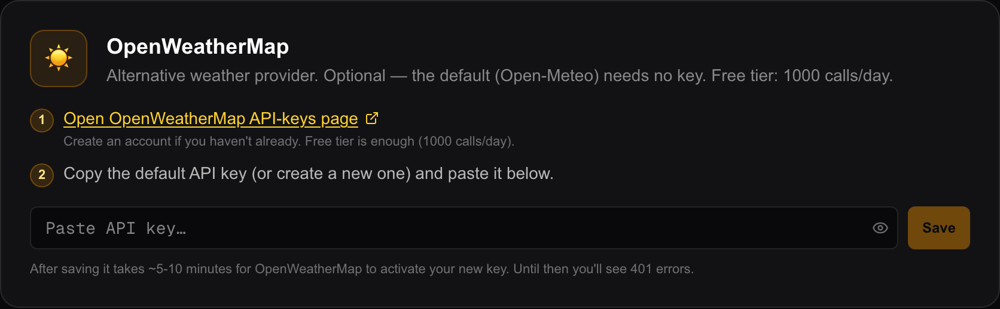

# Weather providers

Where the forecast comes from. There are four sources, and the choice is per
widget — two views on the same server can use different ones.

This page is only about the **sources**. Everything the Weather and Clock widgets
*do* with the numbers — icons, units, which values to show, the forecast row — is
on [Time and weather widgets](widgets-time-weather.md).

## The four

| Provider | Needs a key | Needs the internet | What it is |
| --- | --- | --- | --- |
| `open-meteo` | no | yes | The default. Global, free, nothing to set up. |
| `dwd` | no | yes | The German weather service's ICON model, fetched through Open-Meteo. Most accurate for Germany and central Europe. |
| `openweathermap` | **yes** | yes | An alternative, for people who already have an OpenWeatherMap key. |
| `home-assistant` | no | no | Reads a `weather.*` entity from your own [Home Assistant](home-assistant.md), so the frame agrees with the rest of the house. |

You pick one in the widget: open the view in the editor, click the **Weather**
(`Wetter`) widget, and choose under **Datenquelle** (Data source) at the very top
of the inspector. A line under the dropdown describes whichever one is selected.

**Only the Home Assistant option works without internet access.** The other
three reach out to `api.open-meteo.com` or `api.openweathermap.org`. Nothing
about your household goes with the request — only the coordinates you typed and,
for OpenWeatherMap, the key.

**The display never contacts a weather service.** Every request goes through
`/api/weather` on your own server, which is why no API key can ever reach a wall
tablet. Answers from the two Open-Meteo models and from OpenWeatherMap are held
for **15 minutes**, so a house full of screens causes one request rather than
one each.

## Open-Meteo, and DWD ICON

Nothing to configure. Type a town into the widget's location search, pick it from
the list, and the latitude and longitude fill themselves in.

Both deliver the same set of numbers — current conditions, seven days of daily
forecast, an hourly forecast, sunrise and sunset — because `dwd` is the same
service asked for a different model.

### DWD has no UV index, and that is handled

The DWD ICON model does not report a UV index at all. Rather than showing an
empty field, Magic Frame quietly makes a second, tiny request to standard
Open-Meteo for that one value — the current UV index and the daily maximum — and
merges it into the DWD answer.

You do not have to do anything. It is mentioned here so the number is not a
mystery, and so nobody removes the extra request thinking it is redundant. If
that second request fails, there is simply no UV value; the forecast itself is
unaffected.

The Weather widget's inspector shows a small amber note when you combine the DWD
provider with the UV display, saying the same thing.

## OpenWeatherMap

This is the only provider that needs a key.

**Integrations is its own entry in the editor's left-hand menu — it is not inside
Settings.**

1. Open `https://home.openweathermap.org/api_keys` and sign in, creating an
   account if you have none.
2. Copy the default API key, or create a new one.
3. Open `http://192.0.2.10/editor` — replacing `192.0.2.10` with the address of
   the machine running Magic Frame — and sign in.
4. Click **Integrations** (`Integrationen`) in the menu down the left side.
5. Scroll to the card headed **OpenWeatherMap**.
6. Paste the key into the field. The eye icon at its right end reveals what you
   pasted, which is worth a glance.
7. Click **Speichern** (Save). A green line confirms *Key gespeichert*, and a
   **verbunden** (connected) badge appears beside the card's title.

**A new key does not work immediately.** The card says so under the field:
OpenWeatherMap takes roughly five to ten minutes to activate one, and until then
every request comes back as an error. If the widget is empty right after you save,
wait and reload before changing anything.

Magic Frame requests OpenWeatherMap's **One Call 3.0** endpoint. A key that is
not entitled to that endpoint is rejected, and the widget shows an error rather
than a forecast.

### The key can also come from the environment

`OPENWEATHERMAP_API_KEY` in `.env` works too, and a key coming from there is
marked with a blue **via ENV** badge on the card. In that state the **Entfernen**
(Remove) button disappears — you cannot delete an environment variable from the
interface — but **Override setzen** (Set override) lets you enter a key that
takes priority over it.

### What it delivers

Six days of daily forecast and 48 hours of hourly forecast, with sunrise, sunset
and UV. OpenWeatherMap reports its own condition codes and its own units; both
are converted so that the widget looks and reads exactly as it does with the
other providers.

## A Home Assistant weather entity

If your Home Assistant already has a weather integration you trust, point the
frame at it and the two never disagree.

1. Set up the [Home Assistant connection](home-assistant.md) once.
2. In the Weather widget, set **Datenquelle** to **Home Assistant (weather.*
   Entity)**.
3. A field called **HA-Entity-ID** appears underneath. Type the entity into it,
   for example `weather.home`.

The location search below greys out as soon as you choose this provider — the
entity carries its own location, so there is nothing to search for.

What comes back depends on your integration:

- **Up to six days** of daily forecast and **up to 24 hours** of hourly, asked
  for through Home Assistant's `weather.get_forecasts` service. Older
  integrations that still publish the forecast as an attribute are read that way
  instead.
- **No sunrise and sunset.** A `weather.*` entity does not carry them, so
  switching on the sun times gives you nothing here.
- **A UV index only if your integration publishes one.**
- **Day and night** are worked out from the entity's own condition — a
  `clear-night` state is night — and otherwise from your `sun.sun` entity, which
  nearly every Home Assistant has. Neither available means the widget falls back
  to the display's own clock.

Not every Home Assistant weather integration offers an hourly forecast. If the
hourly row stays empty, that is the integration, not Magic Frame.

## Fault-finding

| What you see | What it usually is |
| --- | --- |
| Nothing at all, any provider | No coordinates. Use the location search rather than typing numbers. |
| Empty right after saving an OpenWeatherMap key | The key is not active yet. Five to ten minutes. |
| OpenWeatherMap errors after that | The key is wrong, or it is not entitled to the One Call 3.0 endpoint. |
| Empty with the Home Assistant provider | No Home Assistant connection, or the entity id is wrong. |
| No UV with DWD | The extra request for it failed. Switch to `open-meteo` to confirm. |
| No sun times with Home Assistant | Expected — see above. |

More in [Troubleshooting](troubleshooting.md).
