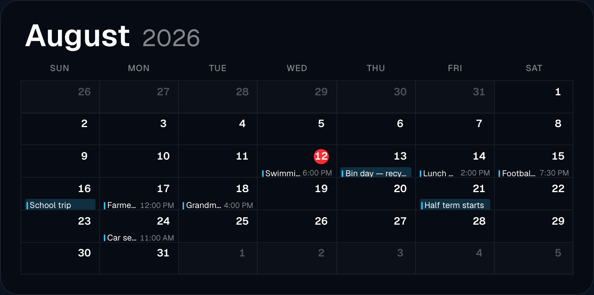

# The calendar widget

One widget, `CalendarWidget.tsx`, that puts your appointments on the wall. It
reads any number of **feeds** — a feed is one calendar, from an iCal address,
from a Google or Microsoft account, or from a calendar your Home Assistant
already knows — merges them, and draws them in one of three views.

Like every widget it also has the shared settings — font, colour, shadow,
hiding rules — described once in [Widgets](widgets.md). This page covers only
what is specific to the calendar.

## Setting it up

1. In the editor, add a **Calendar** (`Kalender`) widget to the view.
2. Under **Calendar sources** (`Kalender-Quellen`), click one of the four add
   buttons: **+ iCal**, **+ Google**, **+ Microsoft** or **+ Home Assistant**. A
   feed card appears.
3. Give the feed a name in the left-hand field — *School*, *Work*, *Bins*. The
   name is not drawn on the display; it tells the two of you apart in the
   editor.
4. Click the colour square next to the name and pick a colour. Every event from
   this feed is marked in it.
5. Fill in the feed itself. What that means depends on the type, and the four
   types are described below.
6. Choose the view under **View** (`Ansicht`) — the three buttons are **list**,
   **Agenda** and **Month**.
7. Click **Save**. The widget loads within a second or two; if it says
   `Collecting calendar…` for longer than that, the feed is not answering.

Repeat from step 2 for each further calendar. There is no limit on the number of
feeds.

## The three views

Pick one under **View** (`Ansicht`).

| View | What it draws |
| --- | --- |
| `list` | Upcoming events, one card each, newest first, across all feeds. The default. |
| `agenda` | The same events grouped under a heading per day — **Today**, **Tomorrow**, then `Wed, 12 Mar`. |
| `month` | A full month grid: weekday header and six week rows, with events inside the day cells. |

**List and agenda live directly on the wallpaper; month and agenda draw their own
card.** In practice that means the list view's *event tiles* carry the frosted
panel, while agenda and month put one panel behind the whole widget. It is the
reason `cardOpacity` looks different between the views.

The month grid always shows six week rows of whole weeks around the current
month, so days from the neighbouring months appear at the edges, slightly dimmed.
The week starts on Monday when the app language is German and on Sunday when it
is English.

### What a month cell shows

- The **day number**, top right. Today's number sits in a filled red circle.
- **All-day events** as a full-width bar, tinted in the feed's colour, with the
  title inside it.
- **Timed events** as a thin colour bar, then the title, then the time pushed to
  the right edge so the times line up down the column.
- Optionally the **location** and the **description** as a smaller, dimmed line
  under the title.
- If more events exist than fit, a row of **coloured dots** — one per hidden
  event, up to seven — followed by `+3`. The dots tell you at a glance whether
  the overflow is one calendar or four.

The text size inside the cells is worked out from the measured cell height and
column width, not from the widget's font size. That is deliberate: chained to the
font size, a large clock-sized setting made a single title fill an entire cell.
Use **Event font size** (`Termin-Schriftgröße`, 60–200 %) to nudge it.

### How many events per day

| Setting | What it does |
| --- | --- |
| `limit` | How many events the list shows in total, and in agenda view how many per day. 1–15, default 5. |
| `monthPerDay` | Month view only: `auto`, `all`, or a fixed number 1–12 (the slider appears when you pick **Fixed number**). Default `auto`. |
| `days` | How far ahead to look, 1–90 days, default 30. Hidden in month view, which always fetches its own six-week window. |

`auto` measures the real cell height and fits as many rows as physically go in,
which is why the same layout shows more events on a big monitor. `all` shows
every event and makes the day cell scroll — usable on a touch display, useless
on a picture frame nobody touches.

**In month view the `limit` slider does nothing.** The month grid asks the server
for the whole month and then fills each cell according to `monthPerDay`. The
slider stays visible in the inspector, but changing it will not change the grid.

### Month view extras

| Setting | Default | What it does |
| --- | --- | --- |
| `showMonthTitle` | on | The month name and year above the grid. |
| `showWeekNumbers` | off | A narrow extra column with ISO week numbers (`KW` / `Wk`). |
| `monthShowTime` | on | The time beside each timed event. Turning it off gives the title noticeably more room in a narrow column. |
| `monthShowLocation` | off | The location as a second, smaller line. |
| `monthShowDescription` | off | The description as a further small line. |
| `monthTextScale` | 100 % | Scales only the events, not the day numbers or weekday header. |

## The designs

**Design** (`Darstellungs-Design`) has two settings:

| Design | What it looks like |
| --- | --- |
| `cards` | Glass tiles: a date box on the left with month and day, the title and time beside it, a coloured left edge in the feed colour. The default. |
| `minimal` | No tiles. A thin coloured line, the date, the title, the weekday and time under it. Right for a photo frame where a row of glass boxes would fight the picture. |

The design matters most in list and legacy views — the agenda and month views
draw their own compact rows and only take a small text-size hint from it.

## Colours, time and text

| Setting | What it does |
| --- | --- |
| feed colour | Per feed, set on the feed card. It colours that feed's events — the left edge of a card, the bar in a month cell, the dot in the overflow row. |
| `color` | The widget's accent and text colour. Events from a feed with no colour of its own fall back to it. Default `#ffffff`. |
| `calendarTimeFormat` | `auto`, `24h` or `12h`. `auto` follows the app language: English gives 12-hour with AM/PM, German 24-hour. |
| `cardOpacity` | How solid the tiles or the panel are, 0–100 %. Default 40. |
| `cardTheme` | `auto`, `dark` or `light`. `auto` follows the view's own light/dark setting. `light` means a light surface with dark text. |
| `hideWeekday` | Drop the weekday from the event line. |
| `hideOnEmpty` | List view only: hide the whole widget when there is nothing coming up, instead of showing "No upcoming events". |

**A colour you set in the Text & colour tab wins over the theme.** The light and
dark themes only supply a *default* text colour. If you once picked white there
and later switch the card to light, the text stays white and disappears — clear
the colour to get the theme's own.

**`auto` brightness only takes effect where the calendar draws its own surface** —
agenda and month view with an opacity above zero. In list view the text stays
white even when the whole view is set to light, because a list view sits on the
wallpaper and dark text on a dark photo is invisible. Set `cardTheme` to `light`
explicitly if you really want dark text there.

## Every feed type

Change a feed's type with the small dropdown on its card. The field beside it
changes with it.

### iCal / Webcal

Paste the calendar's subscription address. Almost every calendar service can
produce one: iCloud calls it a public link, Google calls it the secret iCal
address, an office calendar publishes one from the sharing dialog.

- Both `https://` and `webcal://` addresses work — a `webcal://` address is
  rewritten to `https://` before fetching.
- Nothing needs connecting first. This is the only feed type with no account
  behind it.
- Recurring appointments are expanded properly, including single occurrences
  that were moved or edited in the source calendar: the edited version replaces
  the original instead of appearing twice beside it.
- One malformed entry in a long calendar is skipped rather than taking the whole
  feed down.

### Google

1. Connect the account once under `Editor → Integrations`, described in
   [Calendars](calendars.md).
2. Back in the widget, add a **+ Google** feed and pick the account from the
   dropdown.
3. Pick which of that account's calendars to show. The list is fetched live from
   Google; leave it on **Primary** for the main one.

If no account is connected the feed card shows a link straight to the
integrations page instead of the dropdown.

### Microsoft 365

The same two steps: connect the account under `Editor → Integrations`, then
choose the account and one of its calendars. Leaving the calendar on **Default
calendar** uses the account's main one.

### Home Assistant

Home Assistant has calendars of its own — a rubbish collection schedule, a local
holiday calendar, a school timetable brought in by an integration. Choose
**Home Assistant** as the type and pick the entity; the field only offers
`calendar.*` entities from your connected instance. Needs a
[Home Assistant connection](home-assistant.md); no separate account or token.

## All-day events do not shift

An all-day event carries a *date*, not a moment in time. Magic Frame keeps it
that way: for every feed type, an all-day event is stored as a floating date at
midnight and never converted through a time zone. A birthday on the 3rd stays on
the 3rd whether the server runs in Berlin, the display sits in London or the
calendar was written in New York.

This is the single most common calendar bug in dashboards — events sliding a day
backwards or forwards for anyone not in the server's time zone — and it is worth
knowing that it does not happen here.

## Refreshing, and what happens when a feed breaks

The widget calls `/api/calendar` when it loads and then every 15 minutes.
On the server, fetched iCal data is cached for 10 minutes, so several displays
showing the same calendar cause one request, not one each.

**A broken feed fails quietly.** The server fetches all feeds at once and returns
whatever came back; a feed that timed out, lost its authorisation or answered
with an error simply contributes no events. The other feeds still draw, and the
widget shows no warning. If a calendar you expected has vanished from the wall,
that is where to look first — and reconnecting the account under
`Editor → Integrations` is usually the fix.

The widget only shows "Calendar could not be loaded" when the request itself
fails, which normally means the Magic Frame server is unreachable, not the
calendar.
