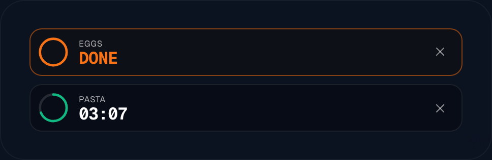
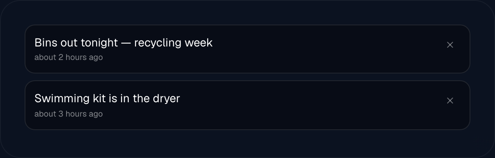
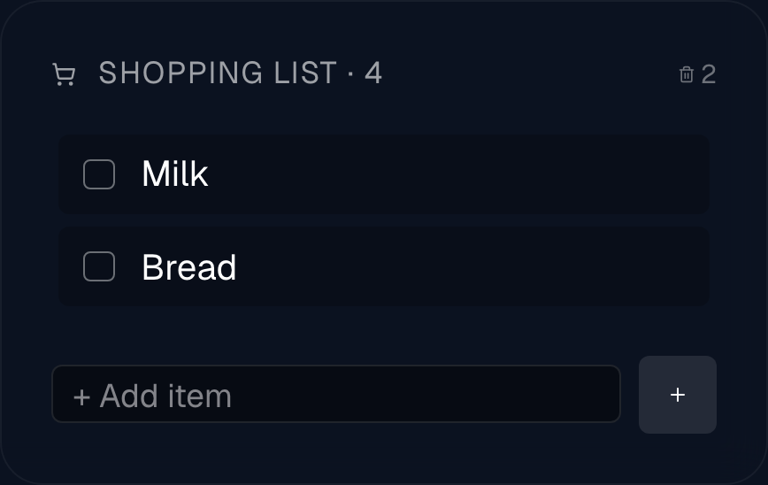
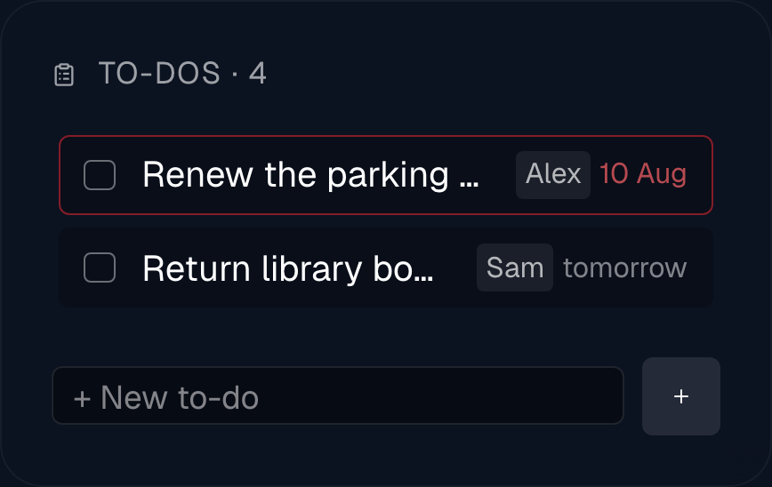

# Family widgets

Four widgets for the things a household actually puts on a kitchen screen: the
**Timer** (`TimerWidget.tsx`), **Messages** (`MessagesWidget.tsx`), the
**Shopping list** (`ShoppingListWidget.tsx`) and **To-dos**
(`TodosWidget.tsx`).

They differ from the rest of the catalogue in one way: they hold their own data.
There is nothing to connect first. You add the widget, and it works — but most of
the point is putting things *onto* the screen from elsewhere, which is what
[The companion API](companion-api.md) is for.

All four also have the shared settings — font, colour, shadow, hiding rules —
described once in [Widgets](widgets.md).

## Timer

Running timers with a countdown and a progress ring. Started from a phone, ended
at the screen.



### Setting it up

1. Add a **Timer** widget to the view.
2. That is the whole setup. It shows "No active timer" until one starts.
3. Start one to see it work — see below.

### Starting a timer

Timers are started over HTTP, not in the widget:

```
POST /api/timers?key=TOKEN&label=Pasta&minutes=10
```

`TOKEN` is your personal companion token from `Settings`; the whole mechanism,
including ready-made iOS Shortcuts, is on
[The companion API](companion-api.md). `minutes`, `seconds` and `durationMs` all
work, and adding `&dashboardId=<view id>` sends the timer to one screen instead
of all of them.

A timer is **capped at 24 hours**, so a mistyped number cannot leave a ten-year
countdown on the wall.

### On the screen

- Each timer shows its label, a countdown, and a ring that empties as it runs.
- A finished timer turns orange, says **DONE**, and pulses gently. It does not
  make a sound; the screen is the alarm.
- The ✕ on a timer ends it, on every display at once.

New timers appear on all displays **within a second** without a reload, over the
same live connection the editor uses for saving layouts.

### Options

| Setting | Default | What it does |
| --- | --- | --- |
| `maxTimers` | 4 | How many timers to show at once. The slider goes to 6. |
| `hideWhenEmpty` | off | Hide the whole widget when no timer is running, instead of showing "No active timer". |

**The widget never draws more than 4 timers**, whatever `maxTimers` says. The
slider allows 5 and 6, and those values are stored, but the display caps at 4 and
puts the rest in a `+2 more` line at the bottom. Treat 4 as the real maximum.

Timers can also appear as cards inside the
[Notifications widget](widgets-home-assistant.md), which is how most people run
them: one stack with alerts and timers in it, rather than a separate tile that is
empty most of the day.

## Messages

Short notes on the screen. "Back at six", "Vet at 4pm", "Well done on the test".



### Setting it up

1. Add a **Messages** (`Nachrichten`) widget.
2. Nothing to configure. It shows "No messages" until one arrives.

### Posting a message

```
POST /api/messages?key=TOKEN&text=Hallo&ttlSec=3600
```

- `ttlSec` makes the message expire by itself after that many seconds. Without
  it, the note stays until somebody clears it.
- `imageUrl` adds a small picture beside the text.
- `dashboardId` sends it to one view instead of all of them.

Again, `TOKEN` and the Shortcut recipes are on
[The companion API](companion-api.md).

### On the screen

Newest first. Each note shows how long ago it arrived, in words ("about 2 hours
ago"), in your app language. The ✕ removes it everywhere.

Expired messages disappear without a reload: the widget re-checks its own list
every 30 seconds, so a note with a one-hour life really is gone an hour later
even on a display nobody has touched.

### Options

| Setting | Default | What it does |
| --- | --- | --- |
| `maxMessages` | 5 | How many notes at once, 1–10. Older ones stay in the list and reappear as newer ones are cleared. |
| `hideWhenEmpty` | off | Hide the whole widget when there are no messages. |

## Shopping list

A shared shopping list. Tick an item on the kitchen screen and it is ticked on
everyone's phone.



### Setting it up

1. Add a **Shopping list** (`Einkaufsliste`) widget.
2. Under **Source** (`Quelle`), choose where the list lives — **Local**, **Home
   Assistant** or **Todoist**. Local needs nothing further.
3. Type an item into the field at the bottom and press enter. It appears at once
   on every other display.

### The three sources

| Source | Where the items live | What it needs |
| --- | --- | --- |
| `local` | In Magic Frame's own database | Nothing. |
| `ha` | A `todo.*` list in your Home Assistant — its own shopping list, or one from an integration | A [Home Assistant connection](home-assistant.md). Pick the list from the dropdown; **Refresh** re-reads it. |
| `todoist` | A Todoist project | A Todoist token under `Editor → Integrations`, described in [Other sources](other-sources.md). Then pick the project. |

Which you pick changes only where the items are kept; the widget looks and
behaves the same. Choose Home Assistant if your voice assistant already adds to a
list there, Todoist if the family already uses Todoist, and Local if neither.

**Local lists update live; the other two are polled every 10 seconds.** Adding an
item on your phone therefore appears instantly with a local list and within ten
seconds with the other two.

### On the screen

- Unticked items first, then a **Done** divider, then the ticked ones, struck
  through and dimmed.
- Tapping an item ticks or unticks it.
- The small bin icon in the header, with a number beside it, clears everything
  ticked. It asks first.
- Item text understands a little markup: `**bold**`, `*italic*`, `~~struck
  through~~`, `` `code` `` and `[label](https://example.com)`, which becomes an
  underlined word you can tap to open the link.

### Options

| Setting | Default | What it does |
| --- | --- | --- |
| `listSource` | `local` | `local`, `ha` or `todoist`. |
| `haListEntity` | — | Which `todo.*` list, with `listSource: ha`. |
| `todoistProjectId` | — | Which project, with `listSource: todoist`. |
| `title` | "Shopping list" | Your own heading. |
| `hideHeader` | off | Drop the heading row entirely. |
| `hideCount` | off | Keep the heading but drop the item count after it. |
| `hideAddForm` | off | Remove the input field, making the list read-only on this screen. |

Todoist's own API only returns open tasks, so a Todoist-backed list shows nothing
under **Done**. Clearing ticked items there deletes whatever this display has
just ticked, because Todoist has no "throw away everything completed" call.

## To-dos

The same idea for tasks: what has to be done, optionally filtered to one person.



### Setting it up

1. Add a **To-dos** (`Todos`) widget.
2. Choose the **Source** — the same three as the shopping list.
3. With the **Local** source, optionally set **Filter to person**
   (`Filter auf Person`) to a name. The widget then shows only that person's
   tasks, and anything typed into it is assigned to them.

One widget per child, each filtered to a name, is the usual arrangement on a
family screen.

### On the screen

- Open tasks first, then a **Done (12h)** divider, then anything completed in
  the last 12 hours — so a child sees what they finished today and it clears
  itself overnight.
- Tapping a task completes it, and tapping again un-completes it.
- A due date shows as **today**, **tomorrow**, or a short date. Anything overdue
  gets a red outline and a red date.
- The tick box is coloured by priority when the task is done: red for high, green
  for normal, blue for low.
- Task text understands the same small markup as the shopping list, which is
  what makes a Todoist task with a link in it readable here.

### Options

| Setting | Default | What it does |
| --- | --- | --- |
| `listSource` | `local` | `local`, `ha` or `todoist`. |
| `haListEntity`, `todoistProjectId` | — | Which list or project, as above. |
| `assignee` | — | Local source only: show only this person's tasks, and assign new ones to them. |
| `title` | "To-dos" | Your own heading. With a filter set, the person's name is appended to it. |
| `hideHeader`, `hideCount`, `hideAddForm` | off | As on the shopping list. |

Adding tasks from a phone:

```
POST /api/todos?key=TOKEN&title=Take+the+bins+out&assignee=Emma&priority=high
```

`priority` takes `low`, `normal` or `high`, and `dueDate` takes an ISO 8601 date.

**Home Assistant and Todoist lists carry less.** Both are simple lists of titles,
so a task from them has no assignee, and only Todoist supplies a due date and a
priority. The person filter is therefore only offered with the local source.

## Ticking things off at the display needs a login

This is the sharp edge of these four widgets, and it is worth knowing before you
screw a tablet to the wall.

**With the `local` source, writing needs a signed-in browser or a token.** The
view address (`/view/<id>`) deliberately needs no login, so a kiosk display has
neither. Adding an item, ticking one off, clearing the done ones, dismissing a
message or ending a timer from such a display is rejected by the server, and the
widget does not say so — it removes the item on screen straight away and only
puts it back the next time the list reloads.

What that means in practice:

- On **your own laptop or phone, signed into `/editor`**, everything works: the
  same browser session authorises the writes.
- On a **wall tablet showing `/view/<id>`**, the local list is effectively
  read-only.
- The **Home Assistant and Todoist sources are not affected.** Those writes go
  through Magic Frame's own connection to those services, which does not depend
  on who is looking. A wall tablet can tick off a Home Assistant or Todoist list
  perfectly well.

So: for a display that people should be able to tick things off on, point the
shopping list and the to-dos at a Home Assistant `todo.*` list or a Todoist
project. This is a defect rather than a decision, and it may change; until then,
that is the way around it.
