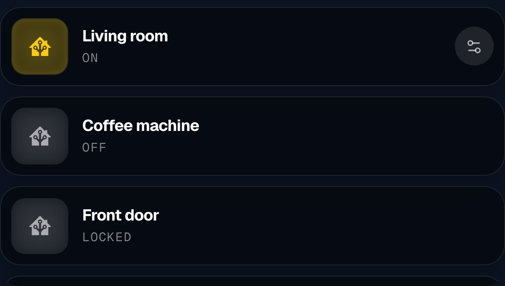
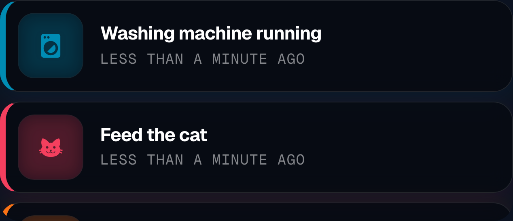
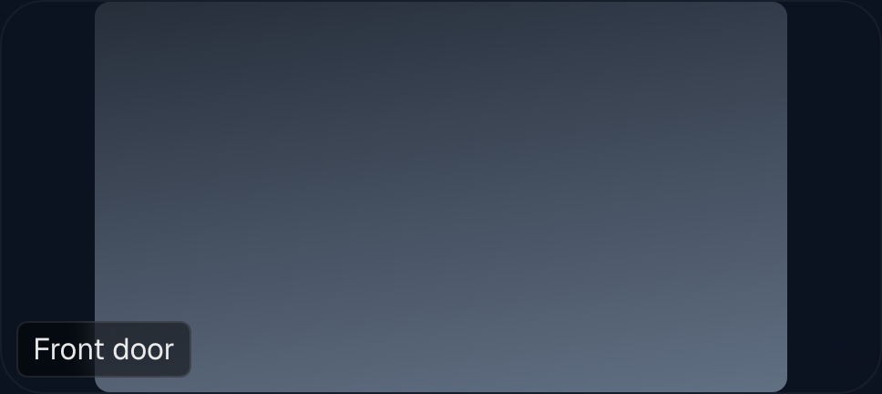
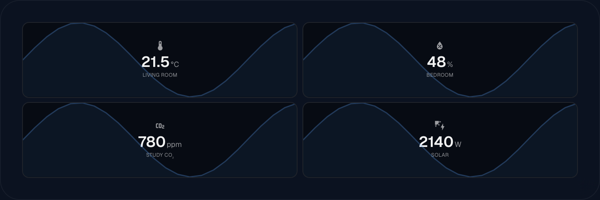
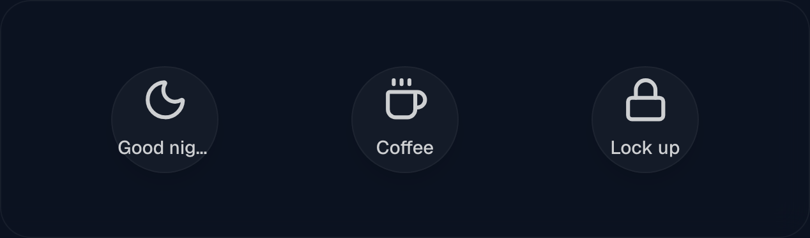

# Home Assistant widgets

Five widgets that read from — and write back to — your own Home Assistant: the
**HA entity** widget (`HomeAssistantWidget.tsx`), the **Notifications** widget
(`HANotificationWidget.tsx`), the **Camera** (`CameraWidget.tsx`), the **Sensor**
widget (`SensorWidget.tsx`) and the **Buttons** widget (`ButtonWidget.tsx`).

Home Assistant is the open-source home control software many people run at home;
if you do not run it, none of this page applies. In it, every light, sensor,
switch and camera is an **entity** with an id like `light.kitchen` or
`sensor.living_room_temperature`. All five widgets need the connection set up
once under `Editor → Integrations`, described in
[Home Assistant](home-assistant.md).

Everywhere this page says "type the entity", the field is an autocomplete: start
typing a room or device name and it offers matching entities from your own
instance, matching on both the id and the friendly name.

All five also have the shared settings — font, colour, shadow, hiding rules —
described once in [Widgets](widgets.md).

## HA entity

A vertical stack of pills, one per entity: an icon, the name, the current value,
and — for lights and blinds — a small control button. Tapping a pill toggles the
thing.

### Setting it up

1. Add an **HA entity** widget to the view.
2. Click **Add entity** (`Entity hinzufügen`). A card opens.
3. Type the entity into the first field and pick it from the list.
4. Pick an icon. The picker defaults to the MDI set, the same icons Home
   Assistant itself uses, so `mdi:lightbulb` looks like it does in your app.
5. Optionally type your own name under **Custom name** (`Eigener Name`). Left
   empty, the widget shows the name Home Assistant already has.
6. Repeat for each entity. The arrows in each card's header move it up or down.
7. Turn on **Live sync (WebSocket)** unless you have a reason not to — see below.

### Per-entity settings

| Setting | What it does |
| --- | --- |
| `entityId` | Which entity this row shows. |
| `icon` | The icon, e.g. `mdi:washing-machine`. |
| `label` | Your own name for it. Empty = the Home Assistant name. |
| `color` | The colour used when the row counts as active. |
| `hideWhen` | Hide this row while the entity has this exact state — `off`, `idle`. Good for a washing-machine row that should only exist while it runs. |
| `showIfEntity`, `showIfState` | Show this row only while a *different* entity has a given state. |
| `colorWhen` | When to colour it. Empty means "whenever the state counts as active". |
| `colorTarget` | `icon` colours only the icon badge (default), `bg` tints the whole pill. |

`colorWhen` understands more than an exact match. `>=25`, `<=5`, `>0` and `<10`
compare the state as a number, and `!=off` matches anything that is not `off`.
Anything else is compared as text.

**What counts as "active" without a `colorWhen`:** the states `on`, `playing`,
`home`, `open`, `active`, `detected`, `unlocked`, `charging`, `cleaning`, `heat`,
`cool` and `mowing`. A light that is on and reports a colour is drawn in that
actual colour; a person or device tracker turns blue; everything else turns
yellow — unless you set your own colour, which always wins.

A row with a colour set but no `colorWhen` is coloured all the time.

### The whole widget

| Setting | Default | What it does |
| --- | --- | --- |
| `design` | `cards` | `cards` = glass pills. `minimal` = a thin coloured line, icon and text, no tile. |
| `cardTheme` | `auto` | `auto` follows the view's light/dark setting, or fix it to `dark` / `light`. |
| `cardOpacity` | 40 | How solid the pills are, 0–100 %. |
| `cardBlur` | 12 | Frosting behind them, 0–64 px. |
| `iconFrame` | on | Draw the icon inside a rounded box. |
| `iconScale` | 100 % | Icon size, 60–240 %. |
| `frameScale` | 100 % | Size of that box, 60–200 %. |
| `hideControlButton` | off | Hide the small control button on the right of a light or blind. |
| `useLiveSync` | off | See below. |
| `refreshInterval` | 5 s | Polling interval when live sync is off, 3–60 s. |
| `showSparkline` | off | Draw the entity's recent history as a faint graph across the pill. |
| `sparklineHours` | 6 | How far back that graph reaches, 1–48 h. |

**Turn `useLiveSync` on.** With it off, every display polls
`/api/ha/state` every few seconds forever. With it on, the server holds one
WebSocket to Home Assistant and pushes changes to the displays the moment they
happen — a light you switch elsewhere updates instantly, and the polling stops.

A sparkline only makes sense for entities with numbers behind them, and Home
Assistant's history must be recording. Rows without usable history simply show
no graph.

### Tapping, and the control button

Tapping a pill calls `/api/ha/action`, which toggles the entity. Locks are
handled specially: Home Assistant has no `lock.toggle`, so the server reads the
current state and calls `lock.lock` or `lock.unlock` accordingly. Buttons
(`button.*`, `input_button.*`) get pressed rather than toggled.

Lights that support brightness or colour, and blinds that report a position, get
a small round button on the right. It opens a panel for brightness, colour or
position. Hide it with `hideControlButton` if the screen should be look-only.

**Anyone standing at the display can switch your lights.** The view address needs
no login, so treat a screen with this widget on it the way you treat a light
switch on the wall — which is fine in a kitchen and worth thinking about in a
hallway that guests use.

## Notifications

A stack of alert tiles. You write rules — *when the washing machine says
finished, put "Washing is done" on the wall* — and the widget raises a tile while
the rule holds.

### Setting it up

1. Add a **Notifications** (`Benachrichtigungen`) widget.
2. Open the **Notifications** section and leave the source on **Custom rules**
   (`Eigene Regeln`).
3. Click **+ New notification rule**. A rule card opens.
4. Set **Trigger entity** to the thing you are watching, and **Trigger state** to
   the state that should raise the tile — `on`, `finished`, whatever your entity
   actually reports.
5. Type the **Alert message** — the sentence that appears on the wall. Left
   empty, the tile shows the entity id, which nobody wants to read.
6. Pick an icon and a colour.
7. Set **Duration (min)**. Read the section on it below first — it does not
   behave the way most people expect.
8. Click **Save** and watch the tile appear the next time the entity hits that
   state.

### The other source

Switch **Source** to **HA Persistent** and the widget shows Home Assistant's own
persistent notifications instead — everything that appears in the notification
drawer of your Home Assistant. No rules to write. `persistentPollSec` sets how
often it looks, 5–120 s, default 15. Dismissing a tile dismisses the
notification in Home Assistant too.

### A rule, field by field

| Field | What it does |
| --- | --- |
| `entityId` | The entity being watched. |
| `triggerState` | The exact state that raises the tile. Compared without regard to upper and lower case. |
| `message` | The text on the tile. |
| `icon`, `color` | The icon and the tile's accent colour. Default `#F43F5E`. |
| `durationMinutes` | How long the tile stays. Default 15 on a new rule. See the warning below. |
| `quitMode` | When the tile may go away: `both`, `time` or `entity`. |
| `clearEntityId` | An entity that acknowledges the tile — a button by the door, a motion sensor in the utility room. |
| `clearStateVal` | The state that counts as acknowledgement. The dropdown offers `on`, `off`, any change, or your own value. |
| `clearMatchMode` | `fixed` waits for that exact state; `change` accepts *any* change of the clear entity. |
| `dropOnTriggerLoss` | Drop the tile the moment the trigger state goes away, without waiting for anything else. |
| `tapAction` | `none` (default), `toggle_self` toggles the trigger entity, `toggle_custom` toggles a different one. |
| `tapActionEntity` | The entity for `toggle_custom`. |

`quitMode` in words:

- **`both`** — "duration expired *or* acknowledged". The default.
- **`time`** — only the clock removes it. The clear entity is ignored, and the
  acknowledgement fields disappear from the inspector.
- **`entity`** — only the acknowledgement removes it, and the duration is
  ignored. If you pick this and set no clear entity, the tile is dropped as soon
  as the trigger goes away, so it cannot get stuck forever.

Acknowledging a tile — by the clear entity or by the ✕ on the tile — marks it
silently satisfied. It disappears, and it stays gone until the trigger entity
leaves the trigger state and comes back.

### `durationMinutes` — read this

**The countdown runs from the entity's `last_changed`, not from when the tile
appeared.** When a tile is created, its age is taken from the moment Home
Assistant last recorded a state change on the trigger entity.

For a normal, short event that is invisible: the entity changes to `finished`,
the tile appears, and 15 minutes later it goes. For an entity that *stays* in the
trigger state, it is not:

- A switch that has been `on` for two hours raises a tile whose age is already
  two hours. With a 15-minute duration, that tile is removed on the very first
  evaluation — you never see it at all.
- Once expired, the tile does not come back while the entity stays in that state,
  because its age only grows. It reappears only after the entity leaves the state
  and returns, which resets `last_changed`.

**This is a defect, not a design.** Until it is fixed, the workarounds are:

- **Leave the duration empty (or 0)** for anything that stays on. A tile with no
  duration never expires; it waits to be acknowledged — by the clear entity, or
  by tapping the ✕. This is the right setting for "the door is open", "the
  freezer is warm", "the washing is still in the machine".
- Use a duration only for genuinely momentary triggers — a doorbell, a button
  press, a sensor that pulses and returns.
- Or set `quitMode` to `entity` and give it a clear entity, which ignores the
  duration entirely.

### The look of the stack

| Setting | Default | What it does |
| --- | --- | --- |
| `maxNotifications` | 5 | How many tiles at once, 1–15. Newest first. |
| `design` | `cards` | `cards`, `minimal`, or `tint` — the media-style card with a colour wash and a round icon badge. |
| `tintStrength` | 45 % | Only with `tint`: how strong and how far the colour wash reaches. |
| `tintDirection` | `left` | Which side the wash comes from. |
| `tintAnimate` | off | Drift the wash slowly. |
| `notifyBorder` | `off` | `accent` outlines the tile in its own colour, `custom` in `notifyBorderColor`. |
| `notifyBorderWidth` | 1.5 px | Thickness of that outline, 0.25–6 px. |
| `timeFormat` | `auto` | The age line: `auto` ("5 minutes ago"), `minutes` ("120 min ago"), `hours`, `days`, or `combined` ("1d 2h ago"). |
| `dismissButton` | `auto` | The ✕ that acknowledges a tile. `auto` shows it on touch screens and only on hover with a mouse; `hover`, `always` and `off` force it. |
| `cardTheme`, `cardOpacity`, `cardBlur` | `auto`, 40, 12 | Apply to *every* card in the stack, including the media, RSS and status cards below. |
| `iconFrame`, `iconScale`, `frameScale` | on, 100 %, 100 % | The icon box, as on the HA entity widget. Alert and timer tiles only. |

Set `dismissButton` to `off` on a screen nobody touches. On a kitchen tablet
leave it on `auto`, because on a touch display there is no hover and an invisible
✕ is an unfindable one.

### The stack takes other cards too

The Notifications widget can dock four more kinds of card into the same stack,
each switchable in the inspector without deleting its settings:

- **Timers** — running timers appear as cards with a countdown ring. On by
  default; see [Family widgets](widgets-family.md).
- **Now playing** — one card per configured `media_player`, appearing while it
  plays. The same component as the [Media Player widget](widgets-media.md).
- **RSS** — a rotating headline card. The same component as the
  [RSS widget](widgets-media.md).
- **Status cards** — "the car is charging", "the printer is printing". The same
  component as the [Status widget](widgets-media.md), with a whole list of cards
  configurable here.

`mediaPosition`, `rssPosition` and `statusPosition` each put their group above or
below the alerts, and `mediaCardHeightEm`, `rssCardHeightEm` and
`statusCardHeightEm` set how tall those cards are.

**With timers, media, RSS or status cards switched on, the widget stops hiding
itself when there are no alerts** — it has to stay mounted to notice that
something started playing.

## Camera

A picture from a camera, refreshed or streamed, with an optional caption and a
tap-for-fullscreen.

### Setting it up

1. Add a **Camera** (`Kamera`) widget.
2. Leave **Source** on **Home Assistant** and pick the camera entity. The field
   offers only `camera.*` entities.
3. Choose a display mode: **Snapshot**, **MJPEG** or **WebRTC**.
4. With Snapshot, choose how often the picture refreshes: 1, 2, 5, 10 or 30
   seconds. Default 5.
5. Optionally type a **Caption** (`Beschriftung`) — it appears as a small chip in
   the bottom-left corner.

### Options

| Setting | Default | What it does |
| --- | --- | --- |
| `source` | `ha` | `ha` reads a Home Assistant camera; `url` fetches a picture or stream address directly. |
| `entityId` | — | The camera entity, with `source: ha`. |
| `streamUrl` | — | A snapshot JPEG or MJPEG address, with `source: url`. |
| `streamMode` | `snapshot` | `snapshot`, `mjpeg` or `webrtc`. |
| `refreshIntervalSec` | 5 | Snapshot mode only. |
| `aspectRatio` | `auto` | `auto` lets the picture keep its own shape; `16:9`, `4:3` and `1:1` fill the tile and crop. |
| `clickFullscreen` | on | Tapping anywhere in the tile opens the picture full screen. Tap again, or the ✕, to close. |
| `fullscreenOnTrigger` | off | A Home Assistant entity pops the camera full screen by itself — see below. |
| `fullscreenTriggerEntity` | — | The entity that does it. Empty = the widget's own visibility trigger. |
| `fullscreenTriggerState` | — | The state that counts as "now". Empty = any active state. |
| `fullscreenSeconds` | — | How long it stays up. `0` = as long as the trigger is active; empty = the auto-hide seconds from the Layout tab. |
| `caption` | — | The corner chip. Empty = no chip. |

### Which mode to pick

- **Snapshot** fetches a still every few seconds through
  `/api/ha/camera/[entity]/snapshot`. Cheapest on bandwidth and on Home
  Assistant, and enough for a wall display that shows the front door.
- **MJPEG** streams continuously through `/api/ha/camera/[entity]/stream`.
  Smooth, and considerably more traffic.
- **WebRTC** gives HD at low latency through `/api/ha/camera/[entity]/webrtc`.
  It needs a Home Assistant that can do WebRTC — a go2rtc setup, which comes with
  Frigate, UniFi Protect through go2rtc, ESPHome cameras and others.

**WebRTC is Home Assistant only.** Choosing a direct URL falls back to MJPEG,
because a browser given a bare address can only show a JPEG or an MJPEG stream.

**A browser cannot play RTSP at all.** If your camera only speaks RTSP, put it
into Home Assistant or go2rtc and point this widget at that.

When a camera does not answer, the tile shows a crossed-out camera icon and a
short message rather than going black — "Snapshot could not be loaded", or the
actual signalling error for WebRTC, which is usually a camera that cannot do
WebRTC. Switching back to MJPEG is the fix.

Full screen is drawn over the whole page, not inside the tile, so it really does
fill the screen even when the widget is a small square in a corner.

### The doorbell case: full screen without a tap

A wall display is usually across the room, and the one moment you want the front
door camera is the moment nobody is standing at the display. **Open fullscreen
automatically on an HA trigger** (`fullscreenOnTrigger`) does that: a doorbell,
motion or person-detection entity pops the camera over wallpaper and gallery on
its own, and the display returns to its calm view afterwards.

1. Tick **Open fullscreen automatically on an HA trigger** on the camera widget.
2. Leave the entity empty to reuse the widget's own visibility trigger — the one
   under `Layout → Visibility → Automatically via Home Assistant`. A camera that
   is hidden until the doorbell rings needs nothing else.
3. Set an entity (and optionally a state) here instead when the camera sits on
   the display permanently and should only *jump* to full screen.
4. **Fullscreen duration in sec.** decides how long it stays. A doorbell is often
   "on" for a second or two, which would flash the picture and take it away
   again; a duration keeps it up regardless. `0` means it stays as long as the
   entity is active, and a tap closes it by hand at any time.

This is independent of `clickFullscreen`: a camera that must not react to taps at
all can still be popped open by its trigger.

## Sensor

Numbers, large and readable, from your own sensors. Where the HA entity widget is
about switching things, this one is about reading them.

### Setting it up

1. Add a **Sensor** widget.
2. Click **Add sensor** (`Sensor hinzufügen`).
3. Type the entity — a temperature, a meter reading, anything numeric.
4. Pick an icon and, if you like, an icon colour. **Standard** clears it again.
5. Give it a short label. The tiles are small; "Pool" beats "Pool temperature
   sensor outdoor".
6. Optionally override the unit and the number of decimal places.
7. Choose **Cards** or **Grid (tiles)** under **Layout** (`Darstellung`).

### Options

| Setting | Default | What it does |
| --- | --- | --- |
| `design` | `cards` | `cards` = one row per sensor, label left, value right. `grid` = square tiles with the icon above the value. |
| `entities[].unit` | from HA | Overrides the unit. Empty = the unit Home Assistant reports. |
| `entities[].decimals` | `auto` | `auto` prints the state as it comes; 0, 1 or 2 round it. |
| `entities[].label` | from HA | Your own short name. |
| `entities[].color` | none | Colours the icon and, with a frame, tints its box. |
| `cardTheme` | `auto` | Follows the view, or fix it `dark` / `light`. |
| `cardOpacity` | 40 | 0–100 %. |
| `cardBlur` | 12 | 0–40 px. |
| `iconFrame` | **off** | Put the icon in a rounded box. Off by default here, unlike the HA entity widget. |
| `iconSize` | 100 % | 60–240 %. |
| `frameScale` | 100 % | Only with the frame on, 60–200 %. |
| `showSparkline` | off | A faint history graph behind each tile. |
| `sparklineHours` | 6 | 1–48 h. |

The grid design uses **two columns at most**: one sensor fills the width, two or
more sit two abreast and wrap. There is no setting for more columns — for a wide
row of many values, use two Sensor widgets side by side.

A sensor that is `unavailable` or `unknown` shows `—` rather than the raw word.

This widget **polls every 15 seconds** and has no live-sync option. That is fine
for temperatures and meter readings, which is what it is for; if you need a value
to flip the instant it changes, the HA entity widget with live sync is the one to
use.

**The Sensor widget cannot colour by state.** Its colours are fixed per sensor.
If you want an icon that turns yellow when something is on and grey when it is
off, that is the HA entity widget's `colorWhen`.

## Buttons

Up to four buttons in one tile. A button can switch a light, run a script, call
a webhook, reload the page, or show and hide other widgets on the same view.

### Setting it up

1. Add a **Buttons** widget.
2. The inspector has tabs: **Design**, **Btn 1** to **Btn 4**, and **Auto**.
3. On **Btn 1**, type the button's text under **Display text** and pick an icon.
   A button with neither an icon, nor text, nor a target is treated as empty and
   is not drawn.
4. Under **Action** (`Aktion`), pick what a short tap does.
5. Fill in whatever that action needs — see the table.
6. Repeat on **Btn 2** to **Btn 4** for as many as you want, then arrange them
   with the **Design** tab.

Each button tab also has a **Show this button** switch. Turning it off drops the
button from the widget but keeps its settings, so you can put one back without
retyping anything.

### What a button can do

| Action | What it needs | What happens |
| --- | --- | --- |
| `toggle` | Linked widgets | Show the linked widgets if hidden, hide them if shown. The default. |
| `show` | Linked widgets | Show them. |
| `hide` | Linked widgets | Hide them. |
| `ha_toggle` | An entity | Toggle it, the same way tapping an HA entity pill does. |
| `ha_service` | An entity, a service, optionally JSON | Call any Home Assistant service — `script.good_night`, `scene.movie_time`, `light.turn_on`. |
| `webhook` | A URL | Send an empty `POST` to it. |
| `refresh` | nothing | Reload the page. Useful on a wall display that has been open for weeks. |
| `none` | nothing | Nothing. |

**Linked widgets** is a checklist of every other widget on this view; tick the
ones this button controls. Pair it with `defaultHidden` on the target so a panel
starts hidden and appears on a tap — see
[Stacking and visibility](stacking-and-visibility.md).

**Service data** takes a JSON object for services that need parameters:
`{"brightness": 128}`, `{"temperature": 21}`, `{"value": 1}`. Invalid JSON is
ignored silently and the service is called without it, so check the braces and
quotes if a service seems to do nothing.

### Long press

Under **Long press (≥500 ms)** every button gets a *second*, completely
independent action with the same list of choices. Short tap turns the light on;
hold it for half a second and the scene changes. On a phone or tablet the long
press also gives a short vibration when it fires.

### Design

| Setting | Default | What it does |
| --- | --- | --- |
| `designLayout` | `auto` | `auto` arranges by count — one centred, two side by side, three in a row, four as a 2 × 2. `row` and `col` force one line. |
| `btnShape` | `square` | `square`, `circle`, `subtle` (invisible until hovered) or `fill` (fills its share of the tile). |
| `iconScale` | 100 % | Icon size, 10–250 %. |
| `btnScale` | 100 % | Button size, 30–100 %. Circles only. |
| `bgOpacity` | 5 % | How solid the glass behind a button is. |
| `bgBlur` | 10 px | Frosting behind it, 0–30 px. |
| `bgRadius` | 50 % | Corner rounding, 0–50 %. At 50 a square becomes a circle. |

### The Auto tab: let Home Assistant press a button

The **Auto** tab lets an entity press one of the four buttons by itself, running
exactly the action and widget group that button already has — as if a finger had
tapped it. This is how one entity switches a whole group of widgets at once.

1. Open **Auto** and set **HA entity** to the trigger — `binary_sensor.doorbell`.
2. Set the state that fires it. Leave it empty for "whenever it becomes active".
3. Choose which of the four buttons to press. The inspector tells you underneath
   what that button currently does, and warns you if it does not switch any
   widgets.
4. Optionally set **Auto-hide after seconds**: the doorbell shows the camera, and
   the camera disappears again by itself a minute later.

For a single widget that appears with a state, you do not need a button at all —
`showWhenEntity` on that widget is simpler. The Auto tab is for groups.
