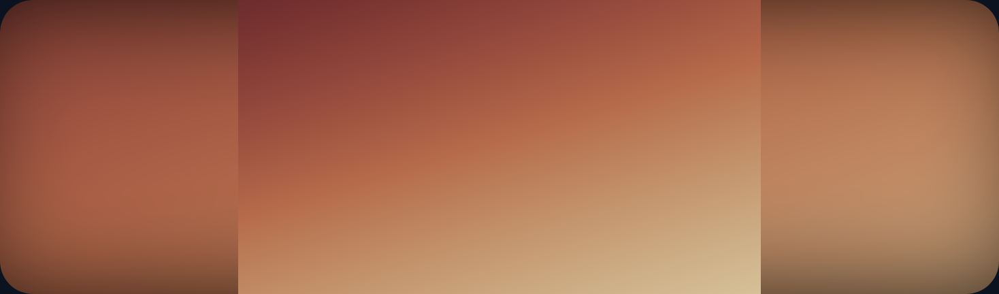
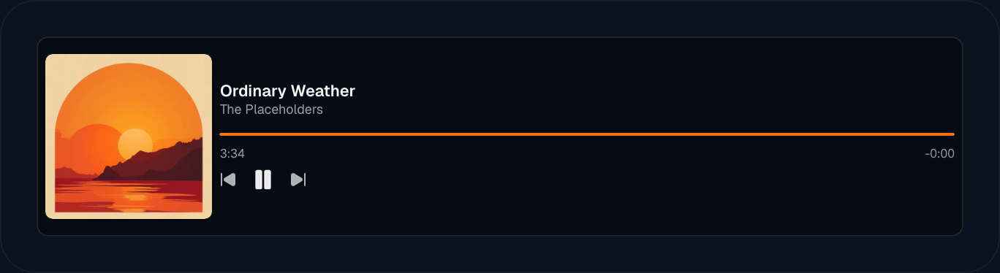
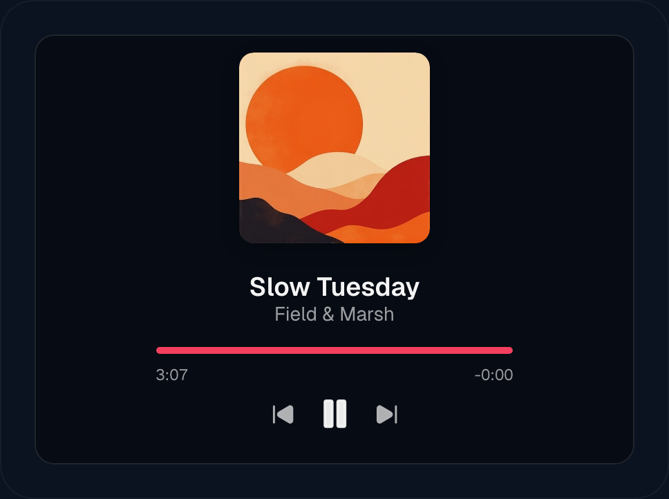
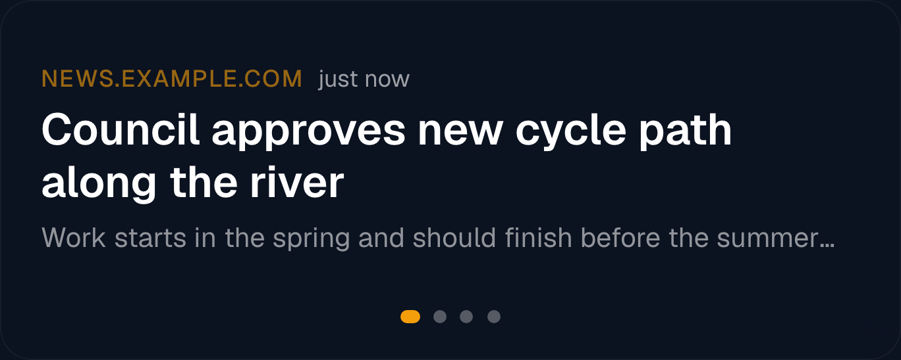
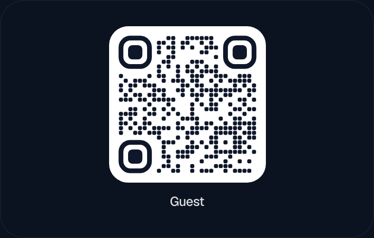
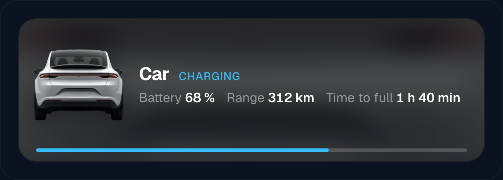
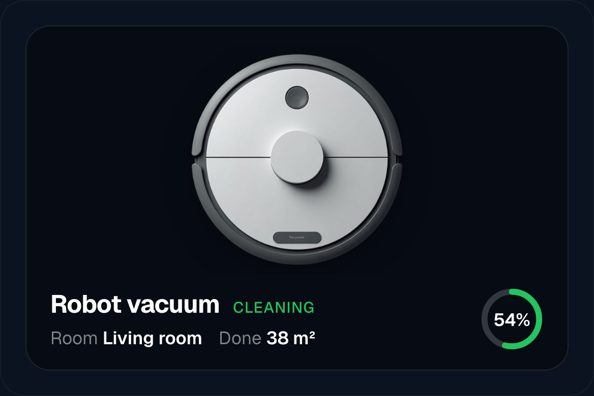

# Media and photo widgets

Five widgets that put something to look at on the screen: the **Image** widget
(`ImageWidget.tsx`), the **Media Player** (`MediaPlayerWidget.tsx`), the **RSS
Feed** (`RssWidget.tsx`), the **QR Code** (`QrWidget.tsx`) and the **Status**
card (`StatusWidget.tsx`).

All five have the shared settings — font, colour, shadow, hiding rules —
described once in [Widgets](widgets.md). This page covers only what is specific
to these five.

## Image

One tile with a photo in it, or a slideshow through an album from your own
[Immich](immich.md) photo library. Unlike a wallpaper, which fills the whole
screen behind everything, this sits in a tile you place on the grid — a family
photo beside the calendar rather than under it.

### Setting it up

1. Connect Immich once under `Editor → Integrations` — see
   [Immich](immich.md).
2. Add an **Image** (`Bild`) widget to the view.
3. Leave **Immich source** (`Immich-Quelle`) on **Global (Settings)**. The
   album list fills with your albums, each showing its photo count.
4. Pick an album under **Album**.
5. Choose a **Image display** (`Bildanzeige`) mode — see the table below.
6. Set the **Image change interval**, 5–600 seconds. Default 30.

If the album list stays empty, the message under it says which end is missing:
Immich not configured globally, or no Immich set on this view's wallpaper.

### Options

| Setting | Default | What it does |
| --- | --- | --- |
| `immichSource` | `global` | `global` uses the Immich connection from `Editor → Integrations`; `view` uses the one configured in this view's own wallpaper, which can be a different server. |
| `immichAlbumId` | — | Which album to show. |
| `fit` | `cover` | How the photo fills the tile — see below. |
| `intervalSec` | 30 | Seconds per photo, minimum 5. |
| `cornerRadius` | 16 px | Rounded corners on the photo, 0–40 px. 0 is square. In a view running edge-to-edge the corners go square by themselves unless you set a value here. |

### The fit modes

| Mode | What it does |
| --- | --- |
| `cover` | Fill the tile and crop whatever does not fit. The default, and the right answer when the photo and the tile are roughly the same shape. |
| `contain` | Show the whole photo, letterboxed with black bars where the shapes disagree. |
| `blur` | Show the whole photo **and fill the bars with a blurred, enlarged copy of the same photo** instead of black. |
| `fill` | Stretch to the tile. Distorts. |
| `none` | Original size, centred. Crops if the photo is larger than the tile. |

**`blur` is the one to reach for with portrait photos in a landscape tile.** Every
phone photo taken upright leaves two thick black bars in a wide tile; the blurred
copy turns them into a soft frame in the photo's own colours, and nothing is
cropped away. It is the same trick the wallpaper offers.

### The slideshow

The playlist is fetched once through `/api/immich-widget`, **shuffled**, and
capped at 200 photos. Photos then crossfade over 1.2 seconds. The order is
re-shuffled whenever the widget reloads — a display that runs for weeks keeps the
same order until it is refreshed or the layout is saved.

Photos are fetched through `/api/immich-widget/image` on the server, so the
display never talks to Immich and never sees the API key. That also means a
display outside your network still shows photos, as long as it can reach Magic
Frame.

**The widget's own background opacity slider is hidden**, because the photo fills
the tile to the edges and nothing behind it could show.

## Media Player

What is playing right now: cover art, title, artist, a progress bar and transport
controls, for any Home Assistant `media_player` entity. Needs a
[Home Assistant connection](home-assistant.md).

### The four ways it can look

`layout` decides the shape, and `auto` picks one from the tile: a wide tile gets
`row`, a tall one `stack`, a square one `cover`. Setting it yourself is what you
do when the tile is somewhere in between.

The last one is two settings, not a layout: `coverCorners: circle` makes the
artwork a disc and `vinylSpin` turns it while the music plays. Combined with
`artworkAsTileBg` — the same cover blurred behind the card — it turns a
dashboard tile into something you would leave on a screen on purpose.

### Setting it up

1. Add a **Media Player** widget.
2. Under **Media players** (`Media-Player`), type the entity — the field offers
   only `media_player.*` entities.
3. Click **Add another player** for each further player. With more than one, the
   widget follows whichever is playing.
4. Leave **Layout** (`Darstellung`) on **Automatic**. It picks a shape from the
   tile you drew.

### Layouts

| Layout | When it is used |
| --- | --- |
| `row` | Wide tiles. Cover left, text and controls beside it. `auto` picks it when the tile is at least 1.7 times as wide as it is tall. |
| `stack` | Tall tiles. Cover on top, text under it, centred by default. `auto` picks it at 0.8 and narrower. |
| `cover` | Square-ish tiles. The artwork fills the tile and the text sits over it behind a gradient. What `auto` picks in between. |

`align` (`left`, `center`, `right`) moves the text block. In the stack layout the
text is centred unless you set `align` explicitly. This and the Clock are the only
two widgets that read `align` at all.

**Everything scales with the tile, and elements drop out rather than being
squashed.** The widget measures itself and, when there is not enough height,
removes things in a fixed order: player dots, then the progress bar, then the
volume slider, then the player name, then the artist, and the transport controls
last. The title always survives. Your `fontSize` from the Text & colour tab acts
as a multiplier on top, from 0.7× to 1.8×.

### Options

| Setting | Default | What it does |
| --- | --- | --- |
| `entityIds` | — | One or more players. |
| `autoFollow` | on | With several players, show whichever one is playing. |
| `dotsPosition` | `bottom-right` | Where the little player dots sit — also `top-right`, `bottom-center`. |
| `dotsShowOnInteract` | off | Show the dots only on hover or touch. |
| `showCover` | on | The cover image, in `row` and `stack`. |
| `coverScale` | 100 % | Cover size, 50–130 %. |
| `coverCorners` | `rounded` | `rounded`, `square` or `circle`. |
| `vinylSpin` | on | With a circular cover, spin it while playing. |
| `showArtist` | on | The artist line. |
| `showProgress` | on | Progress bar and times. Tapping or dragging the bar seeks. |
| `accentColor` | subtle grey | The progress bar's colour. |
| `showControls` | on | Previous / play / next. |
| `showVolume` | off | A volume slider. |
| `showPlayerName` | off | The player's name above the title. |
| `textOverflow` | `truncate` | What a long title does: cut with `…`, `scroll` as a marquee, or `shrink` to fit. |
| `artworkAsTileBg` | off | Blur the cover across the whole tile as a background. |
| `bgBlur`, `bgDarken` | 28 px, 45 % | How blurred and how dark that background is. |
| `scrim` | 70 % | `cover` layout only: how far the dark gradient behind the text reaches. |
| `cardTheme`, `cardOpacity`, `cardBlur` | `auto`, 40, 12 | The tile surface. |
| `hideWhenIdle` | off | Hide the whole widget while nothing is playing. |

With more than one player, **swiping across the tile switches player**.

`hideWhenIdle` is what makes this widget disappear from a photo frame when the
music stops. Leave it off and an idle player shows a quiet placeholder instead.

## RSS Feed

Headlines from news feeds, as a list or one at a time.

### Setting it up

1. Add an **RSS Feed** widget.
2. Under **Feed URLs** (`Feed-URLs`), paste a feed address and press the add
   button. Repeat for each feed.
3. Choose **list** or **single** (`Einzeln`) under **Layout** (`Darstellung`).
4. Set how many articles to keep, 1–30. Default 8.
5. With **single**, set the change interval, 3–60 seconds. Default 8.

Both RSS and Atom feeds work. **Up to 8 feeds** are merged and sorted by date;
paste more and the extra ones are ignored.

### Options

| Setting | Default | What it does |
| --- | --- | --- |
| `feeds` | — | The feed addresses. |
| `rssMode` | `list` | `list` shows several below each other; `rotate` shows one and changes it. |
| `limit` | 8 | How many articles, 1–30. |
| `rotateSec` | 8 | Seconds per article in `rotate`, 3–60. |
| `showSource` | on | The feed's name on each article. |
| `showDate` | on | The article's date. |
| `showSummary` | on | The teaser text. |
| `showImage` | off | The article's preview image, if the feed carries one. |
| `showDots` | on | Pager dots in `rotate`. |
| `titleLines` | Auto | 1–3 lines for the headline, or Auto to fit the tile height. |
| `descLines` | Auto | 1–6 lines for the summary, or Auto. |
| `textOverflow` | `truncate` | `rotate` only: cut a long headline, `shrink` it, or run it as a marquee. |
| `linkable` | off | Make the headline clickable, opening in a new tab. |
| `showQr` | off | `rotate` only: a QR code beside the article so you can carry on reading it on your phone. |
| `rssAccent` | `#f59e0b` | The colour of the source line and the pager dots. |

**`linkable` is off on purpose.** A wall panel that can be tapped into a browser
is a wall panel a child can tap into anything; the QR code gets the article onto
a phone without turning the display into a web browser.

In `rotate` mode you can also **swipe** between articles, which restarts the
timer.

Feeds are fetched and parsed on the server through `/api/rss` — browsers cannot
load a foreign feed directly — and cached there for 10 minutes. The widget
reloads every 10 minutes, and again when the screen wakes up, so a monitor that
was asleep shows current headlines rather than yesterday's.

## QR Code

A QR code for your guest Wi-Fi, a link, or any text. The code is drawn in the
browser, so nothing is sent anywhere to generate it.

### Setting it up

1. Add a **QR Code** (`QR-Code`) widget.
2. Under **Content** (`Inhalt`), choose **Wi-Fi**, **Link** or **Text**.
3. For Wi-Fi: type the network name and the password, and pick the encryption.
   Guests scanning the code join the network without typing anything.
4. Adjust **Size** (`Größe`), 20–100 % of the tile. Default 100.

### Options

| Setting | Default | What it does |
| --- | --- | --- |
| `qrType` | `wifi` | `wifi`, `url` or `text`. |
| `wifiSsid`, `wifiPassword` | — | The network and its password. |
| `wifiEncryption` | `WPA` | `WPA` (covering WPA/WPA2/WPA3), `WEP`, or `nopass` for an open network — which hides the password field. |
| `wifiHidden` | off | Tick for a network that does not broadcast its name. |
| `content` | — | The address or text, for `url` and `text`. |
| `qrScale` | 100 % | 20–100 %. Small tucks it into a corner; large fills the tile. |
| `dotStyle` | `rounded` | `square`, `rounded`, `dots` or `classy`. |
| `eyeStyle` | `rounded` | The three corner squares: `square`, `rounded` or `circle`. |
| `gradient` | `none` | `none`, `linear` or `radial`, using `color1` and `color2`. |
| `bgMode` | `solid` | `solid` draws a coloured panel behind the code, `transparent` puts it straight onto the wallpaper. |
| `bgColor` | `#ffffff` | The panel colour with `bgMode: solid`. |
| `centerIcon` | — | An icon in the middle of the code. |
| `showLabel` | on | A caption under the code. |
| `label` | — | The caption text. For a Wi-Fi code, empty means the network name. |

**A transparent background is the setting that quietly breaks scanning.** A code
sitting directly on a photo needs real contrast between the dots and everything
behind them; over a busy wallpaper, phones give up. Test it with a phone before
leaving it on the wall.

Adding a centre icon **raises the error-correction level to H automatically**, so
the code still scans with a hole punched in it. If the content is too long to
encode at all, the widget says so rather than drawing an unreadable code.

**The Wi-Fi password is stored in the layout and drawn as a scannable code on a
screen with no login.** That is the point of the widget, and it is worth deciding
consciously: use it for the guest network, not the one your NAS is on.

## Status

A card that says what a device is doing right now — the car is charging, the
printer is printing, the washing machine is done. It appears when the thing
starts and goes away when it stops. Needs a
[Home Assistant connection](home-assistant.md).

### What it looks like on other devices

The same widget, three devices, three layouts. What changes between them is only
configuration — the picture source, the layout, whether the progress is a bar or
a ring, and which state counts as "you should look at this".

The third one is the point of the widget. A card that looks the same whether the
machine is running or done is a card nobody checks. `alertStates` is what makes
"finished" impossible to walk past — and it is a separate list from
`statusStates`, so "running" can stay calm while "finished" shouts.

### Setting it up

1. Add a **Status** widget.
2. Set **Entity (trigger)** (`Entität (Auslöser)`) to the thing being watched.
3. Set **Active on state** (`Aktiv bei Zustand`) to the states that mean
   "something is happening" — `charging`, `printing`, `on`, comma-separated.
   While the trigger entity reports a live state, the inspector shows what it is
   saying *right now* with a "click to apply" chip, so you do not have to guess
   between `on` and `charging`.
4. Choose where the picture comes from under **Image** (`Bild`).
5. Optionally add up to four **detail entities** — battery level, remaining time
   — each with a short label.
6. Turn on **Show even without an event** while you are building, so the card
   does not vanish every time you look away.

**Leaving "Active on state" empty means "active unless the state is `off`,
`idle`, `standby`, `none`, `unavailable` or `unknown`".** That works for most
devices. Note that a `binary_sensor` only ever reports `on` and `off` — never
`charging` — so point the widget at the sensor that carries the real word.

### Options

| Setting | Default | What it does |
| --- | --- | --- |
| `statusEntity` | — | The trigger. |
| `statusStates` | empty | Comma-separated states that count as active. |
| `alertStates` | — | States at which the card becomes loud: strong colour, and by default a pulse and a ring. For "finished", which nobody should miss. |
| `alertPulse`, `alertRing` | on, on | The two parts of that, separately switchable. |
| `statusLayout` | `bar` | `bar` = a row, `stack` = image above text, `center` = everything centred. |
| `imageMode` | `entity` | `entity` takes the picture from an entity — `image.*`, `camera.*`, `media_player.*`, `person.*`. `url` uses an address you supply, including `/local/…` paths from Home Assistant's own `www` folder. `icon` uses just an icon. |
| `imageEntity` | the trigger | A different entity to take the picture from. |
| `imageUrl` | — | The address for `imageMode: url`. The inspector can also upload an image straight into Magic Frame. |
| `imageStyle` | `box` | `box` crops the picture into a tile (photos, cover art); `free` shows a cut-out PNG with no crop. |
| `imageScale` | 100 % | 50–200 %. |
| `icon` | — | The icon, used in `icon` mode and as the fallback when no picture loads. |
| `label` | entity name | The card's title. |
| `statusDetails` | — | Up to four extra entities with labels, shown as live values. |
| `tapEntity` | — | Tapping the card triggers this entity — press a button, flip a switch, run a script. Acknowledging the laundry at the card itself. |
| `progressEntity` | — | An entity reporting 0–100. |
| `progressStyle` | `bar` | `bar` along the bottom or `ring` on the right. |
| `progressShowPercent` | on | The number inside the ring. |
| `showState` | on | Show the raw state word on the card. |
| `artworkAsTileBg` | on | Blur the picture across the card as its background. |
| `bgBlur`, `bgZoom` | 16 px, 120 % | How blurred, and how far that background is enlarged to fill the card. |
| `statusAccent` | `#0ea5e9` | The card's accent colour. |
| `alwaysShow` | off | Keep the card visible even when nothing is happening. |

A cut-out PNG usually carries a wide transparent margin, which would leave the
image looking small and off-centre. **Transparent edges are trimmed
automatically** the first time an image loads, and the result is cached, so
`imageStyle: free` shows the object at the size you asked for.

**A card that stops being active waits 5 seconds before folding away.** Devices
flicker between states, and without that pause a card would open and close every
few seconds. Expect a short delay between the printer finishing and the card
going.

The same Status card can also live inside the
[Notifications widget](widgets-home-assistant.md) stack, where you configure a
whole list of them and each appears as its event starts. The fields are
identical; the difference is only whether it is its own tile or a card in a
stack.
