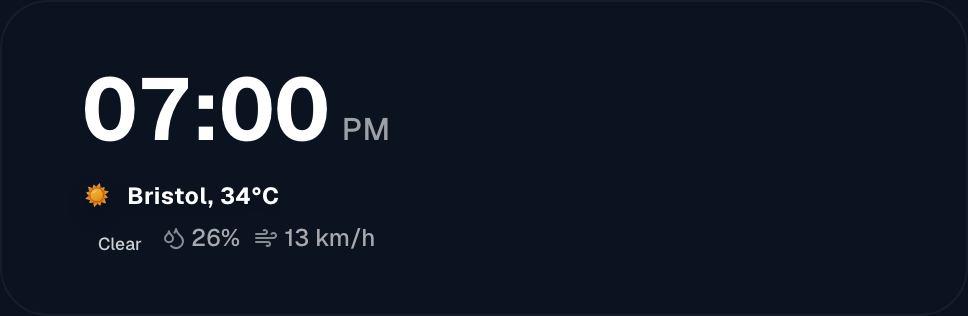
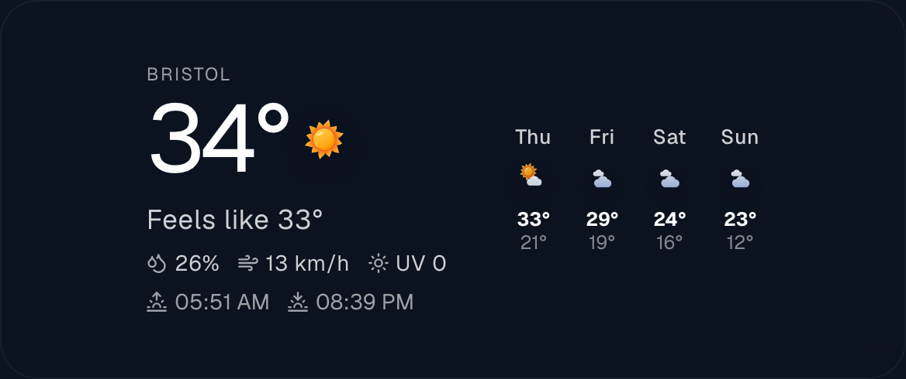
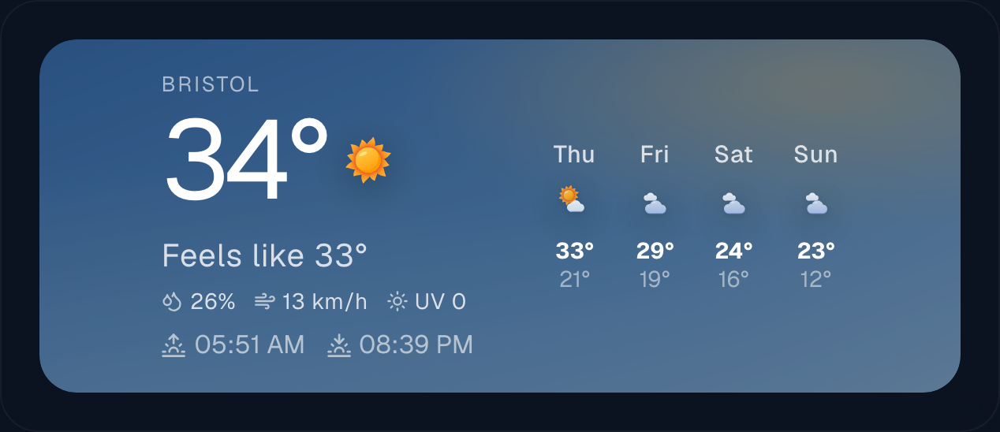
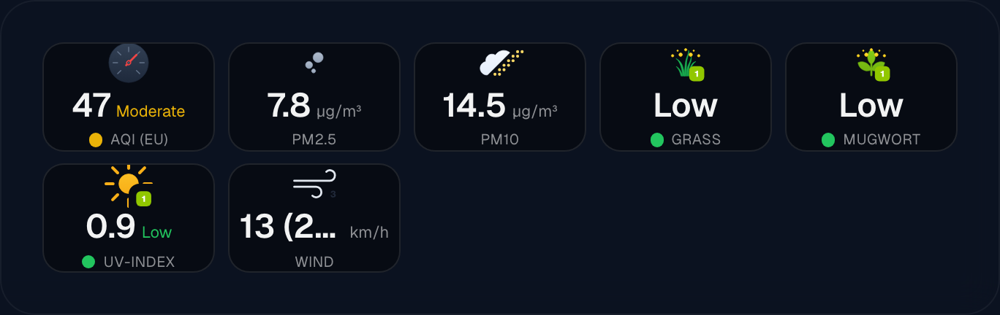

# Time and weather widgets

Three widgets: the **Clock** (`ClockWidget.tsx`), the **Weather**
(`WeatherWidget.tsx`) and the **Environment** widget (`EnvironmentWidget.tsx`).
Together they are what most people put on a screen first.

All three share the settings every widget has — font, colour, shadow, alignment,
hiding rules. Those are described once in [Widgets](widgets.md); this page covers
only what is specific to these three.

## Clock

Shows the time and the date, and optionally a small weather line underneath.

### Setting it up

1. In the editor, add a **Uhr** (Clock) widget to the view.
2. It works immediately — the time comes from the browser showing the view, so
   there is nothing to configure for a normal setup.
3. If this screen should show a *different* time zone than the machine it runs
   on, set **Zeitzone**. Leave it empty otherwise.

### Options

| Setting | What it does |
| --- | --- |
| `timezone` | Show another region's time. Empty = the display's own time zone. |
| `timeFormat` | `auto`, `12h` or `24h`. `auto` follows the app language: English gives 12-hour, German 24-hour. |
| `dateFormat` | `auto`, `en-US`, `en-GB` or `de-DE`. `auto` follows the app language. |
| `hideSeconds` | Hide the seconds. Worth doing on a wall screen — a ticking second hand is movement you notice from across the room. |
| `showMiniWeather` | Add a small weather line under the date. |

When `showMiniWeather` is on, these appear as well:

| Setting | What it does |
| --- | --- |
| `location`, `lat`, `lon` | Which place the weather is for. Search for the town in the inspector and it fills the coordinates in. |
| `unitTemp` | `celsius` or `fahrenheit`. |
| `showHumidity`, `showWind`, `showUv` | Which extra values sit beside the temperature. |
| `iconSet` | Which weather icons to use — the same four sets as the Weather widget, described below. |
| `statsSize` | Size of the small values, in pixels. |

The size of the extra values is set **in pixels, not relative to the clock**.
That is on purpose: when it scaled with the clock's font, the humidity ended up
nearly as large as the time itself.

## Weather

Current conditions and a forecast.

### Setting it up

1. Add a **Wetter** (Weather) widget.
2. Type your town into the location search and pick it from the list. The
   latitude and longitude fill in by themselves.
3. Choose a provider (see below). If you are in Germany or central Europe,
   **DWD ICON** is usually closer to reality than the global default.

### Where the forecast comes from

| Provider | Needs a key | Notes |
| --- | --- | --- |
| `open-meteo` | no | The default. Global, free, nothing to set up. |
| `dwd` | no | The German weather service's ICON model, fetched through Open-Meteo. Most accurate for Germany and central Europe. |
| `openweathermap` | yes | Enter the key under `Editor → Integrations`. The free tier allows 1000 calls a day. |
| `home-assistant` | no | Reads a `weather.*` entity from your own Home Assistant, so the frame agrees with the rest of your house. Needs a [Home Assistant connection](home-assistant.md). |

**DWD ICON does not report a UV index.** When you pick DWD and switch UV on,
Magic Frame quietly fetches just that one value from standard Open-Meteo. You do
not have to do anything; it is mentioned here so the number is not a mystery.

### Icons

Four sets, chosen with `iconSet`:

| Set | What it looks like |
| --- | --- |
| `lucide` | Thin outlines. Calm, works at any size. |
| `solid` | Filled flat shapes. |
| `meteocons` | Coloured illustrations by Bas Milius. Can animate, and can show the real phase of the moon at night. |
| `3d` | A moulded, plastic-looking set made for Magic Frame. Day and night variants, real moon phases, can animate. |

With `meteocons` you also get `meteoconsStyle` (`fill` or `line`),
`meteoconsAnimated`, `meteoconsMoonPhase`, and `meteoconsStats` — the last one
draws the humidity and wind icons in the same style instead of plain outlines.

**`iconAnimatedAll` is off by default, and should usually stay off.** With it on,
every forecast and hourly icon animates at once. On a cheap wall tablet that is
a dozen animations running forever, and it shows: the whole screen gets slower.
Left off, only the large current-conditions icon moves.

### Sizes and units

| Setting | What it does |
| --- | --- |
| `currentIconSize` | Size of the big icon, in percent. Default 100. |
| `forecastIconSize` | Size of the small forecast icons, in percent. Default 100. |
| `unitTemp` | `celsius` or `fahrenheit`. |
| `unitWind` | `kmh`, `mph`, `ms` or `kn`. |
| `subtextSize`, `statsSize` | Size of the secondary text and the small values, in pixels. |

Making an icon larger changes only how it is drawn — the tile keeps its size and
the layout does not move.

### What to show

`hideForecast` removes the forecast row and leaves only the current conditions —
useful in a narrow tile. `showHumidity`, `showWind`, `showUv` and `showSunTimes`
each add one value.

`weatherBg` paints a soft atmospheric background behind the widget that follows
the current conditions — it changes with the weather rather than staying put.

`weatherBgOpacity` and `weatherBgBlur` tone it down. It is **off by default**,
and that default is deliberate: over a photo wallpaper two backgrounds compete
and both lose. It comes into its own on a view with a plain or dark background,
where the card would otherwise be a flat rectangle.

## Environment

Air quality, pollen, particulates and UV — the numbers you want before opening a
window or sending someone out with hay fever.

### Setting it up

1. Add an **Umwelt** (Environment) widget.
2. Set the location. It uses `lat` and `lon` like the Weather widget.
3. Switch on the tiles you care about. Everything is off-or-on individually, so
   a narrow tile can show air quality alone.

### Options

| Setting | What it does |
| --- | --- |
| `aqiScale` | `european` or `us`. The two scales give different numbers for the same air — pick the one you are used to. |
| `showAqi`, `showPm25`, `showPm10`, `showOzone`, `showNo2` | Air quality values. |
| `showPollen` | Pollen counts. |
| `hidePollenZero` | Hide pollens that are currently at zero. Recommended — in winter it saves eight empty tiles. |
| `showUv`, `showSolar`, `showWind` | UV index, solar radiation, wind. |
| `unitWind` | `kmh`, `mph`, `ms` or `kn`. |
| `cardTheme` | `dark`, `light` or `auto` for the tiles. |
| `cardOpacity`, `cardBlur` | How solid and how frosted the tiles are over the wallpaper. |
| `meteoconsIcons`, `meteoconsStyle` | Use Meteocons for the tile icons instead of plain outlines. On by default. |

### Your own sensors

`haEntities` adds tiles fed by **your own Home Assistant sensors**, next to the
ones from the internet. This is how you show a CO₂ meter in the bedroom, a
solar inverter, or the German DWD pollen forecast that your Home Assistant
already knows about.

Each entry takes a Home Assistant entity and, optionally, a name, an icon and a
colour — the same shape the [Sensor widget](widgets-home-assistant.md) uses.
Needs a [Home Assistant connection](home-assistant.md).

## Where the data comes from

The Clock and Weather widgets fetch through `/api/weather`, the Environment
widget through `/api/environment`. Both run on the server, not in the display's
browser, which means a wall tablet never talks to a weather service directly and
no API key is ever sent to it.
