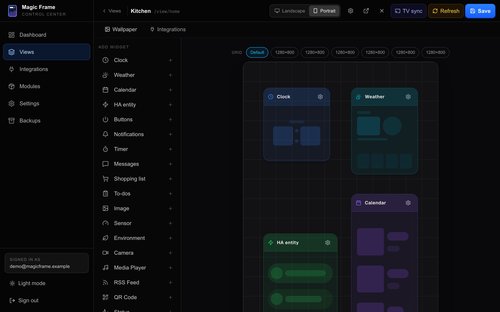
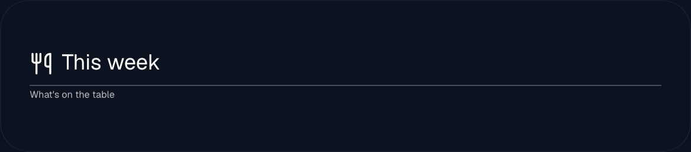

# Widgets

A **widget** is one tile on a view — the clock, the weather, a photo, a light
switch. There are 19 kinds. This page is the catalogue, and then the settings
that every one of them has, whatever kind it is.

A **view** is one screenful shown at one address; you build it in the editor,
described in [The editor](the-editor.md).

## The catalogue

| Widget | Type id | What you see | Documented in |
| --- | --- | --- | --- |
| Clock (`Uhr`) | `ClockWidget.tsx` | The time and date, optionally a small weather line under it | [Time and weather](widgets-time-weather.md) |
| Weather (`Wetter`) | `WeatherWidget.tsx` | Current conditions and a forecast | [Time and weather](widgets-time-weather.md) |
| Environment (`Umwelt`) | `EnvironmentWidget.tsx` | Tiles for air quality, pollen, UV and wind | [Time and weather](widgets-time-weather.md) |
| Calendar (`Kalender`) | `CalendarWidget.tsx` | Appointments as a list, an agenda or a month grid | [Calendar](widgets-calendar.md) |
| HA entity (`HA Entity`) | `HomeAssistantWidget.tsx` | A stack of pills, one per Home Assistant entity, tap to toggle | [Home Assistant widgets](widgets-home-assistant.md) |
| Notifications (`Benachrichtigungen`) | `HANotificationWidget.tsx` | A stack of alert tiles raised by rules you write | [Home Assistant widgets](widgets-home-assistant.md) |
| Camera (`Kamera`) | `CameraWidget.tsx` | A live picture from a camera, tap for full screen | [Home Assistant widgets](widgets-home-assistant.md) |
| Sensor | `SensorWidget.tsx` | Large readable numbers from your own sensors | [Home Assistant widgets](widgets-home-assistant.md) |
| Buttons | `ButtonWidget.tsx` | Up to four buttons that switch lights, run scripts or hide other widgets | [Home Assistant widgets](widgets-home-assistant.md) |
| Image (`Bild`) | `ImageWidget.tsx` | One photo, or a slideshow from an Immich album, inside a tile | [Media and photos](widgets-media.md) |
| Media Player | `MediaPlayerWidget.tsx` | What is playing right now, with cover art and controls | [Media and photos](widgets-media.md) |
| RSS Feed | `RssWidget.tsx` | Headlines from news feeds, as a list or one at a time | [Media and photos](widgets-media.md) |
| QR Code (`QR-Code`) | `QrWidget.tsx` | A QR code for your guest Wi-Fi, a link or any text | [Media and photos](widgets-media.md) |
| Status | `StatusWidget.tsx` | A card that appears while something is happening — the car is charging, the printer is printing | [Media and photos](widgets-media.md) |
| Timer | `TimerWidget.tsx` | Running kitchen timers with a countdown ring | [Family widgets](widgets-family.md) |
| Messages (`Nachrichten`) | `MessagesWidget.tsx` | Short notes sent to the screen from a phone | [Family widgets](widgets-family.md) |
| Shopping list (`Einkaufsliste`) | `ShoppingListWidget.tsx` | A shared shopping list you can tick off on the screen | [Family widgets](widgets-family.md) |
| To-dos (`Todos`) | `TodosWidget.tsx` | Tasks, optionally filtered to one person | [Family widgets](widgets-family.md) |
| Text | `TextWidget.tsx` | A heading or caption that labels the widgets around it | [Labelling a view](#labelling-a-view), below |

Anything beyond these 19 is a **custom module** — a widget somebody else wrote,
installed under `Editor → Modules`. Its type id starts with `custom:` instead
of ending in `.tsx`. See [Custom modules](custom-modules.md).

## Adding one

1. Open `/editor`, sign in, and click the view you want to change.
2. Down the left of the canvas is the **Add widget** (`Widget hinzufügen`)
   palette, listing all 19 with their icons, and any custom modules under a
   **Custom** heading below them.
3. Click a row. The widget lands on the grid and its inspector opens.
4. Drag it where you want it and drag its bottom-right corner to resize.
5. Click **Save**. Every display showing this view updates within a second.

On a phone the palette is a sheet instead of a sidebar — tap the widget button
in the toolbar to open it.

## The type id is a filename

Every widget's type is literally the name of the file that draws it —
`ClockWidget.tsx`, `CalendarWidget.tsx`. You will meet these ids in three
places:

- in a layout you export from the editor, as the `type` of each tile,
- in the tables on the widget pages of this wiki,
- in [Writing a module](module-development.md), where you register your own.

They are stored in the database with every saved tile, which is why they never
get renamed once released: renaming one would break every layout that uses it.

## Settings every widget has

Select a widget in the editor and the inspector opens with three tabs:
**Layout**, **Text & colour** (`Text & Farbe`) and **Content** (`Inhalt`). The
first two are the same for all 19 widgets; the Content tab is what the
individual widget pages document.

### Layout

| Setting | What it does |
| --- | --- |
| Name | Your own title for this tile, replacing the type name in the editor. Leave it empty and it shows the widget's normal name in your language. |
| X, Y, Width, Height | Position and size on the 24 × 24 grid. Same thing as dragging, but exact. |
| `offsetX`, `offsetY` | Nudge the tile by up to 500 pixels in any direction, *without* changing which cells it occupies. Use it to line two tiles up optically when the grid puts them a few pixels apart. |
| `bgOpacity` | How solid the dark panel behind the tile is, 0–100 %. Default 20. At 0 the widget sits directly on the wallpaper. |
| `floatingCard` | Only appears when the view runs in edge-to-edge mode (`Randlos`). Normally widgets dock square onto the edge-to-edge grid; a floating card keeps its rounded corners and hovers over the background instead. |
| `defaultHidden` | Start hidden, and only appear when a Button widget shows it. |
| `showWhenEntity`, `showWhenState`, `autoHideSeconds` | Show the tile only while a Home Assistant entity has a given state — a camera that appears when the doorbell rings. Described in [Stacking and visibility](stacking-and-visibility.md). |

The background opacity slider is hidden for the Image widget, because that
widget fills its tile edge to edge and nothing behind it could ever be seen.

### Text and colour

| Setting | What it does |
| --- | --- |
| `fontSize` | The base text size, 8–150. Default 20. With `responsiveText` off this is pixels; with it on it is a percentage factor. |
| `responsiveText` | Scale the text with the tile instead of fixing it in pixels. Turn it on for any tile you might resize later, or that has to look right on both a 10-inch tablet and a 40-inch monitor. |
| `fontFamily` | Geist (the default), Inter, Roboto, Montserrat, SF Pro, Playfair, Lato, Oswald or Outfit. |
| `fontWeight` | 100 Thin, 300 Light (the default), 400 Regular, 500 Medium, 700 Bold or 900 Black. |
| `color` | The text colour. Default white — which is right over a photo and wrong over a white one. |
| `textShadowBlur` | Softness of the drop shadow, 0–40 px. |
| `textShadowX`, `textShadowY` | Shadow offset, −50 to 50 px. `textShadowY` defaults to 4. |
| `align` | `left`, `center` or `right`. |

**The shadow is only drawn when one of the three values is not zero**, and it is
always black at 80 % opacity — there is no shadow colour. A blur of about 8 with
Y at 4 is what keeps white text readable over a bright photo.

**`align` is not honoured by every widget.** Only the Clock and the Media Player
read it, and only those two offer it in their Content tab. On the other 16 the
value is stored but changes nothing; use `offsetX` or resize the tile instead.

**How `responsiveText` scales.** With it on, the size becomes half your
`fontSize` value in `cqmin` units — that is, relative to the *shorter* side of
the tile. The HA entity and Notifications widgets are the exception: they scale
on tile *width* (`cqw`), because their rows grow sideways, not down.

### The live preview

Every widget's Content tab starts with a **Live preview** panel that renders the
real widget with real data while you change settings. On a wide screen the
preview moves into its own column beside the inspector. Widgets that would
normally be empty — a calendar with no appointments, a notification stack with
nothing to report — fill the preview with invented example entries so you can
judge the layout. Those examples exist only in the editor and never on a display.

## Labelling a view

The **Text** widget (`TextWidget.tsx`) is the odd one out: it fetches nothing
and shows nothing but the words you type. It exists because a view can become
ambiguous — two calendars next to each other, one holding this week's meals and
one the family's appointments, look identical until something says which is
which.

Give it a **Text**, and optionally a **second line** under it in a smaller size.
Both are plain text; there is no Markdown and no HTML.

It deliberately has **no font settings of its own**. Size, typeface, colour,
weight and shadow come from the inspector's **Text** tab, the same one every
widget has — a heading is not a special kind of text, it is text set larger.
Turn on **Responsive auto-scale** there and the heading grows with its tile
instead of staying at a fixed pixel size.

What it does add, in the Content tab:

- **Alignment**, horizontal and vertical. Vertical is the useful one: set it to
  **Bottom** and the heading sits on the lower edge of its tile, right above
  whatever it labels, no matter how tall you drag the tile.
- **An icon** in front of the text, from the same picker the other widgets use,
  with its own size relative to the text.
- **Uppercase** and **letter spacing**, which belong together — capitals need
  the extra air to stay readable across a room.
- **A divider** under the text: a thin line in the text's own colour, which
  turns a label into a section heading.

A new Text widget arrives 10 columns wide, 2 rows high and with no background,
rather than the usual tile — a heading with a grey box behind it is almost never
what you want. Drag it to fit like any other widget.

If the text is longer than the tile, it wraps, and what does not fit is cut off
at the bottom edge. It always starts at the top of the visible area, so you lose
the end of a heading, never its beginning.

## When two widgets overlap

Widgets may sit on top of each other, and a Button or a Home Assistant entity
can swap which one is visible. That is a subject of its own:
[Stacking and visibility](stacking-and-visibility.md).

## Where the data comes from

Widgets never talk to your Home Assistant, your Immich or a weather service
directly. They call a route on the Magic Frame server — `/api/ha/state`,
`/api/calendar`, `/api/weather` and so on — and the server holds the tokens. A
wall tablet therefore never sees a single credential, which matters because the
view address needs no login.
